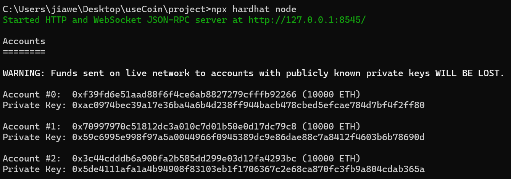
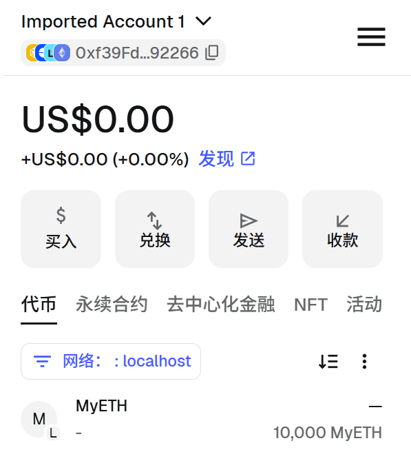
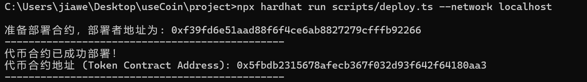
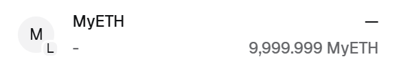

# ERC-20

了解区块链的基础知识后，尝试发行自己的币

- Trust wallet

支持多链，可以使用一套助记词，查看BTC、ETF等地址

- MetaMask

以太坊DApp、DeFi协议、NFT平台，开发者友好

不支持非EVM链

## 基础知识

### 网络

区块链的网络不是区分服务器，而是区分一个完全独立的账本副本和一套独立的规则引擎

每个链创世时都有一个唯一的整数编号，从密码学层面隔离了跨链之间的交易

区分存储状态和EVM参数等内容

### 地址

区块链的地址就像一个银行账号，即能收款也能转账

**助记词**

是人类的可读备份，之所以能够恢复钱包

助记词能够转换成一个种子，基于种子能够使用另一套标准，像一棵树一样派生出无穷的私钥、公钥、地址

### DApp

运行在区块链系统上的应用城西，而不是托管在单一公司服务器上

**解决的问题**

抗审查和单点故障

用户真正拥有资产和数据

理论上能够实现去中心化金融（DeFi）、链上游戏、去中心化社交以及基础设施等，但是现在的需求，包括体验门槛、安全风险等限制因素较多。

### DeFi

不仅包括ETH、BTC等基础资产，DeFi是运行在这些网络上的金融服务应用，相当于银行、证券交易所等


### NFT

是一种记录在区块链上的数字所有权凭证，相当于带有区块链防伪的数字原件

感觉流动性缺失和泡沫拉满了

### BNB

顺便说一下BNB，就是币安发布的区块链代币

借助于最大的加密交易所，BNB有其优势：

- 作为公链的刚性燃料

链上有交易、DeFi等，需要抵押等消耗

- 支持质押给新的验证节点，以及链上质押维护网络共识

通过把BNB存入Launchpool等，有新项目上线能够无偿发放新代币，每年打新能够获取10%-15%的年化收益

- 转账相对于ETH等手续费极低

普通转账消耗0.03$左右，基本ETH的十分之一

但是牺牲了一定的去中心化能力

同时，它的几项机制个人认为有其双面性

- 高度确定的通缩模型

发行量控制为2亿枚，通过算法目标消耗至1亿枚，人为制造稀缺性

感觉想要同时扮演：通缩避险资产、低成本Gas、平台股票分红等多种功能，但是由此引发的阶级固化，可能只会在特定的历史阶段占据一定的生态位

## 发行货币

### ERC-20

以太坊以及所有EVM兼容链上同质化代币的官方统一标准

规定了一套标准接口

**查询方法**

```
totalSupply()	查询代币总发行量
balanceOf(account)	查询某个账户的余额
allowance(owner,spender)	查询某个地址授权给其他地址的额度
```

**交易方法**

```
transfer(recipient,amount)	转账
approve(spender,amount)	 	授权其他地址使用代币
transferForm(sender,recipient,amount)	代表他人进行代币划转
```

### 初始化

初始化一个js项目

```
npm init -y
```

安装一些常用的包

```
// 本地模拟网络
npm install --save-dev hardhat

// 合约模板库
npm install @openzeppelin/contracts
```

创建Hardhat工程

```
npx hardhat init
```

安装推荐进行，之后就可以创建合约

### 合约

简单尝试一个，在`contracts`文件夹新建一个sol

```solidity
// SPDX-License-Identifier: MIT
pragma solidity ^0.8.20;

import "@openzeppelin/contracts/token/ERC20/ERC20.sol";

contract MyToken is ERC20 {
    constructor(uint256 initialSupply) ERC20("MyCustomToken", "MCT") {
        _mint(msg.sender,initialSupply*10*decimals());
    }
}
```

其中只使用了`contruct`构造函数，就只发一次

`10**decimals()`是初始铸造，默认返回10^18，

执行脚本发布，相当于在本地开启了以太坊服务器

```
npx hardhat node
```

会生成20个带有10000ETH的测试账号公钥和私钥

这只是EOA的初始用户账户，只是源码文件，无法交易



导入账户后就可以看到10000ETH，但是只是没有EVM的源码



编写`script/deploy.ts`

```typescript
import { network } from "hardhat";

async function main() {
  const initialSupply = 1_000_000n;

  // 通过 network.create() 建立连接，拿到已注入插件功能的 viem 实例
  const { viem } = await network.create();

  // 1. 获取部署账户（默认取 Account #0）
  const [deployer] = await viem.getWalletClients();
  console.log("准备部署合约，部署者地址为:", deployer.account!.address);

  // 2. 发起部署，将 initialSupply 传给 Solidity 的 constructor
  const token = await viem.deployContract("MyToken", [initialSupply]);

  // 3. 获取部署成功后的代币合约地址
  const tokenAddress = token.address;
  console.log("-----------------------------------------------");
  console.log("代币合约已成功部署！");
  console.log("代币合约地址 (Token Contract Address):", tokenAddress);
  console.log("-----------------------------------------------");
}

main().catch((error) => {
  console.error("部署失败:", error);
  process.exitCode = 1;
});
```

将sol编译为EVM可识别的字节码，并且广播创建交易，写入状态树，创建构造函数

```
npx hardhat run scripts/deploy.ts --network localhost
```



部署地址就是EOA，合约地址就是代币在数据库和链上的存储位置

执行后，余额会扣除gas



将合约地址导入后，能够进行转账

下一步就需要进行智能合约编写以及单元化自动测试了


