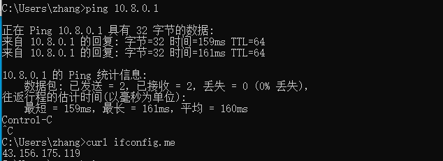

# VPS

## 基础

### QUIC

QUIC是传输层协议，底层使用udp发包，上层给http3使用

使用了udp当载体，内部实现了类似tcp的可靠传输，tls加密等，使得http3能够直接跑在quic上

### TLS

**transport layer security**，传输层安全协议

https基本等于http+tls，tls相当于ssl的升级版

**加密**

客户端和服务端的通信加密

**防篡改**

校验数据传输的正确性1

**身份验证**

使用数字证书验证身份

但是tls比较耗费算力，一般后端专心业务，nginx负责tls

### **vps**

相当于一台远程Linux电脑，能够通过ssh连接后运行各种服务

### vpn

是一种加密连接/隧道服务

vpn服务有WireGuard、openVPN等服务

**WireGuard**

因为个人科学上网的场景，更加适配WireGuard，速度快延迟低，默认基于UDP

本质是vpn协议，更加适用于自建

**OpenVPN**

支持udp和tcp，配置相对复杂，但是稳定

**Hysteria2**

本质是代理协议，是基于QUIC的tcp/udp代理，伪装为http3，能够抗丢包

**Xray**

也是代理协议，但是是多协议代理核心，有VLESS、VMess、Trojan、Shadowsocks等多种协议，很灵活

### 反向代理

先来说**正向代理**，比较好理解

```
你 → 代理服务器 → Internet
```

正向代理就是帮客户端工作

**反向代理**就是：

```
用户 → 反向代理 → 真正服务器
```

代理就是帮服务器工作，用户不知道背后的服务器

现代互联网一般不适用`浏览器-apache-网站`的形式，而是

```
浏览器 - Nginx（反向代理） - 服务器 - 数据库
```

反代能够：负载均衡、隐藏后端、nginx负责tls、静态资源速度更快、网关能力

因此，nginx通过事件驱动的模式，获得了更高的并发性

### DNS

DNS的功能是解析域名

不同的DNS地址代表不同的DNS服务器，在配置中，使用了`1.1.1.1`的服务器表示为Cloudflare服务器，也有`8.8.8.8`是Google DNS服务器


## 流程

安装基础工具

```
sudo apt install -y wireguard iptables iproute2 qrencode curl
```

开启ipv4转发

```
sudo vim /etc/sysctl.conf

# 末尾添加
net.ipv4.ip_forward=1

# 配置生效
sudo sysctl -p
```

创建配置目录

```
sudo mkdir -p /etc/wireguard
sudo chmod 700 /etc/wireguard
cd /etc/wireguard
```

创建服务端和客户端密钥

```
sudo sh -c 'wg genkey | tee /etc/wireguard/server_private.key | wg pubkey > /etc/wireguard/server_public.key'

wg genkey | tee client_private.key | wg pubkey > client_public.key
```

就能够查看服务器的公私钥

```
# 私钥放在VPS上，公钥写进客户端配置
cat server_public.key 
kNPXZ8TudGc/fiZf+Md80er20WKkewHKDE5pxnPlcQ4=
cat server_private.key 
MH3uVhQEH7ztRNiT6j/VFe46SzET54gM82kYo4mNo3U=

cat client_private.key 
uPWLeeON5/A9iUDjrwsVKdg6/i4U73oywHGXzThNEFY=
cat client_public.key 
zMiG6I7EFdGPYPTx5UbdGkk7bqdQ7ZnQi/Ssn2DJfGc=

```

替换配置文件

```
vim /etc/wireguard/wg0.conf

[Interface]
Address = 10.8.0.1/24
ListenPort = 51820
PrivateKey = SERVER_PRIVATE_KEY

PostUp = iptables -A FORWARD -i wg0 -j ACCEPT; iptables -A FORWARD -o wg0 -j ACCEPT; iptables -t nat -A POSTROUTING -o eth0 -j MASQUERADE
PostDown = iptables -D FORWARD -i wg0 -j ACCEPT; iptables -D FORWARD -o wg0 -j ACCEPT; iptables -t nat -D POSTROUTING -o eth0 -j MASQUERADE

[Peer]
PublicKey = CLIENT_PUBLIC_KEY
AllowedIPs = 10.8.0.2/32
```

客户端配置

```
sudo nano /etc/wireguard/client.conf

[Interface]
PrivateKey = <客户端私钥>
Address = 10.8.0.2/32
DNS = 1.1.1.1

[Peer]
PublicKey = <服务端公钥>
Endpoint = <你的公网IP>:51820
AllowedIPs = 0.0.0.0/0
PersistentKeepalive = 25
```

这个`client.conf`就能够作为配置文件导入wireguard应用中



### 问题

在自己的windows上试图连接，但是直接没网；在虚拟机上就能够实现

是因为`AllowedIPs=0.0.0.0/0`，所有的流量都试图走wg0，但是多个网络接口可能会有问题

虽然能够接入从而访问youtube等，但是轻量级服务器的带宽太小，而且cpn速度较慢，无法支撑个人的正常使用


