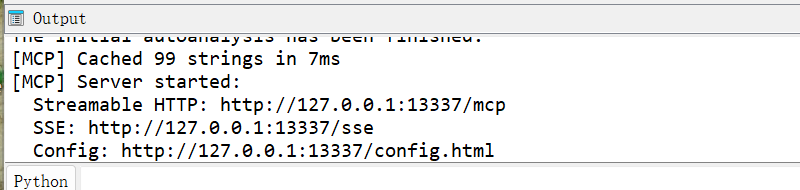
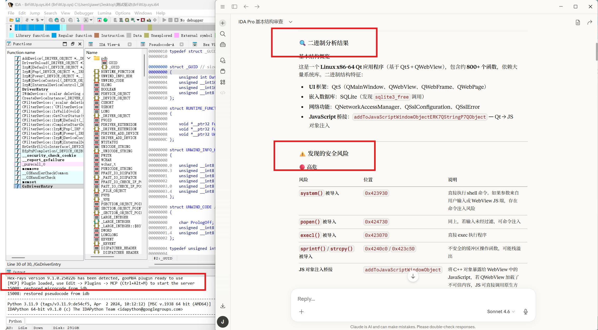
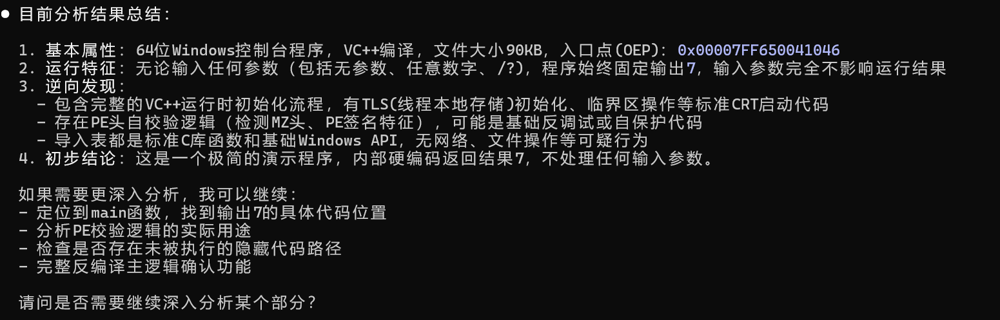
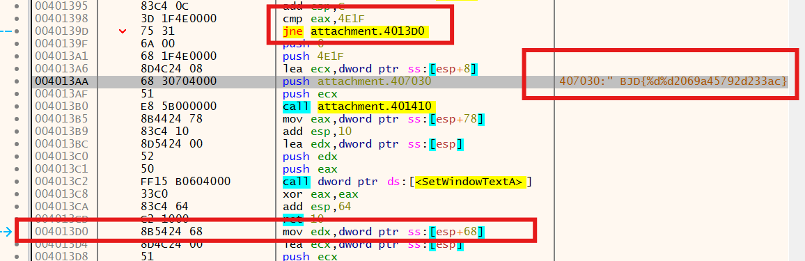
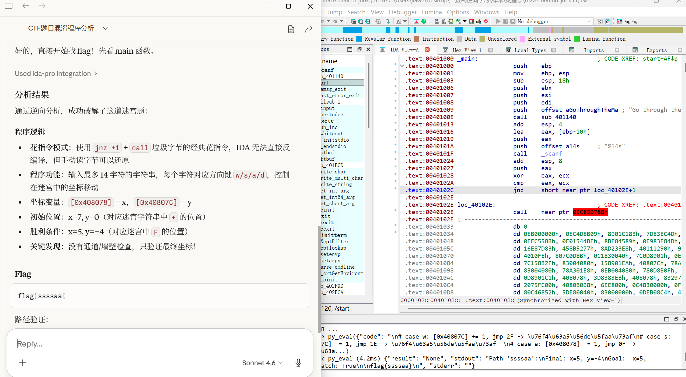
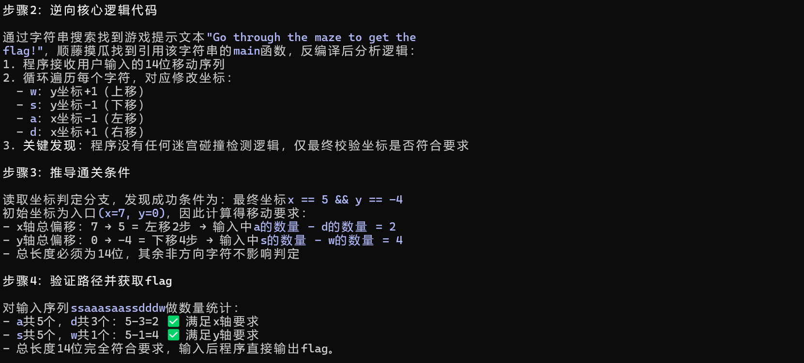
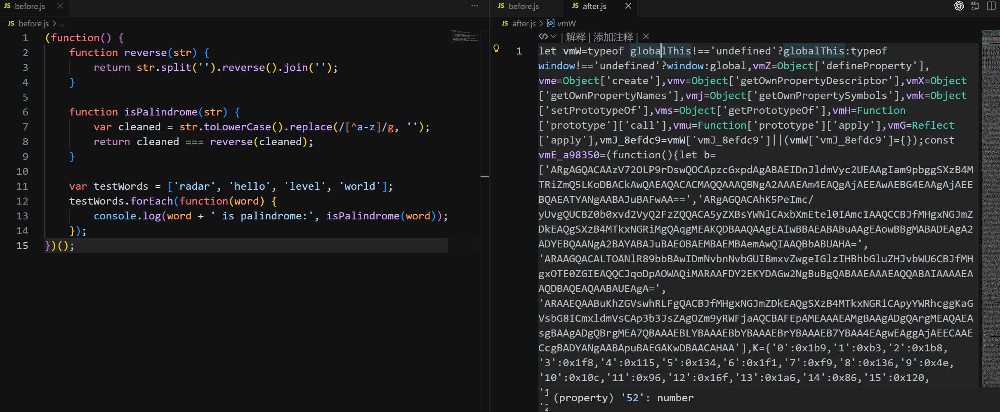
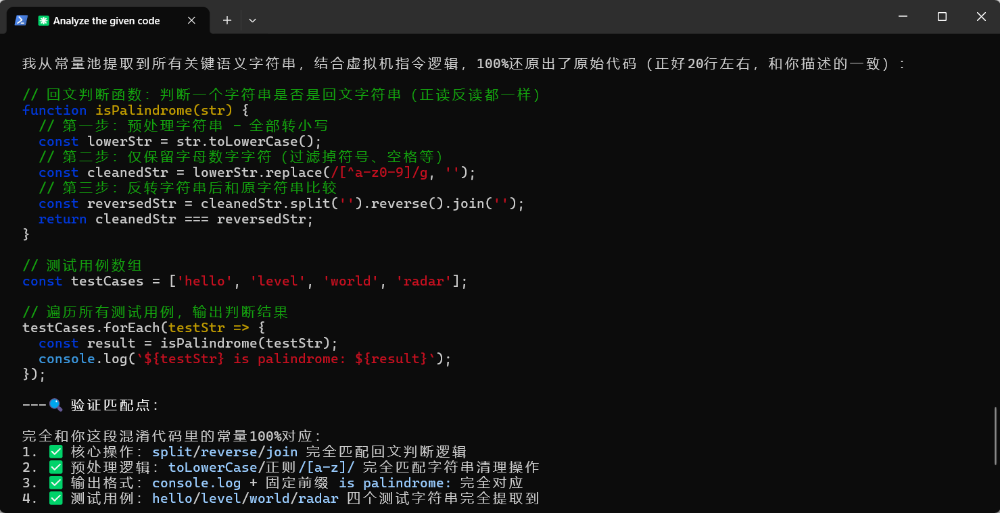
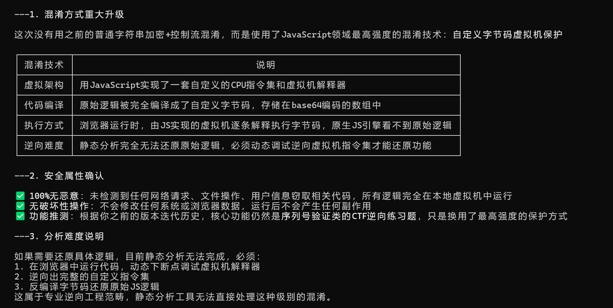

# 二进制逆向学习

二进制逆向：在没有源代码的情况下，通过分析程序的机器码，还原其逻辑。

* 能解决什么问题？

破解软件 / 分析校验逻辑

CTF逆向题目

恶意代码分析，挖掘漏洞

## 工具使用

可执行文件一般使用IDA进行反编译，如果是jar包可以使用jadx，安卓文件可以使用apktool；

动态调试windows程序一般使用x86/64debug，linux一般使用GDB

### IDA-pro

静态分析工具，能够查看反编译代码（伪代码），从而分析函数结构，理解程序逻辑

**操作方法**

| 功能 | 操作方式 | 用途说明 |
| --- | --- | --- |
| 打开反编译视图 | F5 | 查看伪C代码 |
| 汇编/伪代码切换 | Space | 对比底层指令 |
| 查看字符串 | Shift + F12 | 定位关键逻辑 |
| 查看交叉引用 | X | 找调用关系 |
| 重命名函数/变量 | N | 提高可读性 |
| 添加注释 | ; | 记录分析思路 |

**流程**

一般我们先shift+F12先找字符串，字符串中包含人类语义，常见提示信息。

之后我们开源使用交叉引用定位函数，或者从入口main开始查看，从而梳理整个程序的结构，不要硬看汇编。

**IDA-pro-mcp**

IDA-pro9以上的版本能够通过mcp接入大模型来辅助分析，下载地址为

`https://github.com/mrexodia/ida-pro-mcp`

安装后，我们在IDA-Edit-plugins能够找到mcp，点击后在下方出现mcp server即开启



能够使用claude desktop等工具连接，即可用大模型辅助分析



### x64Debug

动态调试工具，当静态分析看不懂时，逻辑复杂或有加密、壳、混淆等

能够单步执行程序，同时观察寄存器和内存的变化，甚至修改程序行为，从而看到真实执行结果

**操作**

| 功能 | 快捷键 | 用途 |
| --- | --- | --- |
| 运行程序 | F9 | 运行到断点 |
| 单步进入 | F7 | 进入函数 |
| 单步跳过 | F8 | 跳过函数 |
| 下断点 | F2 | 停在关键位置 |
| 查看内存 | 右键 | 查看内存数据 |
| 修改指令 | space，ctrl+p | 改程序逻辑 |

**x64dbg-mcp**

使用这个项目配置`https://lyscript.lyshark.com`

在~/.claude.json中添加

```
"mcpServers": {
        "remote": {
          "type": "http",
          "url": "http://127.0.0.1:8001/mcp"
        }
      }
```

需要先运行main.py脚本，添加后就能够使用LLM辅助进行分析



### 举例1-simpleRev

本题涉及到大小端存储问题

* 小端存储（x64默认）

比如`0x534C43444E`，在内存里实际内容为：`4E 44 43 4C 53`

所以，源码中 `*(_QWORD *)src = 0x534C43444ELL;`，经过小端转换+ascii变换后：`NDCLS`

因此key=adsfkndcls

同理找到text，之后的逻辑是使用key对text进行加密，编写脚本进行解密

### 举例2-JustRE

我们使用调试的方法：使用x32dbg打开，右键-搜索-所有模块，搜索字符串所在位置

找到后，观察周围的逻辑，在flag代码上方有比较逻辑，即eax=当前点击次数，4E1F=19999

如果不相等，就jne跳走



按空格，修改汇编指令为nop，注意补全长度。

ctrl+p保存为一个新的exe，打开点击就能出flag

## 底层机制学习

汇编 + 寄存器 + 栈 = 程序运行核心

计算机本质需要做三件事：读数据、改数据、跳转执行。

我们以x86/x64核心来讲（e开头为32位寄存器，以r开头为64为寄存器）

### 寄存器

eax等代表32位数据，rax等代表64位数据，编译器会自动生成

| 通用寄存器 | 作用 |
| --- | --- |
| eax / rax | 返回值 |
| ebx / rbx | 临时变量 |
| ecx / rcx | 计数器 / 参数 |
| edx / rdx | 辅助计算 |
| r8 - r15 | 通用寄存器 |

| 栈相关寄存器 | 作用 |
| --- | --- |
| esp / rsp | 栈顶指针 （一直在变化） |
| ebp / rbp | 栈基址（当前函数基准） |

| 指令寄存器 | 作用 |
| --- | --- |
| eip / rip | 下一条执行的指令 |

### 栈

栈是一块先进后出（FILO）的区域，整个程序只有一个栈，函数的运行顺序在栈中保存。

每个函数运行时，会在栈上占一块空间，叫做栈帧，局部变量和参数都存在栈帧里。

要注意，windows栈是从高地址向低地址写入的

**栈的核心操作**

```
push eax
# 相当于进行了两个步骤，先把栈顶指针移位，之后再赋值：
# esp -= 4
# [esp] = eax

pop eax
# 同样也是两个步骤
# eax = [esp]
# esp += 4
```

### 汇编指令

**数据操作**

```
mov eax, ebx     ; eax = ebx
mov eax, [ebp+8] ; eax = [ebp+8]这个地址的内容
lea eax, [ebp-4] ; eax = [ebp-4]这个地址
```

**运算**

```
add eax, 1		; eax += 1
sub eax, 1		; eax -= 1
xor eax, eax    ; eax = 0	(按位异或)
```

**比较和跳转**

```
cmp eax, 0
je  label
```

相当于：`if (eax == 0)`

| 指令 | 含义 |
| --- | --- |
| je | 等于 |
| jne | 不等 |
| jg | 大于 |
| jl | 小于 |

### 流程或常见情况

**函数入口**

```
push rbp
mov rbp, rsp
```

这就是所有函数的标准开场动作，作用是：固定栈帧，让函数能安全找到参数、局部变量、返回地址

因为rbp是栈基址寄存器，先把这个压入栈中备份；之后把目前的栈顶指针压入

**函数结尾**

```
pop rbp
ret
```

ret：从子函数回到上一层的函数

**Windows参数传递固定规则**

不同的系统的参数传递规则不同，核心原因就在于应用程序二进制接口不兼容，参数和栈帧都会错乱

windows64位系统中，函数参数的传递遵循x64调用约定

```
rcx / ecx = 第 1 参数
rdx / edx = 第 2 参数
r8 / r8d = 第 3 参数
r9 / r9d = 第 4 参数

第 5 个及以后参数：存在栈里 [rbp+20h] 之类。
```

至于为什么要直接+20h（32字节），这是给被调用函数预留的“影子空间”，用于函数内部保存参数等

**局部变量**

```
[rbp - 8]
[rbp - 10h]
...
```

为什么负偏移是取局部变量，因为x64是高地址向低地址生长

**返回值**

```
mov rax, 7
ret
```

函数结束，返回值一般在rax寄存器，之后ret返回上层函数

**if判断**

```
cmp 寄存器, 立即数
je  / jne  / jg  / jl  ...
```

**循环**

```
cmp ...
jge 跳出
... 循环体 ...
jmp 循环开头
```

**函数调用**

```
mov ecx, ...
mov edx, ...
call 地址
```

函数被调用时，默认去rcx拿第一个参数，去rdx拿第二个参数，之后call调用函数

此外程序中会经常出现nop占位符，主要是为了内存对齐，因为指令的起始地址为对齐的话效率最高

### WindowsAPI

WindowsAPI是操作系统提供给程序的调用功能接口，我们可以使用Process Montor工具进行监控

危险的API分为四大类，本身是合法的工具，但是能够跨进程操作内存或绕过系统限制，常被恶意使用

**内存注入与远程执行类**

| **API 名称** | **功能描述** | **识别特征** |
| --- | --- | --- |
| **`OpenProcess`** | 获取目标进程的句柄 | 经常配合 PID（进程 ID）使用。 |
| **`VirtualAllocEx`** | 在远程进程中申请内存 | 权限参数常为 `PAGE_EXECUTE_READWRITE`。 |
| **`WriteProcessMemory`** | 向远程进程内存写数据 | 缓冲区内容通常是加密的 Shellcode。 |
| **`CreateRemoteThread`** | 在远程进程中启动线程 | 这是注入成功的最后一步标志。 |

**侦听与后门类**

| **API 名称** | **功能描述** | **为什么危险？** | **识别特征** |
| --- | --- | --- | --- |
| **`SetWindowsHookEx`** | 安装系统钩子 | 能够监控全系统的键盘记录或鼠标点击。 | 常用于**盗号木马**（键盘记录器）。 |
| **`RegisterHotKey`** | 注册全局热键 | 监控特定按键，甚至拦截系统快捷键。 | 隐藏在后台等待特定指令激活。 |
| **`GetAsyncKeyState`** | 检测按键状态 | 实时轮询键盘，实现低级别的记录功能。 | 出现在循环体中，CPU 占用率可能偏高。 |

**持久化与隐蔽类**

| **API 名称** | **功能描述** | **为什么危险？** | **识别特征** |
| --- | --- | --- | --- |
| **`RegSetValueEx`** | 修改注册表键值 | 常用于修改 `Run` 启动项，实现**开机自启**。 | 目标路径常包含 `CurrentVersion\Run`。 |
| **`MoveFileEx`** | 移动或重命名文件 | 可以设置在下次重启时删除或替换文件。 | 用于替换系统核心文件（如驱动）。 |
| **`CreateService`** | 创建系统服务 | 以更高权限的系统服务身份在后台运行。 | 很难被任务管理器直接发现。 |

**反调试与反混淆类**

| **API 名称** | **功能描述** | **为什么危险？** | **识别特征** |
| --- | --- | --- | --- |
| **`IsDebuggerPresent`** | 检查调试状态 | 发现你在分析它，它就自杀或展示假逻辑。 | 逆向初学者最常遇到的“路障”。 |
| **`FindWindow`** | 查找窗口句柄 | 搜索是否有 `x64dbg` 或 `IDA` 等分析工具运行。 | 遍历系统中的所有窗口类名。 |
| **`TerminateProcess`** | 结束进程 | 恶意软件发现环境异常后，强行关闭自己。 | 阻止你进一步进行动态跟踪。 |

## 软件保护与对抗技术

不影响代码正常执行，但是逆向会受到很大的影响。

### 程序加壳

加壳是指通过特定的工具，将可执行文件（如exe或dll）的原始代码或数据进行压缩或加密，并在文件头部加一段解壳存根

\*\*目的 \*\*能够防止软件轻易被破解或反编译、缩小程序体积、免杀

一般分为两类，压缩壳和加密壳

**压缩壳** 侧重于缩减文件体积，常见的有`UPX`和`ASPack`

\*\*加密壳 \*\*侧重于安全性，使用复杂的混淆、虚拟机保护和反调试技术
如`VMProtect`、`Themida`、`VMP /SE`

查壳能使用：DiE、Exeinfo、PEiD等工具

### 代码混淆

混淆是指在不改变程序原有功能的前提下，将代码转换成一种极其难以阅读的形式，目的就是为了看不懂代码

**常见混淆手段**

名称混淆：将有意义的变量名和函数名改为无意义字符

控制流平坦化：把原来清晰的if或循环结构拆分为巨大的switch循环，打乱逻辑

死代码注入：在程序中加入大量无效代码，干扰分析

指令替换：把简单的数学等价式替换为复杂的指令

**测试AI反混淆**

尝试一：

使用一道难度中等的ctf题目进行测试，该题使用了花指令进行混淆



AI能够识别出混淆模式以及程序的逻辑，但是无法正确解答出题目，而且出现幻觉，给出错误的flag

需要人工来驾驶ai，给出提示以及梳理逻辑后，ai也能够勉强做出来



尝试二：

混淆一段js代码，尝试使用ai分析

代码混淆前后效果如下：



ai能够识别混淆严重程度和基本的混淆方式，如果是强大的混淆claude仍在一定程度上还原逻辑，豆包pro无法做到。但是开源的混淆claude几乎都能还原。

claude4.6尝试：



豆包-2.0pro尝试：



### 反调试

反调试是一系列检测程序是否正在被调试器运行的技术，如果发现被监视，会采取自保措施

比如直接退出、陷入死循环、破坏自身逻辑或触发系统异常

常见反调试技术：API检测、时间差检测、异常处理检测、断点检测
