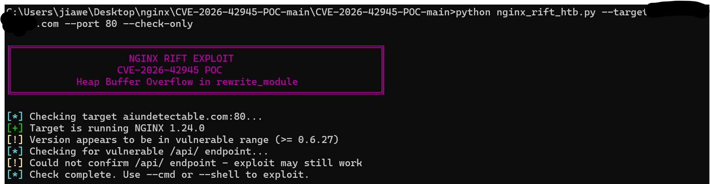
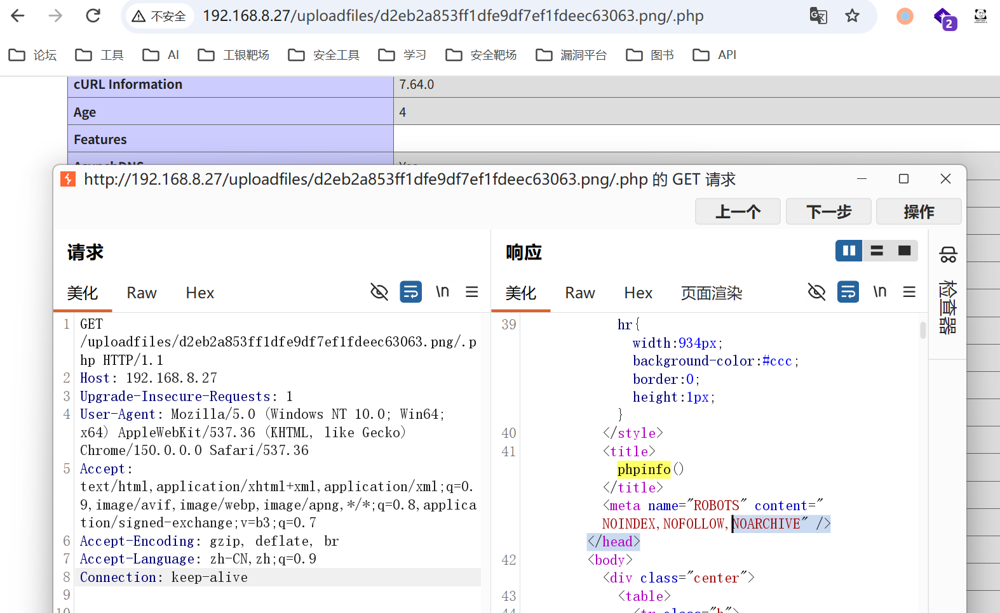
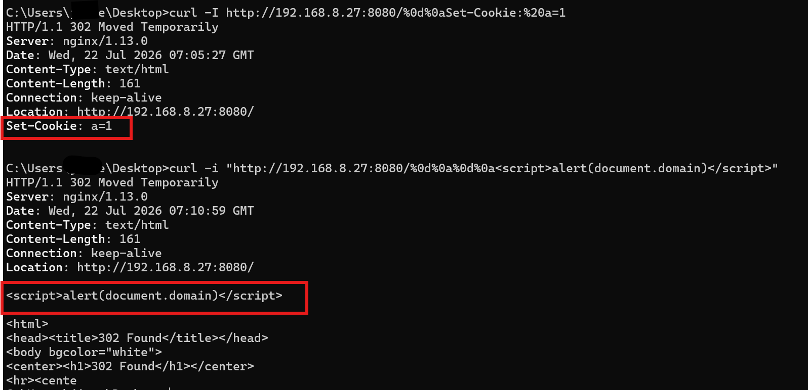
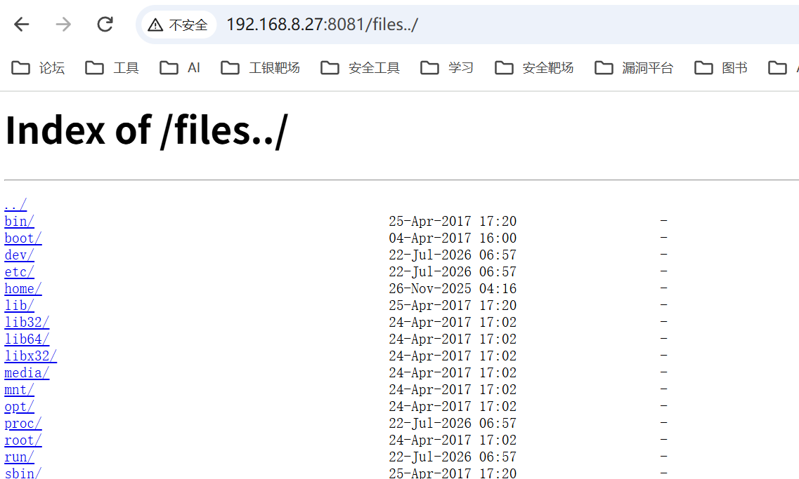
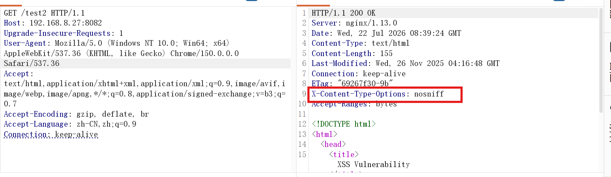
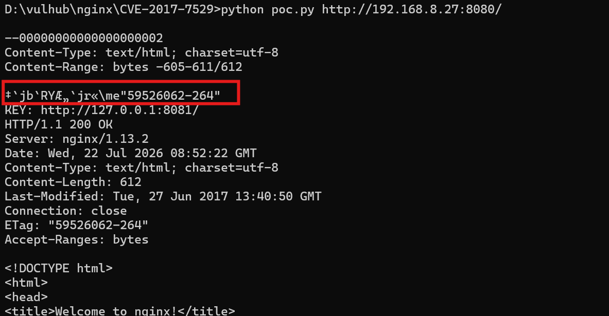

### 基础知识

nginx是一个web服务器，除了作为服务器，还经常用户反向代理、负载均衡、HTTP缓存等。

绝大多数架构中，nginx只充当反向代理或网关，可以尝试下目录配置问题或者注入，一般需要真正爆破到目录。

### 漏洞复现

#### CVE-2026-42945

这个漏洞能检测到的很多，但是难以实际利用

理论上来说，可以实现直接RCE

原理基于`ngx_http_rewrite_module`URL重写模块

**漏洞条件**

版本要求：`0.6.27 ~ 1.30.0`

而且必须nginx.conf中配置了类似的规则：

```
# 必须包含未命名捕获 (.*) 且替换路径包含 ? 和 $1
rewrite ^/download/(.*)$ /files/index.php?file=$1 break;
```



**漏洞原理**

伪代码

```
# 在堆上分配空间，按照未转义长度进行计算
u_char *buf = ngx_palloc(r->pool, len);

# 复制阶段，复制的字符串是经过字符替换、url格式化等之后的长度，造成溢出
p = ngx_http_script_copy_capture(r, p, script_code);
```


#### nginx解析漏洞

该漏洞和nginx、php版本无关，属于用户配置不当造成的解析漏洞

配置中，在请求一个具有多个扩展名的文件时，nginx可能会根据最后的扩展名来处理

```nginx
location ~ \.php$ {
    fastcgi_pass   127.0.0.1:9000;
    fastcgi_index  index.php;
    fastcgi_param  SCRIPT_FILENAME  /var/www/html$fastcgi_script_name;
    include        fastcgi_params;
}
```


**漏洞复现**

上传的图片中有php代码，访问`IP/uploadfiles/***.png/.php`就能按照php处理




#### CRLF注入漏洞

CRLF注入，也叫HTTP响应拆分攻击，类似能够在http响应头里注入回车键等

错误配置，原本的目的是把http跳转到https，但是把用户的url动态拼接到了https：

```nginx
location / {
    return 302 https://$host$uri;
}
```

路径中如果使用了`$uri`，nginx自动做url解码，会替换为换行符

正确用法是：`return 301 https://$host$request_uri;`，这样只会当作字符

在http的报文规则中：

```
单个[CRLF] :表示一次换行
两个[CRLF] :表示响应头结束，下面的是网页内容
```

因此，`%0d%0a`被解码为了`\r\n`换行



能够控制Set-Cookie字段或者直接xss

#### 路径穿越漏洞

错误配置

```nginx
location /files {
    alias /home/;
}
```

原本是要把/files/映射到本地目录/home/，但是斜杠`/`没有统一

结果把文件路径拼接为了：`/home/..`，退回了上一级目录



#### add_header被覆盖

**CSP**

内容安全策略，通过添加限制策略，如仅允许同源资源，能够防御xss等

错误配置：

```nginx
add_header Content-Security-Policy "default-src 'self'";
add_header X-Frame-Options DENY;

location = /test1 {
    rewrite ^(.*)$ /xss.html break;
}

location = /test2 {
    add_header X-Content-Type-Options nosniff;
    rewrite ^(.*)$ /xss.html break;
}
```

`/test2`的配置会关闭全局的CSP配置失效




#### CVE-2017-7529

影响版本：`0.5.6 - 1.13.2`，而且开启了换成

是代码层面的整数溢出，能够读取到缓存中的文件头

**漏洞复现**



KEY部分暴露了代理后端的真正服务地址，可能会出现内网凭证等


